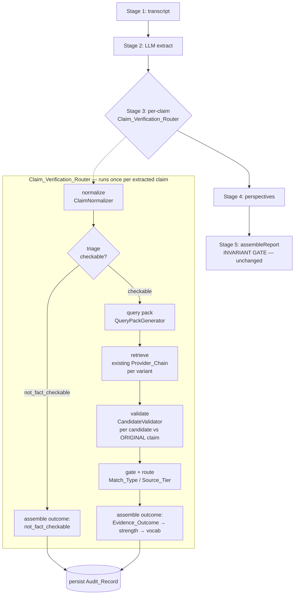

# Design Document

## Overview

The Claim_Verification_Router replaces the current "first provider with citations wins" evidence step with a staged precision pipeline wrapped around the **existing** `Provider_Chain`. It is built entirely inside the existing Worker and Pipeline — no new microservice, no weighted numeric scoring, no 8-variant query explosion.

The single governing metric is the **False_Evidence_Rate**: a wrong citation is far worse than a missing one. Every stage below is biased toward precision and toward an honest "no sufficient evidence found" over a dressed-up near-miss.

Today, `pipeline/stages.ts` Stage 3 calls `providers.evidence.gather(claimText)` once per claim, passing the full claim sentence as the query and accepting whatever citations come back as evidence. This launders weak evidence three ways: (1) a full-sentence query misses real fact-checks, (2) keyword drift returns merely-related material, and (3) there is no check that a returned source actually matches the claim. The router fixes all three by splitting the step into six stages:

```
normalize → triage → query pack → retrieve → validate → assemble outcome
```

The router owns three deterministic decisions that the requirements assign to no one else:
- the **gate logic** (Match_Type + Match_Confidence + Source_Tier as three independent binary gates, never a combined score),
- the **Evidence_Outcome → Evidence_Strength** mapping, and
- the **Evidence_Outcome → prototype vocabulary** mapping.

It explicitly does **not** own source reliability: every Candidate's `Source_Tier` comes from the trust-and-launch-bundle `classifyCitationTier` (`core/sourceTier.ts`), and an `excluded` tier is a hard "cannot be evidence" gate.

The Invariant_Gate in `core/assemble.ts` is treated as fixed law. The router is engineered so that its output always satisfies the gate (strength ≠ `none` ⇒ ≥ 1 citation; strength `none` ⇒ 0 citations), and a runtime self-check at worker boot fails fast if the gate's behavior is ever weakened.

### Design Decisions and Rationale

| Decision | Rationale |
|---|---|
| New `src/router/` module called from Stage 3, **not** a new service | Honors the "wrap around the existing chain inside the existing Worker/Pipeline" constraint and the explicit non-goal of a `/internal/evidence/verify-claim` microservice. |
| Normalize and validate are **new provider interfaces** (`ClaimNormalizer`, `CandidateValidator`) with deterministic mocks | These are LLM judgments; keeping them behind the existing provider-swap pattern means the router's orchestration logic stays pure and property-testable with seeded mocks. |
| Retrieval reuses the **existing** evidence providers; the router only changes how their results are *aggregated* (collect + tag, instead of first-wins) | Precision is now owned by the Candidate_Validator, so the chain no longer needs its first-wins heuristic; no new external service is introduced. |
| Three signals (Match_Type+Confidence, Source_Tier, retrieval rank) recorded separately; **no combined score** | Requirement 5.4 and the explicit non-goal of weighted scoring until the Benchmark justifies it. |
| Router output is constructed to satisfy the Invariant_Gate by construction | The gate is the moat; the router must never need it weakened (Requirement 9). |

## Architecture

### Where the router sits



The router is a pure async function `verifyClaim(originalClaim, deps)` that returns a `VerifiedClaim` (the evidence fields the existing pipeline already expects: `evidenceStrength` + `citations`, plus the new `evidenceOutcome`) and an `AuditRecord`. Stage 3 loops over extracted claims calling it, exactly where `providers.evidence.gather` is called today.

### Stage responsibilities

1. **normalize** (`ClaimNormalizer.normalize`): produce `Canonical_Claim`, `Claim_Type`, `Fact_Checkability` from the `Original_Claim`. LLM-backed; mock for offline.
2. **triage**: if `Fact_Checkability === 'not_fact_checkable'`, short-circuit — no query pack, no `Provider_Chain` call (Req 1.5). Outcome `not_fact_checkable` unless overridden later (Req 4.3 cannot fire because we never retrieve here).
3. **query pack** (`QueryPackGenerator.generate`): from the `Canonical_Claim`, build 4–6 purpose-distinct `Query_Variant`s (Req 2). Pure/deterministic given the normalized claim and a language hint.
4. **retrieve**: submit each `Query_Variant` to the existing evidence providers; flatten returned `Citation`s into tagged `Candidate`s (provider origin, variant kind, retrieval rank). Works correctly with a single query too (Req 3.8).
5. **validate** (`CandidateValidator.validate`): classify each `Candidate` against the **Original_Claim** (never the variant text — Req 3.2) with exactly one `Match_Type` and a `Match_Confidence ∈ [0,1]`.
6. **assemble outcome**: apply the gates and routing, assign exactly one `Evidence_Outcome`, map deterministically to `Evidence_Strength` and prototype vocabulary, build the `Claim`'s citations (ledger evidence only), and emit the `Audit_Record`.

### Composition and wiring

`index.ts` already builds the evidence provider list (Google Fact Check → GDELT → Tavily). The router is constructed there with: that same provider list (for retrieval), the new `ClaimNormalizer` and `CandidateValidator` providers, and `classifyCitationTier` from `core/sourceTier.ts`. The worker boot runs `assertInvariantGateIntact()` once before processing jobs.

## Components and Interfaces

### New module layout

```
src/router/
  index.ts          # verifyClaim() orchestration (the six stages)
  normalize.ts      # ClaimNormalizer interface + mock; triage helper
  queryPack.ts      # QueryPackGenerator (pure)
  retrieve.ts       # candidate collection over existing evidence providers
  validate.ts       # CandidateValidator interface + mock
  outcome.ts        # gates, routing, Evidence_Outcome assignment, deterministic mappings
  audit.ts          # AuditRecord builder
  guard.ts          # assertInvariantGateIntact() runtime self-check
src/router/benchmark/
  runner.ts         # offline Benchmark + False_Evidence_Rate + Ship_Gate
  fixtures.json     # ~100 labeled claims
```

### New provider interfaces (added to `providers/types.ts`)

```typescript
export interface ClaimNormalizer {
  // Stage 1 of the router. LLM-backed in prod; deterministic mock offline.
  normalize(originalClaim: string): Promise<{
    canonicalClaim: string;
    claimType: ClaimType;
    factCheckability: FactCheckability;
  }>;
}

export interface CandidateValidator {
  // Classifies one Candidate against the ORIGINAL claim (not the query variant).
  validate(originalClaim: string, candidate: Candidate): Promise<{
    matchType: MatchType;
    matchConfidence: number; // 0..1 inclusive
  }>;
}

// Existing EvidenceProvider is reused unchanged for retrieval.
export interface Providers {
  transcript: TranscriptProvider;
  llm: LLMProvider;
  evidence: EvidenceProvider;        // existing chain — reused for retrieval
  perspective: PerspectiveProvider;
  normalizer: ClaimNormalizer;       // NEW
  validator: CandidateValidator;     // NEW
}
```

### Router orchestration interface

```typescript
export interface VerifyDeps {
  normalizer: ClaimNormalizer;
  validator: CandidateValidator;
  retrieve: (variant: QueryVariant) => Promise<Candidate[]>; // wraps existing providers
  classifyTier: (sourceUrl: string) => SourceTier;           // classifyCitationTier
}

export interface VerifiedClaim {
  evidenceOutcome: EvidenceOutcome;
  evidenceStrength: EvidenceStrength;  // fed to the existing Claim
  prototypeVocab: PrototypeVocab;
  citations: Citation[];               // ledger evidence ONLY
  usefulContext: Candidate[];          // same_topic_different_claim
  contextCards: ContextCard[];         // background_context
  audit: AuditRecord;
}

export async function verifyClaim(
  originalClaim: string,
  deps: VerifyDeps,
): Promise<VerifiedClaim>;
```

### Retrieval over the existing chain (`retrieve.ts`)

The existing `EvidenceProvider.gather(text)` returns `{ evidenceStrength, citations }`. For the router, each returned `Citation` becomes a `Candidate` tagged with the query variant kind and a retrieval rank (its index in the result). Provider origin (`isFactCheck`) is set when the citation comes from the Google Fact Check provider so the outcome taxonomy can distinguish `matched_fact_check`. The router **ignores** the chain's own `evidenceStrength` — strength is now the router's decision.

`ponytail:` retrieval calls providers and collects results rather than the chain's first-wins short-circuit, because the Candidate_Validator now owns precision. The provider list itself is unchanged; this is not a new evidence service (Req 2.6, non-goals). Ceiling: candidate volume is bounded by `variants × providers × citations-per-provider`; capped per Req 2.2 (≤ 6 variants) and a per-variant result cap.

### Invariant gate runtime guard (`guard.ts`)

```typescript
// Behavioral check — runs assembleReport against canonical fixtures and asserts the
// exact ready/needs_review outcomes the gate must always produce. If the gate is ever
// weakened (e.g. stops holding back an overclaiming claim), this throws at worker boot,
// not in code review. Requirement 9.2.
export function assertInvariantGateIntact(): void;
```

It exercises the four gate conditions (overclaim, evidenceless framing, empty claims, low confidence) plus the honest-`none` ready case, comparing `assembleReport` output to expected statuses. Any divergence throws and the worker refuses to start.

### Changes to existing files (minimal)

- `pipeline/stages.ts` Stage 3: replace the `providers.evidence.gather` loop with `verifyClaim(...)`; build `Claim` from `VerifiedClaim`; collect `usefulContext`/`contextCards` into the report; hand each `AuditRecord` to the repository.
- `pipeline/worker.ts`: call `assertInvariantGateIntact()` once at worker construction; persist audit records after a successful pipeline run.
- `infra/ports.ts`: add `saveAuditRecord(record: AuditRecord): Promise<void>` to `Repository`.
- `core/assemble.ts`: **unchanged** (Req 9.1).

## Data Models

### New union types (added to `types.ts`)

```typescript
export type ClaimType =
  | 'factual_event' | 'statistical' | 'causal' | 'quote_paraphrase'
  | 'prediction' | 'normative_opinion' | 'implied_rhetorical';

export type FactCheckability = 'checkable' | 'not_fact_checkable';

export type QueryVariantKind =
  | 'exact_normalized' | 'compressed_entity_predicate' | 'fact_check_style'
  | 'counterclaim_negated' | 'source_language' | 'english';

export type MatchType =
  | 'same_claim' | 'same_topic_different_claim' | 'background_context'
  | 'contradictory_but_relevant' | 'irrelevant';

export type EvidenceOutcome =
  | 'matched_fact_check' | 'matched_primary_source' | 'matched_institutional_source'
  | 'relevant_context_only' | 'no_sufficient_evidence' | 'not_fact_checkable';

export type PrototypeVocab = 'supported' | 'mixed' | 'weak' | 'insufficient';
```

### Core records

```typescript
export interface QueryVariant {
  text: string;
  kind: QueryVariantKind;
}

export interface Candidate {
  sourceUrl: string;
  sourceName: string;
  excerpt?: string;
  sourceTier: SourceTier;        // from classifyCitationTier
  isFactCheck: boolean;          // provider origin = Google Fact Check
  fromVariant: QueryVariantKind; // which query surfaced it
  retrievalRank: number;         // 0-based rank within that variant's results
}

export interface ValidatedCandidate {
  candidate: Candidate;
  matchType: MatchType;
  matchConfidence: number;       // 0..1 inclusive
  selectedAsEvidence: boolean;   // entered the Claim_Ledger
}

export interface AuditRecord {
  claimId: string;
  originalClaim: string;
  canonicalClaim: string;
  claimType: ClaimType;
  factCheckability: FactCheckability;
  queryPack: QueryVariant[];                 // empty when not_fact_checkable
  candidates: ValidatedCandidate[];          // empty when not_fact_checkable
  evidenceOutcome: EvidenceOutcome;
  evidenceStrength: EvidenceStrength;
  prototypeVocab: PrototypeVocab;
  createdAt: string;                         // ISO
}
```

### Deterministic mappings (router-owned, `outcome.ts`)

**Evidence_Outcome → Evidence_Strength** (Req 4.7, 4.8):

| Evidence_Outcome | Evidence_Strength | Citations attached |
|---|---|---|
| `matched_fact_check` | `strong` | ≥ 1 |
| `matched_primary_source` | `moderate` | ≥ 1 |
| `matched_institutional_source` | `weak` | ≥ 1 |
| `relevant_context_only` | `none` | 0 |
| `no_sufficient_evidence` | `none` | 0 |
| `not_fact_checkable` | `none` | 0 |

This guarantees the Invariant_Gate invariant by construction: every outcome with strength ≠ `none` is exactly the set of outcomes that carry ledger evidence (≥ 1 citation), and every `none` outcome carries 0 citations (Req 9.3, 9.4).

**Evidence_Outcome → prototype vocabulary** (Req 4.9):

| Evidence_Outcome | Prototype vocab (base) |
|---|---|
| `matched_fact_check` | `supported` |
| `matched_primary_source` | `supported` |
| `matched_institutional_source` | `supported` |
| `relevant_context_only` | `weak` |
| `no_sufficient_evidence` | `insufficient` |
| `not_fact_checkable` | `insufficient` |

`mixed` override: when a `matched_*` outcome's ledger contains both a supporting citation and a contradicting one (`contradictory_but_relevant`), the displayed vocabulary is `mixed`. The mapping is a deterministic pure function of `(evidenceOutcome, hasSupporting, hasContradicting)`.

### Evidence_Outcome assignment (`outcome.ts`)

Given the validated candidates for one claim:

1. **not checkable + no ledger evidence** → `not_fact_checkable` (Req 4.2).
2. Compute **ledger-eligible** candidates: `matchType ∈ {same_claim, contradictory_but_relevant}` AND `sourceTier !== 'excluded'` (Req 3.3, 3.4, 5.2).
3. If ledger-eligible is non-empty, pick the strongest by provenance order `fact_check > tier1_primary > {tier2_institutional, tier3_viewpoint}`:
   - any `isFactCheck` → `matched_fact_check`
   - else any `tier1_primary` → `matched_primary_source`
   - else → `matched_institutional_source`
   - (this also handles the Req 4.3 override: a claim triaged `not_fact_checkable` that nonetheless yields ledger evidence is reassigned to the matched outcome — though in practice triage short-circuits retrieval, so this path is defensive.)
4. Else if any candidate was routed to Useful_Context or a Context_Card → `relevant_context_only` (Req 4.5).
5. Else → `no_sufficient_evidence` (Req 4.4).

### Candidate routing (`outcome.ts`)

| Match_Type | Routing | In Claim_Ledger as evidence? |
|---|---|---|
| `same_claim` | Claim_Ledger (`supports: true`) | yes, if tier ≠ excluded |
| `contradictory_but_relevant` | Claim_Ledger (`supports: false`) | yes, if tier ≠ excluded |
| `same_topic_different_claim` | Useful_Context | no |
| `background_context` | Context_Card | no |
| `irrelevant` | discarded | no |
| any, with `sourceTier === 'excluded'` | dropped from ledger | no (regardless of Match_Type/Confidence) |

### Persistence

A new `audit_records` table mirrors the existing JSONB-blob pattern (`analysis_reports.data`):

```sql
CREATE TABLE audit_records (
  id          UUID PRIMARY KEY DEFAULT gen_random_uuid(),
  report_id   UUID NOT NULL REFERENCES analysis_reports(id) ON DELETE CASCADE,
  claim_id    UUID NOT NULL,
  data        JSONB NOT NULL,           -- the full AuditRecord, lossless
  created_at  TIMESTAMPTZ NOT NULL DEFAULT now()
);
CREATE INDEX idx_audit_report ON audit_records (report_id);
```

The in-memory repository keeps audit records in a `Map<reportId, AuditRecord[]>` for offline/dev parity.

### Offline Benchmark model (`benchmark/`)

```typescript
interface BenchmarkClaim {
  id: string;
  originalClaim: string;          // pre-extracted: extraction model held constant
  sourceKind: 'video' | 'article';
  language: 'en' | 'nl';
  category: 'recent_local' | 'known_misinfo' | 'mundane_factual' | 'other';
  idealOutcome: EvidenceOutcome;
  acceptableUrls: string[];
  unacceptableUrls: string[];
}

interface StrategyResult {
  strategy: 'current_chain' | 'router';
  falseEvidenceRate: number;      // fraction citing an unacceptable / non-matching URL
}
```

The runner feeds the **same pre-extracted claim text** to both strategies (Req 8.6 — extraction model held constant), runs each offline (Req 8.5), and reports `False_Evidence_Rate` per strategy. The Ship_Gate approves the router iff `FER_router ≤ FER_current` (Req 8.4).

## Correctness Properties

*A property is a characteristic or behavior that should hold true across all valid executions of a system — essentially, a formal statement about what the system should do. Properties serve as the bridge between human-readable specifications and machine-verifiable correctness guarantees.*

The router is a strong fit for property-based testing: its orchestration, gating, routing, and mapping logic are pure functions of the normalizer/validator outputs. LLM judgments are supplied by seeded deterministic mocks so the properties test the router's logic, not the model. The properties below were derived from the prework analysis and consolidated to remove redundancy (routing rules folded into one property; the two strength/citation invariants folded into the "moat" property; the audit-field criteria folded into one completeness property).

### Property 1: Normalizer output is well-formed

*For any* claim string, the `ClaimNormalizer` output assigns exactly one `Claim_Type` from the seven-member set and exactly one `Fact_Checkability` value from `{checkable, not_fact_checkable}`.

**Validates: Requirements 1.1, 1.2**

### Property 2: Claim type determines fact-checkability

*For any* normalized claim, if its `Claim_Type` is `normative_opinion` then its `Fact_Checkability` is `not_fact_checkable`, and if its `Claim_Type` is `factual_event` then its `Fact_Checkability` is `checkable` (never `not_fact_checkable`).

**Validates: Requirements 1.3, 1.4**

### Property 3: A not-fact-checkable claim is never searched

*For any* claim whose `Fact_Checkability` is `not_fact_checkable` (including a rhetorical claim the normalizer could not turn into a checkable hypothesis), the router generates no `Query_Pack` and makes zero `Provider_Chain` calls for that claim.

**Validates: Requirements 1.5, 1.7**

### Property 4: Query packs are well-formed

*For any* checkable canonical claim, the generated `Query_Pack` contains the four required `Query_Variant` kinds (`exact_normalized`, `compressed_entity_predicate`, `fact_check_style`, `counterclaim_negated`), contains no more than six variants, has a valid `kind` on every variant, and derives its `exact_normalized` variant from the `Canonical_Claim`.

**Validates: Requirements 2.1, 2.2, 2.4, 2.5**

### Property 5: Non-English topics get a source-language and an English variant

*For any* checkable claim carrying a non-English language hint, the generated `Query_Pack` contains at least one `source_language` variant and at least one `english` variant.

**Validates: Requirements 2.3**

### Property 6: Validator output is well-formed

*For any* `Candidate`, the `CandidateValidator` assigns exactly one `Match_Type` from the five-member set and a `Match_Confidence` in the inclusive range 0 to 1.

**Validates: Requirements 3.1**

### Property 7: Candidates are validated against the original claim

*For any* claim and *for any* `Candidate` surfaced by any `Query_Variant`, the string the router passes to the `CandidateValidator` is the `Original_Claim`, never the `Query_Variant` text that surfaced the candidate.

**Validates: Requirements 3.2**

### Property 8: Candidate routing honors match type and the excluded-tier hard gate

*For any* set of validated candidates, a candidate enters the `Claim_Ledger` as a citation if and only if its `Match_Type` is `same_claim` or `contradictory_but_relevant` **and** its `Source_Tier` is not `excluded`; a `contradictory_but_relevant` citation is recorded with `supports === false`; `same_topic_different_claim` candidates go only to `Useful_Context`; `background_context` candidates go only to a `Context_Card`; `irrelevant` candidates appear nowhere; and a candidate with `Source_Tier === 'excluded'` never appears as a citation regardless of its `Match_Type` or `Match_Confidence`. This holds whether retrieval used a single query or a full pack.

**Validates: Requirements 3.3, 3.4, 3.5, 3.6, 3.7, 3.8, 5.2, 7.4**

### Property 9: Source tier always comes from the policy

*For any* `Candidate`, its `Source_Tier` equals `classifyCitationTier(candidate.sourceUrl)` from the trust-and-launch-bundle Source_Tier_Policy; the router computes no source-reliability rating of its own.

**Validates: Requirements 5.1**

### Property 10: Exactly one Evidence_Outcome is assigned per the assignment rules

*For any* processed claim, the router assigns exactly one `Evidence_Outcome` from the six-member set such that: a `not_fact_checkable` claim with no ledger-eligible candidate is `not_fact_checkable`; a claim with at least one ledger-eligible candidate (`same_claim`/`contradictory_but_relevant`, tier ≠ `excluded`) is a `matched_*` outcome (overriding a prior `not_fact_checkable`); a checkable claim with only routed context and no ledger evidence is `relevant_context_only`; and a checkable claim with no ledger-eligible candidate and no routed context is `no_sufficient_evidence`.

**Validates: Requirements 4.1, 4.2, 4.3, 4.4, 4.5**

### Property 11: Outcome-to-strength and outcome-to-vocabulary mappings are deterministic and total

*For any* `Evidence_Outcome`, the mapping to `Evidence_Strength` is total, single-valued, and stable across repeated calls, with `no_sufficient_evidence` and `not_fact_checkable` both mapping to `none`; and *for any* `(Evidence_Outcome, hasSupporting, hasContradicting)` the mapping to the prototype vocabulary `{supported, mixed, weak, insufficient}` is total, single-valued, and stable.

**Validates: Requirements 4.7, 4.8, 4.9**

### Property 12: Strength and citations are always consistent — the invariant moat

*For any* `verifyClaim` output, if `Evidence_Strength` is `weak`, `moderate`, or `strong` then the claim carries at least one `Citation`, and if `Evidence_Strength` is `none` then the claim carries zero `Citations`; consequently a `no_sufficient_evidence` or `relevant_context_only` outcome attaches zero citations and remains a valid served state that the unchanged Invariant_Gate accepts as `ready`.

**Validates: Requirements 9.3, 9.4, 7.1, 7.2, 7.3**

### Property 13: The Audit_Record is complete for every claim

*For any* processed claim, the router emits exactly one `Audit_Record` that records the distinct `Original_Claim` and `Canonical_Claim`, the `Claim_Type`, the `Fact_Checkability`, the `Query_Pack`, the raw `Candidate` results, the final `Evidence_Outcome`, and — for each candidate — whether it was selected as evidence, its `Match_Type`, its `Match_Confidence`, its `Source_Tier`, and its retrieval rank as four distinct signals (never collapsed into a single score); and when the claim is `not_fact_checkable` the recorded `Query_Pack` and `Candidate` results are both empty.

**Validates: Requirements 1.9, 4.6, 5.4, 6.1, 6.2, 6.3, 6.4, 6.5, 6.6**

### Property 14: False_Evidence_Rate is computed correctly

*For any* labeled benchmark set and *for any* assignment of cited URLs to those claims, the reported `False_Evidence_Rate` lies in the inclusive range 0 to 1 and equals the fraction of claims whose cited URL is absent from that claim's acceptable set (or present in its unacceptable set).

**Validates: Requirements 8.3**

### Property 15: The Ship_Gate approves only a non-worse strategy

*For any* pair of rates `(ferRouter, ferCurrent)`, the `Ship_Gate` approves adoption of the router if and only if `ferRouter ≤ ferCurrent`.

**Validates: Requirements 8.4**

### Property 16: The Benchmark holds the extraction model constant

*For any* benchmark run, the claim text supplied to the `current_chain` strategy is identical, claim for claim, to the claim text supplied to the `router` strategy.

**Validates: Requirements 8.6**

## Error Handling

The router runs inside the existing pipeline's `try/catch` in `worker.ts`, which already marks a report `failed` on a thrown error. The router refines this so a single claim's trouble never fails a whole report and never weakens the gate:

- **Normalizer failure or timeout.** If `ClaimNormalizer.normalize` throws, the claim is treated as `not_fact_checkable` with an `Audit_Record` noting the failure reason. This is the safe default: no search, no citations, honest "not checkable". A report is never failed because one claim could not be normalized.
- **Retrieval / Provider_Chain failure.** A provider error during retrieval for one variant is caught; that variant contributes zero candidates. If every variant fails, the claim resolves to `no_sufficient_evidence` (a successful served outcome per Req 7.3), not a failure.
- **Validator failure or timeout.** If `CandidateValidator.validate` throws for a candidate, that candidate is treated as `irrelevant` (discarded) — the precision-biased default. A validator that cannot judge a candidate must never let it into the ledger.
- **Out-of-range Match_Confidence.** A confidence outside `[0,1]` from a misbehaving validator is clamped and the audit notes the clamp; the candidate is not silently trusted.
- **Excluded / unresolvable source.** `classifyCitationTier` returns `excluded` for unresolvable hosts; the excluded-tier hard gate (Property 8) drops these from the ledger while still recording the computed tier in the audit (Req 5.2).
- **Invariant gate tamper detected.** `assertInvariantGateIntact()` throws at worker boot if the gate's behavior diverges from its pinned fixtures; the worker refuses to process jobs rather than risk serving an unguarded report (Req 9.2).
- **Audit persistence failure.** A failure to persist an `Audit_Record` is logged and does not block serving an otherwise-ready report; audit writes are best-effort and retried, never on the critical path of the gate decision. `ponytail:` best-effort audit write; ceiling is possible loss of one audit row under DB outage, upgrade path is a write-ahead queue if audit durability becomes a hard requirement.

## Testing Strategy

### Dual approach

- **Property-based tests** verify the 16 universal properties above across generated inputs — the router's gating, routing, mapping, and invariant-preservation logic.
- **Unit / example tests** cover specific scenarios and the cases the prework classified as EXAMPLE or SMOKE: the rhetorical-claim canonicalization (1.6, 1.8), submitting every variant exactly once (2.6), and the guard behavior (9.2).

### Property-based testing library

The server uses `node:test` with `tsx` and has no PBT library yet. The design adds **`fast-check`** as a dev dependency (the standard PBT library for the TypeScript/Node ecosystem) and integrates it with the existing `node:test` runner — no bespoke generator framework. Each property test:

- runs a **minimum of 100 iterations** (fast-check default `numRuns` raised to ≥ 100),
- is tagged with a comment referencing its design property in the format **`Feature: claim-verification-router, Property {number}: {property_text}`**,
- implements exactly one correctness property as a single property-based test,
- uses seeded deterministic mocks for `ClaimNormalizer` and `CandidateValidator` so the router's logic — not the LLM — is under test. Generators produce arbitrary claim strings, arbitrary `Candidate` arrays (with controlled `Match_Type`/`Source_Tier`/confidence distributions, including `excluded` and boundary confidences `0` and `1`), and arbitrary language hints.

New test files (mirroring the module layout) under `app/apps/server/test/router/`: `normalize.test.ts`, `queryPack.test.ts`, `validate.test.ts`, `routing.test.ts`, `outcome.test.ts`, `mappings.test.ts`, `invariant-moat.test.ts`, `audit.test.ts`, `guard.test.ts`, `benchmark.test.ts`. The `test` script in `package.json` is extended to include them.

### Edge cases to drive through generators

- Candidates with `Source_Tier === 'excluded'` combined with `Match_Type === 'same_claim'` and `Match_Confidence === 1` (Property 8 — the gate must still block them).
- Claims that normalize to `not_fact_checkable` (Property 3, 13 — no search, empty audit pack/candidates).
- A single-variant retrieval (Property 8 — the validator protects the ledger even before packs are enabled).
- All five `Match_Type` values present in one candidate set (Property 8, 10 — routing and outcome interplay).
- Non-ASCII / Dutch claim text and a non-English language hint (Property 5).
- Boundary `Match_Confidence` values and out-of-range values (Property 6, error handling clamp).

### Integration and smoke tests (not PBT)

- **Invariant gate preservation (9.1):** the existing `test/invariant.test.ts` continues to pass unchanged, and `git` shows an empty diff on `core/assemble.ts`. The guard's behavioral tests (9.2) live in `guard.test.ts`: one example asserts the guard passes against the real `assembleReport`, another asserts it throws against a stub that weakens a gate condition.
- **Benchmark composition (8.1, 8.2):** a smoke test asserts `fixtures.json` holds ~100 claims spanning video/article, Dutch, recent/local, known-misinfo, and mundane categories, each with `idealOutcome` and acceptable/unacceptable URL lists.
- **Offline execution (8.5):** the benchmark runner is a standalone script with no network or user dependency, runnable via `node`.
- **Dataset licensing (5.3) and neutrality (9.5):** a static check asserts no Ad Fontes / AllSides / MBFC dataset is imported, and that `VerifiedClaim`/`AuditRecord` expose no content-truth verdict or creator-reliability field.

### Verification gate for the feature

The router is wired into the live pipeline only after the offline Benchmark shows `FER_router ≤ FER_current` (Property 15 / Req 8.4). Until then it can run shadowed (producing audit records without changing served reports) so the Benchmark can compare strategies with the extraction model held constant.
