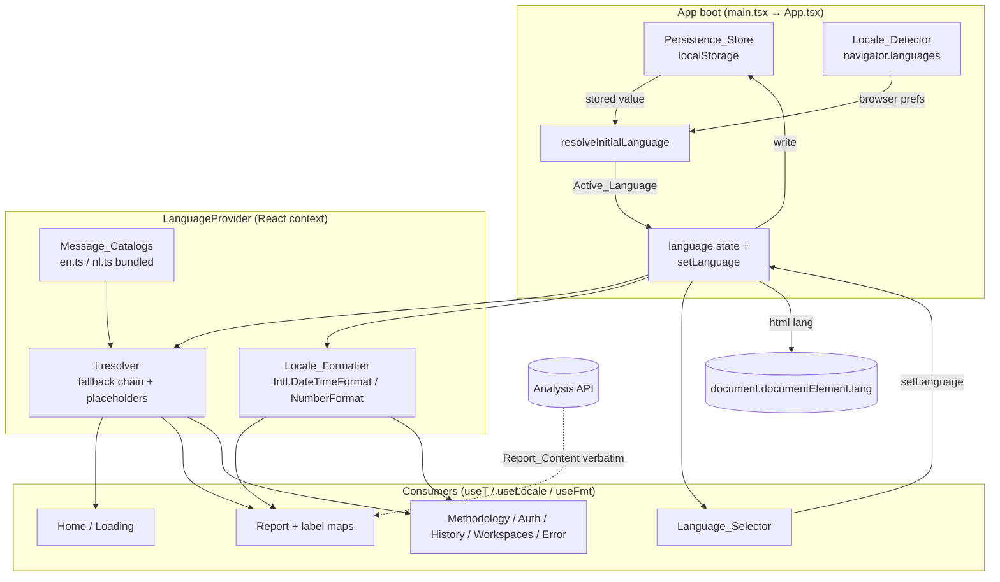
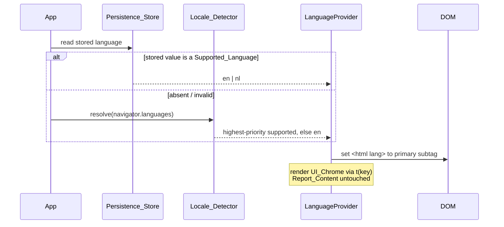

# Design Document

## Overview

This feature internationalizes the f-Socials web client (`app/apps/web`) so its interface can be presented in English (`en`) or Dutch (`nl`). It is a **presentation-layer change only**: the server, the analysis pipeline, and the invariant gate in `core/assemble.ts` are not touched. No new server config value, no network call, no third-party translation service.

The work moves the interface copy that is today scattered as hardcoded English literals — across `App.tsx`, `Report.tsx`, `Methodology.tsx`, `AuthPanel.tsx`, `HistoryView.tsx`, the workspace views, and the display-label maps in `Report.tsx` (`STRENGTH`, `VERIFIABILITY`, `TIER`, `divergenceLabel`, the issue-frame axis poles in `reportView.ts`, and the analysis `STEPS`) — behind a single in-app source of truth: one **Message_Catalog** per Supported_Language, addressed by stable **String_Key**s. A **Language_Selector** in the header switches the **Active_Language**, the choice is persisted in browser-local storage exactly like an interface preference, and dates and numbers are formatted for the Active_Language using the browser's built-in `Intl` facilities.

The hard line the feature draws:

- **UI_Chrome** (product-authored labels, headings, buttons, status/error/empty-state messages, example titles/blurbs, and the enumeration display-label maps) → **localized**, resolved through the active catalog.
- **Report_Content** (claim text, framing technique names/descriptions, transcript spans, AI-written titles, citation excerpts, context-card text, `needs_review` reasons) → **rendered verbatim**, never translated, never reordered, never re-authored.

The Compass holds in both languages. No catalog value in any language may state a verdict on truthfulness or attach a reliability rating to a creator/author/person/channel. The existing descriptive labels (evidence strength, verifiability, issue-frame, source-tier) stay descriptive in Dutch, source-reliability tiers stay attached to sources and citations only, and a build-time denylist scan fails the build if any catalog value drifts into verdict/creator-rating phrasing.

### Design Principles (ponytail rung-ladder)

1. **No i18n dependency.** React 19 context + a tiny pure resolver + the native `Intl` API cover every requirement. `react-intl`/`i18next` would add runtime weight, async loaders, and an ICU layer this feature does not need. Catalogs are plain bundled TypeScript modules.
2. **Compile-time parity for free.** Typing the Dutch catalog as `typeof en` makes a missing or extra String_Key a `tsc -b` error, satisfying "identical key sets" (Req 4.3, 4.7) by construction. A Vitest parity test backs it for human-readable reporting.
3. **Reuse what's here.** The display-label maps already exist as typed `Record`s in `Report.tsx`; they move into the catalog rather than being rewritten. The persistence pattern mirrors the existing theme/`data-theme` attribute flow. Hash routing, `lucide-react` icons, and the color-never-alone conventions are reused, not replaced.
4. **Total resolution.** `t(key)` always returns a non-empty string through a fixed fallback chain, so no surface can render empty text or a raw key (Req 2.6–2.8, 9.5).

## Architecture

The localization layer is a self-contained module `app/apps/web/src/i18n/` plus one new header component. It is injected at the application root via a React context provider; every view consumes it through a `useT()` / `useLocale()` hook. Nothing below the context provider reaches for a hardcoded literal at render time.



### Initialization sequence



### Boundaries that do not move

- **Server / pipeline / gate.** Zero changes under `app/apps/server`. `core/assemble.ts` stays byte-for-byte identical (Req 11.1); readiness (`ready` | `needs_review`) is consumed as delivered and only ever given a display label (Req 11.2, 11.6). A static guard test asserts no localization import reaches into the gate.
- **Report data contract.** The i18n layer never reads, maps, or transforms `AnalysisReport` content fields. Counts and identities of claims, framing signals, context cards, citations, and perspectives are rendered exactly as the API delivers them (Req 5.2, 5.5, 11.3, 11.5).
- **Offline-first.** All catalog text is bundled into the Vite build; switching language is synchronous and network-free (Req 4.5, 10.1, 10.5).

## Components and Interfaces

All new code lives under `app/apps/web/src/i18n/` except the selector component (`components/`). Files use extensionless relative imports per the package convention.

### `i18n/catalog.ts` — catalog types and the two catalogs' shape

Defines `Language = 'en' | 'nl'`, `SUPPORTED_LANGUAGES`, `DEFAULT_LANGUAGE = 'en'`, the `MessageCatalog` type, and re-exports the two catalogs. The English catalog is the canonical shape; the Dutch catalog is typed against it.

```ts
export type Language = 'en' | 'nl';
export const SUPPORTED_LANGUAGES = ['en', 'nl'] as const;
export const DEFAULT_LANGUAGE: Language = 'en';

// A catalog is a flat map from String_Key to a message template. Nested objects
// are allowed for grouping but keys resolve via dotted String_Key (e.g. 'home.analyze').
export type MessageCatalog = Record<string, string>;

export function isSupportedLanguage(v: unknown): v is Language {
  return v === 'en' || v === 'nl';
}
```

### `i18n/en.ts` and `i18n/nl.ts` — the Message_Catalogs

`en.ts` exports a `const en` object literal (the source of truth). `nl.ts` exports `const nl: typeof en` so the compiler enforces an identical key set (Req 4.3, 4.7). Keys are dotted, stable identifiers grouped by surface:

```ts
// en.ts (excerpt) — String_Key → message template
export const en = {
  'home.heading': 'Inspect before you react.',
  'home.analyze': 'Analyze',
  'home.neutralityHint': 'It assesses claims and cites sources — it never declares "true" or "false".',
  'loading.analyzing': 'Analyzing — {status}',
  'report.strength.strong': 'Well-sourced',
  'report.verifiability.verifiable': 'Verifiable',
  'report.tier.tier1_primary': 'Tier 1 · Primary',
  'report.divergence': '{word} divergence ({pct}%)',
  'report.counts.claims': '{n} claims',
  'lang.label': 'Language',
  'lang.en': 'English',
  'lang.nl': 'Dutch',
  // …every UI_Chrome string enumerated in Req 9.1–9.4
} as const;
export type EnCatalog = typeof en;
```

```ts
// nl.ts — typeof en forces parity; a missing/extra key is a tsc error
import type { en } from './en';
export const nl: typeof en = {
  'home.heading': 'Onderzoek voordat je reageert.',
  'home.analyze': 'Analyseer',
  // …
};
```

### `i18n/resolve.ts` — the resolver (`t`) and placeholder substitution

Pure functions, the heart of the property tests.

```ts
// Resolve a String_Key for a language with the fallback chain:
//   active catalog → default (en) catalog → visible placeholder derived from key.
// Always returns a non-empty string. Whitespace-only catalog values count as absent.
export function resolve(
  key: string,
  language: Language,
  catalogs: Record<Language, MessageCatalog>,
): string;

// Substitute named {placeholder} tokens with supplied values. An unmatched token is
// left visible (never blanked); a placeholder with no supplied value stays as written.
export function fill(template: string, values?: Record<string, string | number>): string;

// Convenience used by the hook: resolve then fill.
export function translate(
  key: string,
  language: Language,
  catalogs: Record<Language, MessageCatalog>,
  values?: Record<string, string | number>,
): string;
```

Fallback derivation for a key absent from both catalogs: the visible placeholder is the last dotted segment of the key in a readable form (e.g. `home.analyzeButton` → `analyzeButton`), guaranteeing non-empty visible text rather than an empty string or crash (Req 2.7, 4.6, 9.5).

### `i18n/detect.ts` — the Locale_Detector

```ts
// Walk browser-reported preferences highest→lowest priority; return the first whose
// primary subtag (case-insensitive) is a Supported_Language; else DEFAULT_LANGUAGE.
export function detectLanguage(preferences: readonly string[]): Language;

// Read navigator.languages (falling back to [navigator.language]) for the live call.
export function detectFromNavigator(): Language;
```

### `i18n/persist.ts` — the Persistence_Store adapter

```ts
const STORAGE_KEY = 'fsocials-language';

// Read + validate; a missing/invalid/unreadable value yields null (caller then detects).
export function readStoredLanguage(): Language | null;

// Write, swallowing any storage rejection (private mode / quota) — never throws (Req 3.4).
export function writeStoredLanguage(language: Language): void;

// Resolve the initial Active_Language: stored-if-valid → detect → default.
export function resolveInitialLanguage(): Language;
```

### `i18n/format.ts` — the Locale_Formatter

```ts
const LOCALE: Record<Language, string> = { en: 'en-US', nl: 'nl-NL' };

// Format a date/number for the language via Intl. On an invalid value, return its
// original unformatted string. If Intl is unavailable, return the unformatted value.
export function formatDate(value: Date | string | number, language: Language, opts?: Intl.DateTimeFormatOptions): string;
export function formatNumber(value: number, language: Language, opts?: Intl.NumberFormatOptions): string;
```

These replace the bare `new Date(iso).toLocaleString()` calls in `WorkspaceDetailView.tsx`, `HistoryView.tsx`, and any numeric counts, routing them through the Active_Language.

### `i18n/context.tsx` — `LanguageProvider`, `useT`, `useLocale`, `useFmt`

```tsx
interface LanguageContextValue {
  language: Language;                 // Active_Language
  setLanguage: (next: Language) => void;
  t: (key: string, values?: Record<string, string | number>) => string;
  formatDate: (v: Date | string | number, opts?: Intl.DateTimeFormatOptions) => string;
  formatNumber: (v: number, opts?: Intl.NumberFormatOptions) => string;
}
```

- `LanguageProvider` holds `language` in `useState(resolveInitialLanguage())`.
- `setLanguage(next)`: if `next === language`, it is a no-op (idempotent — leaves DOM unchanged, Req 1.5). Otherwise it sets state (synchronous re-render < 1s, no reload — Req 1.3, 6.3, 9.7), writes to the Persistence_Store (Req 3.1), and sets `document.documentElement.lang` to the primary subtag (Req 8.4); if a subtag cannot be resolved, the previous `lang` is left untouched (Req 8.5).
- `t` closes over `language` and the bundled catalogs and delegates to `translate`.

### `components/LanguageSelector.tsx` — the Language_Selector

A keyboard-operable control offering exactly `en` and `nl`, placed in the existing header `topbar-actions` beside the theme toggle. Design choice: a small set of two real `<button>`s in a `role="group"` with an `aria-label` from `t('lang.label')`, each button showing the language's visible text name and `aria-pressed` reflecting the Active_Language (Req 1.1, 1.4, 8.1–8.3, 8.6, 8.9). It is reachable by Tab, activatable by Enter/Space (native buttons), and shows the standard focus indicator. Any icon is sourced from `lucide-react` (`Languages`) and always sits beside a visible text label (Req 8.8). On ≤768px it inherits the existing single-column layout (Req 8.7).

### Consumer refactor (no behavior change beyond language)

Each view replaces literals with `t(...)` and routes dates/numbers through `useFmt`:

| Surface | File | Req |
|---|---|---|
| Home heading, description, placeholder, Analyze, neutrality hint, examples | `App.tsx` | 9.1 |
| Loading label + analysis step names | `App.tsx` (`STEPS`) | 9.2 |
| Report section titles, controls, banners, empty states, provenance, label maps | `Report.tsx`, `reportView.ts`, `SummaryLead.tsx`, chips | 9.3 |
| Methodology, error view (Retry/Back), dispute/flag, sign-in, history, workspaces | respective components | 9.4 |

The display-label maps become catalog lookups: `STRENGTH[s].label` → `t('report.strength.' + s)`, `VERIFIABILITY[v]` → `t('report.verifiability.' + v)`, `TIER[t]` → `t('report.tier.' + tier)`, `divergenceLabel(d)` → `t('report.divergence', { word, pct })`. The icon/class parts of `STRENGTH` stay in the component (presentation, not text).

## Data Models

### Language and catalog

```ts
type Language = 'en' | 'nl';                  // Supported_Languages
type MessageCatalog = Record<string, string>; // String_Key → message template
const catalogs: Record<Language, MessageCatalog> = { en, nl };
```

- **String_Key**: a stable dotted identifier (`home.analyze`, `report.tier.tier1_primary`). The set of keys is identical across catalogs (compile-enforced via `typeof en`).
- **Message template**: a non-empty string that may contain `{name}` placeholders for runtime values (Req 4.4).
- **Active_Language**: a single `Language` held in context state; the persisted form is the same two-character code.

### Persisted value

`localStorage['fsocials-language']` holds exactly `'en'` or `'nl'`. Any other stored content (missing, corrupt, legacy, unreadable) is treated as absent and triggers detection (Req 2.5, 3.3, 10.4).

### Report contract (read-only, unchanged)

The `AnalysisReport` type from `api/types` is consumed exactly as today. The localization layer reads only enumeration **discriminants** (`evidenceStrength`, `verifiability`, `sourceTier`, readiness state) to pick a String_Key — never the free-text content fields, which pass through to the DOM unaltered (Req 5.2, 5.5, 11.3).

## Correctness Properties

*A property is a characteristic or behavior that should hold true across all valid executions of a system — essentially, a formal statement about what the system should do. Properties serve as the bridge between human-readable specifications and machine-verifiable correctness guarantees.*

The acceptance-criteria prework classified most criteria as universal properties, with a cluster of accessibility/rendering criteria as examples, a curated neutrality scan as an edge-case check, and the byte-level gate comparison plus offline/no-dependency constraints as smoke checks. After reflection, overlapping criteria were consolidated into the following nine properties, each implemented by a single `fast-check` property test (≥100 runs) under Vitest.

### Property 1: Resolution totality with fallback

*For any* String_Key (known or unknown) and any Supported_Language, resolving the key returns a non-empty string: the Active_Language entry when present and non-whitespace, otherwise the Default_Language (English) entry, otherwise a non-empty visible placeholder derived from the key. Whitespace-only catalog values count as absent and trigger fallback.

**Validates: Requirements 1.7, 2.6, 2.7, 2.8, 4.6, 5.6, 8.9, 9.5, 11.6**

### Property 2: Detection totality and priority

*For any* arbitrary list of browser-reported language preferences, the Locale_Detector returns a Supported_Language — the highest-priority preference whose primary subtag matches `en` or `nl` case-insensitively (regardless of region tag), and the Default_Language when no preference matches.

**Validates: Requirements 2.2, 2.3, 2.4**

### Property 3: Persistence round-trip and totality

*For any* Supported_Language, writing it to the Persistence_Store and resolving the initial language restores that same Active_Language; *for any* stored value that is absent or not a Supported_Language, the initial resolution falls through to detection and still returns a Supported_Language without throwing.

**Validates: Requirements 2.1, 2.5, 3.1, 3.2, 3.3, 10.2, 10.3, 10.4**

### Property 4: Switch idempotence

*For any* Supported_Language that is already the Active_Language, setting the Active_Language to that same value leaves the rendered UI_Chrome unchanged.

**Validates: Requirements 1.5**

### Property 5: Catalog parity and completeness

*For any* String_Key defined in either catalog, the same key is defined in the other catalog (identical key sets) and its value in every Supported_Language is a non-empty, non-whitespace string.

**Validates: Requirements 4.3, 9.1, 9.2, 9.3, 9.4, 9.6**

### Property 6: Placeholder substitution round-trip

*For any* message template containing named `{placeholder}` tokens and any supplied runtime values, substitution yields a string that contains each supplied value and leaves no token that had a supplied value unresolved; *for any* token with no supplied value, that token remains visible and the message is non-empty.

**Validates: Requirements 4.4, 4.8**

### Property 7: Content invariance under language switch

*For any* report, rendering it under English and under Dutch produces identical Report_Content text (no characters added, removed, reordered, or substituted) and identical section counts (claims, framing signals, context cards, citations, perspectives), regardless of the Active_Language or the language the Report_Content is in.

**Validates: Requirements 5.2, 5.5, 5.7, 11.2, 11.3, 11.5**

### Property 8: Format presentation-only (metamorphic) with invalid-input fallback

*For any* valid date or number, the Locale_Formatter output under English and under Dutch represents the same underlying value and differs only in presentation; *for any* value that is not a valid date or number, the Locale_Formatter returns the value's original unformatted representation unchanged.

**Validates: Requirements 6.4, 6.6**

### Property 9: Document language reflects Active_Language

*For any* Supported_Language, setting the Active_Language sets the document's `<html lang>` attribute to the primary subtag of that language.

**Validates: Requirements 8.4**

### Non-property verification (for completeness)

- **Examples / accessibility (Req 1.1, 1.3, 1.4, 1.6, 4.2, 4.7, 6.1, 6.2, 6.3, 7.5, 8.1, 8.2, 8.6, 9.7, 10.6):** rendering and keyboard/ARIA behaviors verified with React Testing Library + `vitest-axe`.
- **Neutrality denylist scan (Req 7.1, 7.2, 7.3, 7.4, 7.6):** a static check iterating every value of both catalogs against a curated denylist of truthfulness-verdict and creator-rating phrasings; it fails the web suite (the build gate) and names the offending String_Key. Not randomized — the input is the fixed catalog content.
- **Edge cases (Req 3.4, 6.7, 8.5):** storage-write rejection, `Intl` unavailability, and unresolvable subtag are covered by targeted unit tests with stubbed environments.
- **Smoke / constraint guards (Req 3.5, 4.1, 4.5, 5.4, 6.5, 8.3, 8.7, 8.8, 10.1, 10.5, 10.7, 11.1, 11.4):** static guard tests assert no router/network/external-service dependency, catalogs are static imports, the selector icon comes from `lucide-react`, no server file changed, and a byte-level comparison confirms `core/assemble.ts` is identical to its committed state.

## Error Handling

The localization layer is designed to degrade rather than fail; no localization error is ever Reader-visible as a crash or blank surface.

| Failure | Handling | Requirement |
|---|---|---|
| String_Key absent from Active_Language catalog | Fall back to Default_Language (English) | 1.7, 2.6, 5.6 |
| String_Key absent from both catalogs | Render a non-empty visible placeholder derived from the key | 2.7, 4.6, 9.5 |
| Catalog value is empty / whitespace-only | Treated as absent → fallback chain | 9.5 |
| Placeholder with no supplied value | Leave the token text visible; render the rest of the message | 4.8 |
| `localStorage` unavailable / write rejected | Swallow the error; keep the selected Active_Language in session memory | 3.4 |
| Stored value missing / corrupt / not supported | Ignore; resolve through the Locale_Detector | 2.5, 3.3, 10.4 |
| No browser preference resolves to a Supported_Language | Use the Default_Language | 2.4 |
| Value passed to formatter is not a valid date/number | Return the original unformatted representation | 6.6 |
| `Intl` facilities unavailable | Return the unformatted representation | 6.7 |
| Active_Language has no resolvable primary subtag | Leave previous `<html lang>` unchanged; no Reader-visible error | 8.5 |

Implementation notes:
- The resolver never throws — it returns a string on every path. This is the single guarantee that makes every "no empty surface" requirement hold by construction.
- Persistence writes are wrapped in `try/catch`; reads validate against `isSupportedLanguage` before use.
- The formatter wraps `Intl` construction in a guarded path so a missing `Intl` (or a `RangeError` on a bad value) returns the input string.

## Testing Strategy

Property-based testing **is** appropriate here: the resolver, detector, persistence resolution, placeholder substitution, and formatter are pure functions with large/structured input spaces and clear universal properties (totality, round-trips, idempotence, metamorphic presentation-only). The report-content invariance is a metamorphic property over generated reports. This matches the candidate properties already noted in the requirements document.

### Tooling and conventions

- **Library:** `fast-check` (already a dev dependency), under Vitest + React Testing Library. We do not hand-roll property testing.
- **Iterations:** minimum **100 runs** per property test.
- **Tagging:** each property test carries a comment `// Feature: en-nl-localization, Property <n>: <description>` and a `Validates: Requirements …` reference, per project convention.
- **Suite:** new `*.test.ts(x)` files run under the web `vitest run` suite; `tsc -b` (typecheck) enforces catalog parity at compile time.

### Test inventory

Property tests (one `fast-check` property each, ≥100 runs):

1. `i18n/resolve.totality.test.ts` — Property 1 (arbitrary keys × languages → non-empty via fallback chain).
2. `i18n/detect.test.ts` — Property 2 (arbitrary preference lists → priority/subtag/case-insensitive match, default fallback).
3. `i18n/persist.roundtrip.test.ts` — Property 3 (write→resolveInitial restores; invalid/absent → detection, no throw).
4. `i18n/switch.idempotence.test.ts` — Property 4 (setLanguage(current) leaves rendered output unchanged).
5. `i18n/catalog.parity.test.ts` — Property 5 (identical key sets, all values non-empty).
6. `i18n/fill.placeholder.test.ts` — Property 6 (substitution round-trip; unmatched token stays visible).
7. `i18n/report.contentInvariance.test.tsx` — Property 7 (generated reports render identical content + counts across languages).
8. `i18n/format.metamorphic.test.ts` — Property 8 (presentation-only across languages; invalid input passthrough).
9. `i18n/htmlLang.test.tsx` — Property 9 (setLanguage sets `<html lang>` to primary subtag).

Example / unit / accessibility tests:
- `LanguageSelector.test.tsx` — exactly two options, active text label + `aria-pressed`, keyboard reachability/activation, `role="group"` + non-empty `aria-label`, `lucide-react` icon, color-never-alone, `vitest-axe` no violations (Req 1.1, 1.3, 1.4, 8.1, 8.2, 8.6, 8.8).
- `i18n/neutrality.scan.test.ts` — denylist scan over both catalogs; fails and names the offending key (Req 7.1, 7.2, 7.3, 7.4, 7.6).
- `i18n/persist.edgecases.test.ts` — storage rejection keeps session state; `Intl`-absent and unresolvable-subtag fallbacks (Req 3.4, 6.7, 8.5).
- Static guard tests — no router/network/external-service dependency, catalogs are static imports, no server file changed (Req 3.5, 4.1, 4.5, 5.4, 10.1, 10.5, 10.7, 11.4).
- `assemble.byteIdentical.test.ts` (or reuse the existing invariant guard) — byte-level comparison of `core/assemble.ts` against its committed state (Req 11.1).

### Generators

- **Language:** `fc.constantFrom('en', 'nl')`.
- **String_Key:** mix of `fc.constantFrom(...realKeys)` and `fc.string()` for unknown keys, plus whitespace-only catalog values for the absent-as-fallback path.
- **Preference list:** arrays of tags built from `{en, nl, fr, de, …}` primary subtags with random region suffixes and random casing, plus empty lists.
- **Template + values:** strings with embedded `{name}` tokens and a matching/partial/empty value map.
- **Report:** reuse the existing report arbitraries from the report-UI tests (e.g. `reportGraph.arb`-style builders) so content/count invariance is checked over realistic `AnalysisReport` shapes.
- **Date/number:** `fc.date()`, `fc.double()`, `fc.integer()`, plus invalid inputs (`NaN`, non-date strings).

### Run-before-done

Per project steering, before claiming completion: in `app/apps/web` run `npx vitest run` and `tsc -b`. No server suite change is expected; the byte-identical gate test confirms the server gate is untouched.
