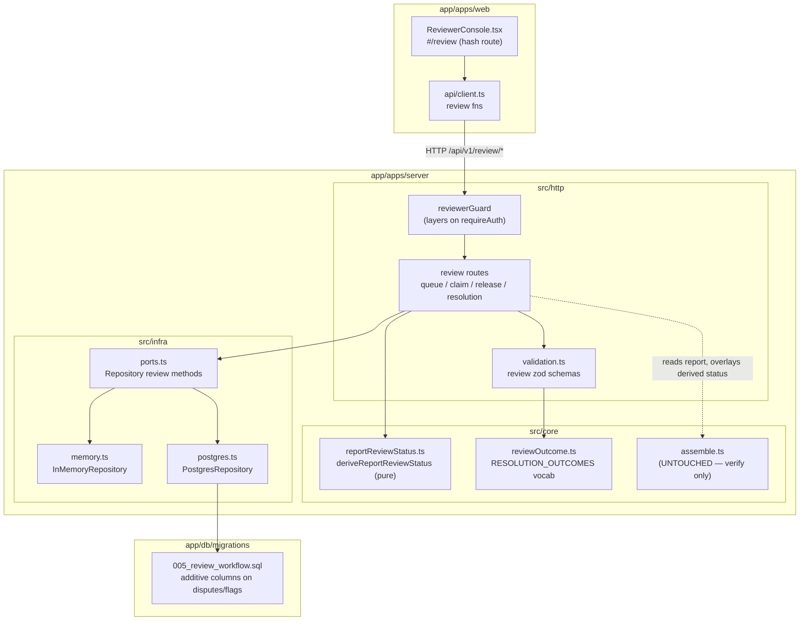
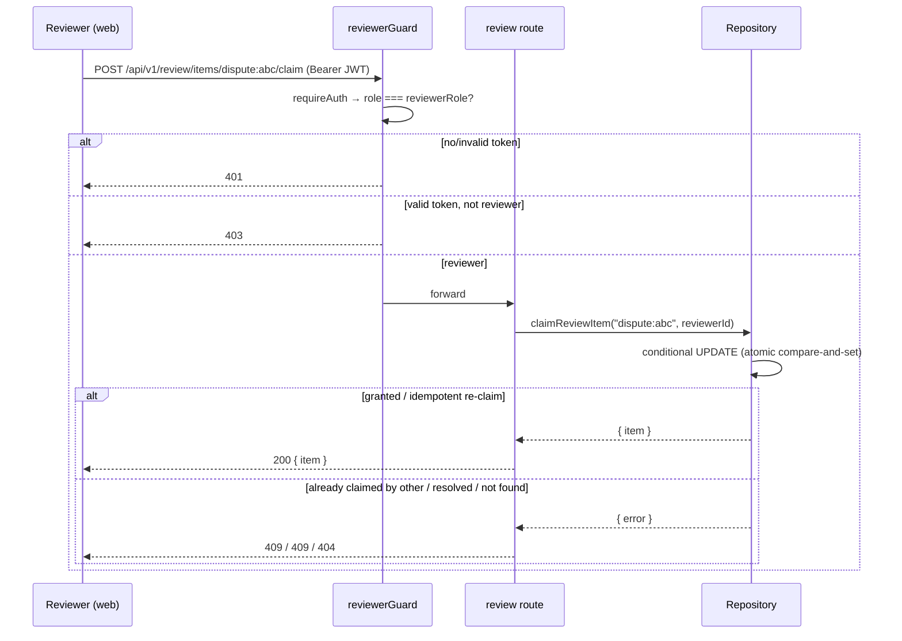
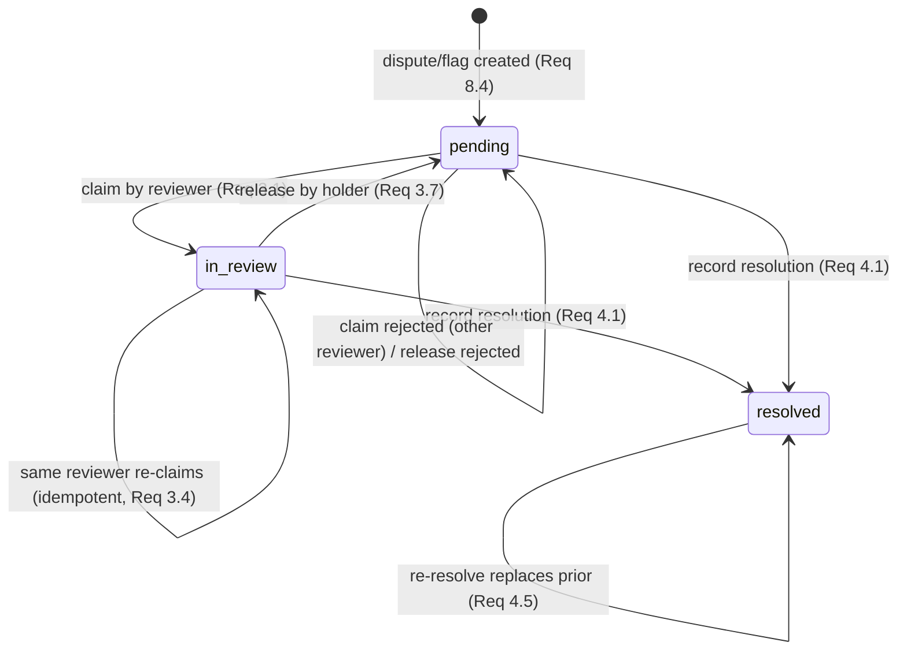

# Design Document

## Overview

The dispute/flag **intake** already ships; this feature adds the review **workflow** that lets authorized reviewers triage, claim, and resolve those intakes, and feeds the result back into the report's existing `Provenance.reviewStatus`.

The design follows the project's "lens, not a judge" compass and three hard constraints:

1. **The invariant gate is verify-only.** This feature never edits `core/assemble.ts`, and — critically — it never writes the report at all. The report's review status is **derived on read** from review state, not persisted into the report. Because no write path touches the report, gate-relevant fields (claims, framing signals, citations, evidence strengths, confidence) cannot change by construction. Requirements 5.4, 10.1–10.5 are satisfied structurally, then verified by a test.
2. **Persistence discipline.** Review state is added as **additive columns on the existing `disputes` and `flags` tables** (Migration_005), reached through new `Repository` methods, parameterized SQL only. No new query path bypasses the Repository.
3. **Neutrality.** The `Resolution_Outcome` vocabulary describes a report's **framing or evidence only**. No schema column, route field, enum value, or UI label carries a creator-reliability rating or a truthfulness verdict, and a static `Neutrality_Check` test fails the build if one appears.

### Key design decisions

| Decision | Choice | Rationale |
|---|---|---|
| Where review state lives | Additive columns on `disputes` + `flags` | Req 7.2 says "for each Dispute and each Flag"; a new `review_status` column defaulting to `pending` makes every existing **and** future intake a `pending` Review_Item with zero changes to the intake routes (Req 8.1, 8.3, 8.4). The memory repo's existing `disputes`/`flags` accessors then expose review state for free (Req 6.4). |
| Review_Item identity | `"{kind}:{sourceId}"` (e.g. `dispute:<uuid>`) | Disputes and flags have separate id spaces; encoding the kind in the id routes a claim/resolve to the correct table without a second lookup. |
| Report review status | **Derived on read**, never persisted | The strongest possible guarantee for Req 10: there is no code path that writes the report, so no path can alter a gate-relevant field. The Methodology page reads the overlaid value. |
| Claim atomicity | Single conditional `UPDATE ... WHERE review_status = 'pending'` | Postgres row locking grants exactly one concurrent winner (Req 3.5); the same predicate makes a same-reviewer re-claim idempotent (Req 3.4). The in-memory repo is atomic because each method runs to completion with no `await` between read and write on the single-threaded event loop. |
| Reviewer authorization | `Reviewer_Guard` layered on `requireAuth`, role from JWT `role` claim | Mirrors the existing `requireAuth` middleware and the degrade-and-warn ("fail closed") posture: absent reviewer-role config denies every review request and warns at startup without blocking startup (Req 1.6). |

## Architecture



Request flow for a review action:



## Components and Interfaces

### 1. Reviewer authorization — `src/http/auth.ts` (+ `config.ts`)

A new `reviewerGuard` middleware, applied **after** `requireAuth` on every review route:

```ts
// Admits only a Reviewer. Layered after requireAuth, so a missing/invalid token
// has already produced 401 (Req 1.2, 1.3). Here we only decide reviewer-or-not.
export function reviewerGuard(req: Request, res: Response, next: NextFunction): void {
  const role = config.reviewerRole;            // '' when unconfigured
  if (!role) {                                  // Req 1.6 — fail closed, deny all
    res.status(403).json({ error: 'reviewer_role_not_configured' });
    return;
  }
  if (req.user?.role !== role) {                // Req 1.4 — authenticated non-reviewer
    res.status(403).json({ error: 'not_a_reviewer' });
    return;
  }
  next();                                       // Req 1.1
}
```

- `config.reviewerRole` is read from `REVIEWER_ROLE` in `.env` (added to `config.ts` and `.env.example`), defaulting to `''`.
- Startup (`index.ts`/`compose.ts`) emits a degrade-and-warn line — `[auth] REVIEWER_ROLE absent — all review routes denied (fail closed)` — when it is empty, mirroring the telemetry/rate-limiter degrade pattern, and does **not** abort startup (Req 1.6).
- Routes mount it as `router.use('/review', requireAuth, reviewerGuard, ...)` or per-route, so it covers every listing and mutating review route (Req 1.5).

### 2. Review routes — `src/http/routes.ts`

Four routes under `/api/v1/review`, all `requireAuth + reviewerGuard`:

| Method & path | Purpose | Maps to |
|---|---|---|
| `GET /review/queue` | List Review_Items, optional `?status=` filter | Req 2 |
| `POST /review/items/:id/claim` | Claim a pending item | Req 3.1–3.6 |
| `POST /review/items/:id/release` | Release an item the caller holds | Req 3.7, 3.8 |
| `POST /review/items/:id/resolution` | Record a resolution | Req 4 |

`:id` is the Review_Item identifier `"{kind}:{sourceId}"`. A small parser splits it into `{ kind: 'dispute' | 'flag', sourceId }`; a malformed id yields `400 invalid_review_item_id`. Repository errors map to status codes:

- not found → `404 review_item_not_found`
- already claimed by another / status conflict → `409 review_item_conflict`
- release on an item the caller does not hold → `409 review_item_not_actionable` (release only; recording a resolution does not require a claim, so it never returns `not_actionable`)

### 3. Resolution vocabulary — `src/core/reviewOutcome.ts`

A single source of truth for the bounded, neutrality-safe `Resolution_Outcome` set, reused by the zod schema and the `Neutrality_Check`:

```ts
// Each value describes the report's FRAMING or EVIDENCE only — never the creator,
// never a truth verdict (Req 9.1, 9.3). Union type, matching types.ts convention.
export const RESOLUTION_OUTCOMES = [
  'framing_example_confirmed',   // a surfaced framing signal's evidenced example holds up
  'framing_example_weak',        // a surfaced framing signal's example is thin/unconvincing
  'evidence_adequately_cited',   // claims' asserted evidence strength matches their citations
  'evidence_overstated',         // a claim asserts more evidence strength than it cites
  'context_gap_noted',           // a useful missing-context item was identified
  'no_change_needed',            // review found nothing to adjust
  'needs_further_review',        // inconclusive / escalate
] as const;
export type ResolutionOutcome = (typeof RESOLUTION_OUTCOMES)[number];
```

There is deliberately **no** value such as "true", "false", "accurate", "misinformation", "unreliable", or any creator/channel descriptor.

### 4. Report review status — `src/core/reportReviewStatus.ts` (pure)

```ts
import type { Provenance } from '../types';

export type ReviewLifecycle = 'pending' | 'in_review' | 'resolved';

// Pure, offline. Derives the report's review status from its review items.
// Never mutates a report and never reads gate-relevant fields, so it cannot
// affect the invariant gate (Req 5, 10.2, 10.5).
export function deriveReportReviewStatus(
  current: Provenance['reviewStatus'],            // existing value (e.g. 'ai-generated')
  itemStatuses: ReviewLifecycle[],                // every review item for this report
): Provenance['reviewStatus'] {
  if (itemStatuses.length === 0) return current;                       // Req 5.5
  if (itemStatuses.some((s) => s !== 'resolved')) return 'under-dispute'; // Req 5.1
  return 'expert-reviewed';                                            // Req 5.2
}
```

The report read path (`GET /analyses/:id`, `GET /r/:slug`) overlays the derived value onto the **outgoing response object's** `provenance.reviewStatus`; the persisted report is never rewritten. `provenance` is not a gate input, so this overlay is invisible to `assembleReport`.

> ponytail: overlay-on-read adds one indexed `review items by report` read per report fetch. Ceiling: hot read path does an extra query. Upgrade path: cache the derived status alongside the report or maintain a counter column if it ever shows up in profiling. Offline/in-memory cost is negligible.

### 5. Repository methods — `src/infra/ports.ts`

Four new methods on the `Repository` interface (Req 6.1), plus the in-memory read accessor requirement (Req 6.4) satisfied by the existing `disputes`/`flags` arrays gaining review fields:

```ts
export type ReviewKind = 'dispute' | 'flag';
export type ReviewLifecycle = 'pending' | 'in_review' | 'resolved';

export interface ReviewItem {
  id: string;                 // "{kind}:{sourceId}"
  kind: ReviewKind;
  reportId: string;
  status: ReviewLifecycle;
  assignedReviewer: string | null;   // null when unassigned (Req 2.2)
  createdAt: string;          // ISO 8601
  // dispute-derived (Req 2.3)
  reason?: string;
  claimId?: string;           // only when the dispute carries one
  // flag-derived (Req 2.3)
  technique?: string;
  note?: string;              // only when the flag carries one
}

export interface ReviewResolutionInput {
  outcome: ResolutionOutcome;
  note?: string;              // <= 2000 chars (validated at the route)
  reviewer: string;           // resolving reviewer id
}

// Discriminated result so callers map outcomes to HTTP codes without exceptions
// for expected control flow (mirrors the repo's existing fail-soft style).
export type ReviewActionResult =
  | { ok: true; item: ReviewItem }
  | { ok: false; reason: 'not_found' | 'conflict' | 'not_actionable' };

export interface Repository {
  // ...existing methods unchanged...
  listReviewItems(filter?: { status?: ReviewLifecycle }): Promise<ReviewItem[]>;
  claimReviewItem(id: string, reviewer: string): Promise<ReviewActionResult>;
  releaseReviewItem(id: string, reviewer: string): Promise<ReviewActionResult>;
  recordReviewResolution(id: string, resolution: ReviewResolutionInput): Promise<ReviewActionResult>;
}
```

`createDispute`/`createFlag` signatures are **unchanged** (Req 8.1, 8.3); new intakes default to `pending` via column defaults (Postgres) and explicit initialization (memory).

### 6. In-memory implementation — `src/infra/memory.ts`

The existing `disputes` and `flags` arrays gain review fields, so the existing public accessors already expose review state (Req 6.4). Defaults are set on create:

```ts
readonly disputes: (DisputeRow & ReviewFields)[] = [];
readonly flags: (FlagRow & ReviewFields)[] = [];
// ReviewFields = { reviewStatus: ReviewLifecycle; assignedReviewer: string | null;
//                  resolution: { outcome: ResolutionOutcome; note?: string;
//                                reviewer: string; resolvedAt: string } | null }
```

- `createDispute`/`createFlag` push with `reviewStatus: 'pending', assignedReviewer: null, resolution: null` (Req 8.4).
- `claimReviewItem` resolves the kind from the id, finds the row, and applies an **atomic compare-and-set** (no `await` between read and write → no interleaving on the event loop, satisfying Req 3.5 in-process):
  - `pending` → set `assignedReviewer = reviewer`, `reviewStatus = 'in_review'` → `{ ok: true }` (Req 3.1)
  - `in_review` held by the **same** reviewer → no change, `{ ok: true }` (idempotent, Req 3.4)
  - `in_review` held by a **different** reviewer → `{ ok: false, reason: 'conflict' }` (Req 3.2)
  - `resolved` → `{ ok: false, reason: 'conflict' }` (Req 3.3)
  - id matches no row → `{ ok: false, reason: 'not_found' }` (Req 3.6)
- `releaseReviewItem`: if held by the caller (`in_review` + `assignedReviewer === reviewer`) → clear assignment, set `pending`, `{ ok: true }` (Req 3.7); otherwise `not_actionable` (Req 3.8, 6.7).
- `recordReviewResolution`: if the id matches any row (`pending`, `in_review`, or `resolved`) → store/overwrite the resolution, set `resolved` (Req 4.1, 4.5; resolution does not require a prior claim, and the overwrite means no duplicate item); only a missing id → `not_found` (Req 4.4).
- `listReviewItems`: project both arrays to `ReviewItem`, apply the optional status filter, sort by `createdAt` asc then `reportId` asc (Req 2.6); empty when nothing matches (Req 2.8, 6.8).

### 7. Postgres implementation — `src/infra/postgres.ts`

All four methods use parameterized SQL (Req 6.2). Examples:

```sql
-- claimReviewItem (kind=dispute). Atomic compare-and-set; the predicate makes a
-- same-reviewer re-claim a no-op success and grants exactly one concurrent winner.
UPDATE disputes
   SET assigned_reviewer = $1, review_status = 'in_review'
 WHERE id = $2
   AND (review_status = 'pending'
        OR (review_status = 'in_review' AND assigned_reviewer = $1))
RETURNING id;            -- rowCount 1 = granted/idempotent; 0 = inspect to classify
```

```sql
-- listReviewItems: a UNION of the two tables projected to the common shape,
-- ordered per Req 2.6. $1 is the optional status filter (NULL = no filter).
SELECT ('dispute:' || id) AS id, 'dispute' AS kind, report_id, review_status,
       assigned_reviewer, created_at, reason, claim_id, NULL AS technique, NULL AS note
  FROM disputes
 WHERE ($1::text IS NULL OR review_status = $1)
UNION ALL
SELECT ('flag:' || id), 'flag', report_id, review_status,
       assigned_reviewer, created_at, NULL, NULL, technique, note
  FROM flags
 WHERE ($1::text IS NULL OR review_status = $1)
 ORDER BY created_at ASC, report_id ASC;
```

When `rowCount = 0` on a claim/release, a follow-up parameterized `SELECT` classifies the failure (`not_found` vs `conflict`/`not_actionable`) so the route returns the right status code.

The resolution write does not gate on `review_status`: its predicate matches any existing row (`WHERE id = $n`) regardless of current status, setting `review_status = 'resolved'` and the `resolution_*` / `review_resolved_at` columns, so a resolution on a `pending`, `in_review`, or already-`resolved` row all succeed (Req 4.1, 4.5; an already-`resolved` row is simply overwritten, never duplicated). A `rowCount = 0` here means only that no row carries the id → `not_found` (Req 4.4).

### 8. Web Reviewer Console — `src/components/ReviewerConsole.tsx`

Reached through the `#/review` hash route, wired into `App.tsx`'s `View` union and hash handler (Hash routing only, no router dep). Behaviors:

- Lists items showing report context, dispute reason / flagged technique, status, and assignee with an explicit **"unassigned"** text label when null (Req 11.1).
- Keyboard-operable claim / release / submit-resolution controls; ARIA descriptions on interactive controls (Req 11.2, 11.3).
- Every color-coded status/outcome indicator is paired with a text label (color-never-alone) (Req 11.3).
- `@media (max-width: 768px)` → single column (Req 11.4).
- Distinct **loading**, **empty-queue**, and **error/sign-in** states, never a partial view (Req 11.5, 11.6, 11.7). Because the web app has no client-side auth flow yet (steering known limit), a `401`/`403` resolves to the sign-in/error state with a retry/back control — consistent with existing Flag behavior.
- On a successful action the displayed status/assignee update to the new state (Req 11.8); on failure (including a conflicting claim) the item is left unchanged, an error indication shows, and controls stay keyboard-operable for retry (Req 11.9).

New `api/client.ts` functions: `getReviewQueue(status?)`, `claimReviewItem(id)`, `releaseReviewItem(id)`, `resolveReviewItem(id, { outcome, note })` — mirroring the existing `submitDispute`/`submitFlag` fetch+throw style.

### 9. Validation — `src/http/validation.ts`

```ts
export const reviewQueueQuerySchema = z.object({
  status: z.enum(['pending', 'in_review', 'resolved']).optional(),   // Req 2.5
});
export const reviewResolutionSchema = z.object({
  outcome: z.enum(RESOLUTION_OUTCOMES),                              // Req 4.2, 4.3
  note: z.string().max(2000).optional(),                            // Req 4.3
});
```

An invalid `status` filter or out-of-set `outcome`/oversized note is rejected at the trust boundary with `400` and a field-named error, persisting nothing (Req 2.5, 4.3).

## Data Models

### Migration_005 — `app/db/migrations/005_review_workflow.sql`

Additive only; preserves every existing `disputes`/`flags` row and the intake route contracts (Req 7.3). Uses `IF NOT EXISTS` guards so re-running is a no-op (Req 7.6; the runner also swallows "already exists"). New columns default to `pending` so existing rows become `pending` Review_Items with no data backfill statement needed (Req 7.5).

```sql
-- f-Socials expert-review-queue — migration 005.
-- Additive review-workflow state on the existing disputes + flags tables.
-- Lens, not a judge: no column here expresses a creator-reliability rating or a
-- truthfulness verdict (Req 7.4, 9.1).

CREATE TYPE review_status_kind AS ENUM ('pending', 'in_review', 'resolved');
-- (wrapped in a DO $$ ... EXCEPTION WHEN duplicate_object $$ guard for re-run safety)

CREATE TYPE resolution_outcome AS ENUM (
  'framing_example_confirmed', 'framing_example_weak',
  'evidence_adequately_cited', 'evidence_overstated',
  'context_gap_noted', 'no_change_needed', 'needs_further_review'
);

-- disputes
ALTER TABLE disputes ADD COLUMN IF NOT EXISTS review_status     review_status_kind NOT NULL DEFAULT 'pending';
ALTER TABLE disputes ADD COLUMN IF NOT EXISTS assigned_reviewer TEXT;            -- NULL = unassigned
ALTER TABLE disputes ADD COLUMN IF NOT EXISTS resolution_outcome resolution_outcome;
ALTER TABLE disputes ADD COLUMN IF NOT EXISTS resolution_note   TEXT;
ALTER TABLE disputes ADD COLUMN IF NOT EXISTS resolved_by       TEXT;
ALTER TABLE disputes ADD COLUMN IF NOT EXISTS review_resolved_at TIMESTAMPTZ;    -- distinct from legacy resolved_at

-- flags (same six columns)
ALTER TABLE flags ADD COLUMN IF NOT EXISTS review_status     review_status_kind NOT NULL DEFAULT 'pending';
ALTER TABLE flags ADD COLUMN IF NOT EXISTS assigned_reviewer TEXT;
ALTER TABLE flags ADD COLUMN IF NOT EXISTS resolution_outcome resolution_outcome;
ALTER TABLE flags ADD COLUMN IF NOT EXISTS resolution_note   TEXT;
ALTER TABLE flags ADD COLUMN IF NOT EXISTS resolved_by       TEXT;
ALTER TABLE flags ADD COLUMN IF NOT EXISTS review_resolved_at TIMESTAMPTZ;

CREATE INDEX IF NOT EXISTS idx_disputes_review_status ON disputes (review_status);
CREATE INDEX IF NOT EXISTS idx_flags_review_status    ON flags (review_status);
CREATE INDEX IF NOT EXISTS idx_disputes_report        ON disputes (report_id);
```

Notes:
- The legacy `disputes.status` (`'open'`) and `disputes.resolution`/`resolved_at` columns are **left untouched** — the workflow uses the new `review_status`/`resolution_*`/`review_resolved_at` columns to avoid colliding with the legacy free-text status (Req 7.3).
- Column types are standard DDL and parameterized-query-compatible (Req 7.4).

### Type additions — `src/types.ts`

`ReviewKind`, `ReviewLifecycle`, `ResolutionOutcome` (union types, no TS enums, matching the file's convention and mapping 1:1 to the Postgres enums), plus the `ReviewItem`/`ReviewResolutionInput`/`ReviewActionResult` shapes (shown in §5). `Provenance.reviewStatus` is unchanged — the feature introduces **no new report review-status value** (Req 5.3).

### State machine for a Review_Item



Report_Review_Status (derived, not stored):
- any item `pending` or `in_review` → `under-dispute` (Req 5.1)
- all items `resolved` → `expert-reviewed` (Req 5.2)
- no items → unchanged existing value (Req 5.5)

## Correctness Properties

*A property is a characteristic or behavior that should hold true across all valid executions of a system — essentially, a formal statement about what the system should do. Properties serve as the bridge between human-readable specifications and machine-verifiable correctness guarantees.*

These properties target the feature's **pure and state-machine logic** (queue projection, the claim/release/resolve state machine, the report-status derivation, the gate overlay, and the neutrality check) — exactly where property-based testing earns its keep. Schema migration, HTTP authorization branches, and UI rendering are covered by integration, example, and accessibility tests in the Testing Strategy, not by properties. Each property is run with fast-check at a minimum of 100 runs and carries a `// Feature: expert-review-queue, Property <n>: …` comment plus a `Validates:` reference.

### Property 1: Queue projection fidelity

*For any* set of persisted Disputes and Flags, `listReviewItems` returns exactly one Review_Item per source row (no duplicate, no omission), and on each item every projected field equals the originating row's value: `reportId`, `kind`, `status`, `createdAt`, and `assignedReviewer` (null when unassigned); a dispute-derived item carries `reason` and carries `claimId` only when the Dispute has one and **no submitter-identity field of any kind**; a flag-derived item carries `technique` and carries `note` only when the Flag has one; and every item derived from a freshly created intake has `status === 'pending'`. Each item's id resolves to exactly one originating Dispute or Flag.

**Validates: Requirements 2.1, 2.2, 2.3, 4.6, 8.2, 8.4**

### Property 2: List filter and ordering contract

*For any* set of persisted Disputes and Flags and any valid `Review_Status` filter, `listReviewItems` returns precisely those items whose `status` equals the filter (every match included, every non-match excluded), and the returned items are ordered by `createdAt` ascending with ties broken by originating report id ascending — for any input, including rows that share a `createdAt`.

**Validates: Requirements 2.4, 2.6**

### Property 3: Claim idempotence

*For any* `pending` Review_Item and any Reviewer, claiming it one or more times in succession yields the same result as claiming it exactly once: `assignedReviewer` equals the claiming Reviewer and `status` equals `in_review`, with no further state change on the second and subsequent claims.

**Validates: Requirements 3.1, 3.4, 12.1**

### Property 4: Claim exclusivity under contention

*For any* `pending` Review_Item and any set of two or more distinct Reviewers claiming it (sequentially or concurrently), exactly one claim succeeds and every other claim is rejected as a conflict; the item's final `assignedReviewer` is the single winning Reviewer and its `status` is `in_review`, and a rejected claim leaves the existing assignment and status unchanged.

**Validates: Requirements 3.2, 3.5, 6.6**

### Property 5: Claim/release round-trip

*For any* `pending` Review_Item and any Reviewer, claiming it and then releasing it as that same Reviewer restores the item to its original state: `assignedReviewer` is null and `status` is `pending`.

**Validates: Requirements 3.7**

### Property 6: Resolution drives item and report status

*For any* report with one or more Review_Items, recording a `Review_Resolution` on a `pending` or `in_review` item persists the outcome, optional note, resolving Reviewer, and resolution timestamp and sets that item's `status` to `resolved` (resolution does not require a prior claim); recording a second resolution on an already-`resolved` item replaces the prior resolution, keeps `status` at `resolved`, and creates no duplicate item; and the derived `Report_Review_Status` is `under-dispute` while any sibling Review_Item for the report remains `pending` or `in_review`, becoming `expert-reviewed` exactly once every Review_Item for the report is `resolved`.

**Validates: Requirements 4.1, 4.5, 5.1, 5.2, 12.2**

### Property 7: Report-review-status derivation is total and bounded

*For any* existing `Report_Review_Status` value and any multiset of Review_Item statuses, `deriveReportReviewStatus` returns the unchanged existing value when the multiset is empty, `under-dispute` when any element is not `resolved`, and `expert-reviewed` when the multiset is non-empty and every element is `resolved`; the result is always one of the three existing values (`ai-generated`, `expert-reviewed`, `under-dispute`) and never a newly introduced value.

**Validates: Requirements 5.1, 5.2, 5.3, 5.5**

### Property 8: Invariant-gate preservation under overlay

*For any* gate-valid `AnalysisReport`, overlaying a derived `Report_Review_Status` onto its `provenance.reviewStatus` leaves every gate-relevant field identical — each claim's `evidenceStrength` and citation set, each framing signal's examples, the extracted claim count, and the `confidence` value — and re-running `assembleReport` over the report's gate inputs yields the same readiness `status` and the same `reasons` as before the overlay.

**Validates: Requirements 5.4, 10.2, 10.4, 10.5**

### Property 9: Neutrality is enforced and the outcome vocabulary is framing/evidence-only

*For any* accepted `Resolution_Outcome`, the value belongs to the approved framing/evidence-only set and matches no creator-reliability or truthfulness-verdict token; and *for any* scanned review surface (schema column names, route fields, the outcome vocabulary, the console labels), the `Neutrality_Check` passes when the surface contains no banned creator-reliability or truthfulness-verdict dimension and fails when any such dimension is injected.

**Validates: Requirements 9.3, 9.6, 12.5**

## Error Handling

The feature follows the codebase's established posture: validate at the trust boundary with zod, return typed JSON error bodies, and use discriminated results (not exceptions) for expected control flow.

| Condition | Surface | Response |
|---|---|---|
| No / invalid bearer token on a review route | `requireAuth` | `401 { error: 'auth_required' \| 'invalid_token' }` (Req 1.2, 1.3) |
| Authenticated non-reviewer | `reviewerGuard` | `403 { error: 'not_a_reviewer' }` (Req 1.4) |
| `REVIEWER_ROLE` unconfigured | `reviewerGuard` | `403 { error: 'reviewer_role_not_configured' }` for every review request; startup warning, no startup abort (Req 1.6) |
| Malformed Review_Item id | route param parser | `400 { error: 'invalid_review_item_id' }` |
| Invalid `?status=` filter | `reviewQueueQuerySchema` | `400 { error: 'invalid_input', details }`, no items (Req 2.5) |
| Out-of-set outcome / note > 2000 | `reviewResolutionSchema` | `400 { error: 'invalid_input', details }`, nothing persisted (Req 4.3) |
| Claim/release/resolve on unknown id | Repository → route | `404 { error: 'review_item_not_found' }`, no state change (Req 3.6, 4.4) |
| Claim on item held by another / resolved | Repository → route | `409 { error: 'review_item_conflict' }`, state unchanged (Req 3.2, 3.3) |
| Release on an item the caller does not hold | Repository → route | `409 { error: 'review_item_not_actionable' }`, state unchanged (Req 3.8, 6.7). Recording a resolution does not require a claim, so a `pending` item resolves normally and never returns `not_actionable`. |
| Postgres normalized-write failure | Repository | Not applicable — review writes are single-statement conditional updates; a failed update returns a discriminated `not_found`/`conflict`, never a partial state |
| Web: review route unreachable or 401/403 | `ReviewerConsole` | Error / sign-in state with retry + back control; controls stay keyboard-operable (Req 11.6, 11.9) |

Repository methods return `ReviewActionResult` (`{ ok: true, item }` or `{ ok: false, reason }`); the route layer maps `reason` to the status codes above. This keeps "already claimed" and "not found" as ordinary, testable return values rather than thrown errors, matching the repo's existing fail-soft style (e.g. `saveAuditRecord`).

## Testing Strategy

**Dual approach.** Property-based tests (fast-check, ≥100 runs) cover the universal logic in the Correctness Properties; example, edge-case, integration, and accessibility tests cover authorization branches, validation rejections, the migration, and the web console — the surfaces where input variation does not add coverage.

**Server property tests** (`node:test` + `node:assert`, fast-check), each tagged `// Feature: expert-review-queue, Property <n>: …` with a `Validates: Requirements …` reference and added to the explicit server test file list in `apps/server/package.json`:

- `test/review.projection.test.ts` — Property 1 (queue projection fidelity, incl. no submitter identity on dispute items).
- `test/review.listContract.test.ts` — Property 2 (filter subset + ordering with timestamp-tie generators).
- `test/review.claimIdempotent.test.ts` — Property 3 (claim idempotence). **Mandated by Req 12.1.**
- `test/review.claimExclusive.test.ts` — Property 4 (exactly one winner under sequential and concurrent claims).
- `test/review.releaseRoundTrip.test.ts` — Property 5 (claim→release restores pending/unassigned).
- `test/review.resolutionStatus.test.ts` — Property 6 (resolution → resolved, replace-on-repeat, derived report status). **Mandated by Req 12.2.**
- `test/review.statusDerivation.test.ts` — Property 7 (pure derivation, total + bounded, empty boundary 5.5).
- `test/review.gatePreserve.test.ts` — Property 8 (overlay preserves gate fields; `assembleReport` unchanged). Reuses `gateValidReportArbitrary` from `test/reportGraph.arb.ts`.
- `test/review.neutrality.prop.test.ts` — Property 9 (neutrality meta-check + outcome-vocab). **Satisfies Req 12.5.**

A shared `test/review.arb.ts` generator produces random Disputes/Flags with review state (mirroring `reportGraph.arb.ts`), with a guarded self-check at the bottom.

**Server example / edge / smoke tests** (added to the same list):

- `test/review.authz.test.ts` — Req 1.1–1.5 (valid reviewer 200; no token 401; bad token 401; non-reviewer 403; every route guarded), using the `req.user` stub pattern from `flag.persist.test.ts`.
- `test/review.failClosed.test.ts` — Req 1.6 (empty `REVIEWER_ROLE` denies all; startup does not abort).
- `test/review.validation.test.ts` — Req 2.5, 4.2, 4.3 (filter + outcome + note bounds; each enumerated outcome accepted; junk rejected).
- `test/review.edges.test.ts` — Req 2.7, 3.3, 3.6, 3.8, 6.7, 6.8 (resolved/unknown/non-holder branches, empty list).
- `test/review.offline.test.ts` — Req 6.3, 6.4 (every method runs on `InMemoryRepository` with zero keys; review fields readable via public accessors).
- `test/review.neutralityStatic.test.ts` — Req 7.4, 9.1, 9.2, 9.5 (static scan of migration SQL, route fields, vocab, console labels — mirrors `reportGraph.neutralityStatic.test.ts`).
- Req 8.1, 8.3, 8.5, 8.6 are already covered by the existing `dispute.persist.test.ts`, `flag.persist.test.ts`, and `flag.unauth.test.ts`; this feature adds a regression assertion that a created intake surfaces as a `pending` Review_Item.

**Migration integration tests** (`apps/server` `test:integration` script, run against a real/mock Postgres — Req 7 is INTEGRATION, not PBT):

- `test/review.migration.test.ts` — Req 7.1, 7.2, 7.3, 7.5, 7.6 (005 applies, adds columns/constraints, preserves seeded rows, sets existing rows to `pending`, re-run is a no-op). Mirrors the existing `reportGraph.migration.test.ts`.

**Web tests** (Vitest + React Testing Library, mirroring existing `colorText`/`a11ySmoke`/`emptySections` patterns) — Req 11 is UI rendering, so example/accessibility tests, not PBT:

- `ReviewerConsole.test.tsx` — list rendering with "unassigned" label (11.1), keyboard operability (11.2), color-never-alone + ARIA (11.3), single-column ≤768px (11.4), empty (11.5), error/sign-in (11.6), loading (11.7), success update (11.8), failure-unchanged (11.9).
- `ReviewerConsole.honestAbsence.test.tsx` — Req 9.4 (no-evidence report renders the labeled "no external review found" state, no substitute verdict).

**Why no property tests for migration, authorization, and UI.** The migration is declarative DDL (snapshot/integration, not "for all inputs"); the authorization decision is a small finite branch best pinned by concrete tokens; UI rendering is verified by snapshot/RTL/axe. None of these have a meaningful "for all inputs X, P(X) holds" statement that 100 random runs would strengthen.

**Run before claiming done** (per steering): in `apps/server`, `npm test` + `npm run typecheck`; in `apps/web`, `npx vitest run` + `tsc -b`. The migration integration suite runs via `npm run test:integration` when a database is configured.
