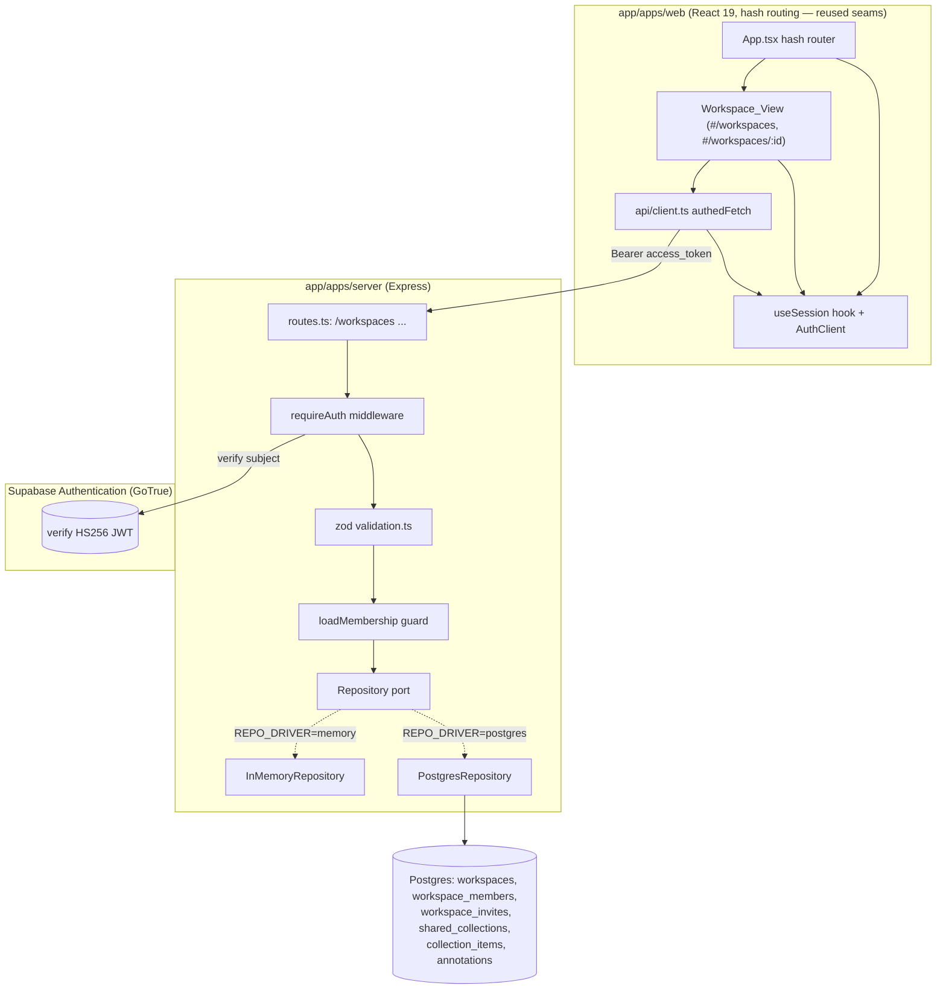

# Design Document

## Overview

This feature is the **institutional workspace** slice: shared collections and classroom annotation built directly on top of the just-shipped `accounts-save-history` slice. Where `accounts-save-history` made f-Socials useful to an *individual* reader (client-side Supabase auth + per-reader save/history keyed on the JWT subject), this feature extends the **same identity and persistence patterns to a group**: an Authenticated Reader can create a Workspace, invite colleagues with a redeemable code, curate analyzed reports into Shared_Collections, and annotate reports together — all scoped to the reader's Membership.

The work is deliberately narrow and follows the established precedent exactly:

- **Server (`app/apps/server`)** — a set of new `requireAuth`-gated routes under `/api/v1/workspaces`, their zod validation, and new `Repository` methods implemented in both the in-memory and Postgres drivers. A small in-handler membership/role guard turns the verified JWT subject into the authorization decision.
- **Schema** — one additive migration `007_workspaces.sql`, the next after `006_saved_reports.sql`, keying Membership on the Supabase JWT subject (`TEXT`) exactly as `006` keys `reader_saved_reports`.
- **Web (`app/apps/web`)** — new Workspace_View surfaces under the `#/workspaces` hash path, reusing the existing `AuthClient` seam, `useSession` hook, and `authedFetch` session-aware API layer with no new auth code and no router dependency.

Three hard constraints from the steering shape every decision:

1. **Lens, not a judge.** No Workspace surface or API response carries a truthfulness verdict or a creator-reliability rating; source tiers attach only to sources/citations. An Annotation is a Reader-authored note the system never converts into a creator rating or a verdict (Req 10).
2. **The invariant gate is read-only.** `core/assemble.ts` is byte-for-byte untouched; report content is referenced by identifier and consumed unchanged (Req 11).
3. **Offline-first survives.** With no Supabase configuration the Workspace_View degrades gracefully and the rest of the app keeps working; with the in-memory repository and no API keys, every workspace operation completes without error (Req 9.10, Req 12).

### Key design decisions

- **Reader identity is the verified JWT subject (`req.user.id`), stored as `TEXT`.** This follows the convention proven by `005` (`assigned_reviewer`/`resolved_by`) and `006` (`reader_saved_reports.reader_id`), not the legacy `users(id)` UUID. Supabase subjects are not provisioned into the local `users` table, so Membership keys on the subject directly (Req 9.5).
- **Authorization is a single pure decision over Membership + Role.** Nearly every access-control criterion (Req 2.2, 3.3, 3.5, 5.3, 5.6, 6.7, 7.4, 7.8, 8.2, 8.3, 8.5) reduces to two predicates: *is this reader a member of this workspace?* (else 403) and *for an owner-only operation, is the reader's role `owner`?* (else 403). Centralizing this as a `loadMembership` helper in the route layer — backed by a single `getMembership` repository read — keeps the rule in one place and the route handlers thin. Workspace non-existence is checked first so a missing workspace yields 404 and an existing-but-not-mine workspace yields 403 (Req 8.7 vs 8.2).
- **Persistence goes through new `Repository` methods only.** Route handlers contain zero SQL (Req 9.1); the Postgres driver uses parameterized SQL exclusively (Req 9.6); the in-memory driver mirrors its results (Req 9.2). This is the same port-first discipline used for saved reports.
- **The web layer adds views, not infrastructure.** The `AuthClient`, `useSession`, session restore/refresh, 401-teardown, and `authedFetch` Bearer attachment already exist from `accounts-save-history`. This feature adds Workspace_View components and new `authedFetch` calls; it reuses the existing hash router and the existing degraded-path detection (`isAuthConfigured`). No new dependency is introduced (Req 13.1).

## Architecture



Representative request flow for *add a report to a collection*:

1. A Workspace_Member activates the add control. With an active session, `authedFetch` POSTs the workspace/collection route with `Authorization: Bearer <access_token>` (Req 13.2, 13.3).
2. `requireAuth` verifies the token → 401 on failure (Req 8.1). zod validates the path/body params → 400 on malformed (Req 8.4).
3. `loadMembership(repo, workspaceId, readerId)` runs: workspace missing → 404 (Req 8.7); reader not a member → 403 (Req 8.2).
4. The route loads the target report by identifier → 404 if absent (Req 6.3), then calls `repo.addCollectionItem(collectionId, reportId)` — idempotent (Req 6.2).
5. On success the web app reflects the updated collection; the API response carries only neutral association fields — no verdict, no creator rating (Req 10.5).

The server never holds client-side auth; it only verifies tokens. CORS, rate limiting, `requireAuth`, and the analysis pipeline are unchanged and reused.

## Components and Interfaces

### Server

#### Repository port additions (`src/infra/ports.ts`)

New types and methods are added to the `Repository` interface. They are the only persistence path for Workspace data (Req 9.1), and both drivers must return equivalent results for identical inputs (Req 9.2). All reads and writes are scoped by workspace and, where relevant, by the verified reader subject.

```ts
export type WorkspaceRole = 'owner' | 'member';

// Lens-safe projections. None of these carry a content-truthfulness verdict or a
// creator-reliability rating; a Report is referenced by identifier only (Req 10.4, 10.5).
export interface WorkspaceSummary {
  id: string;
  name: string;
  role: WorkspaceRole; // the requesting reader's role in this workspace
}

export interface Membership {
  readerId: string;    // Supabase JWT subject (TEXT)
  role: WorkspaceRole;
}

export interface SharedCollection {
  id: string;
  name: string;
}

export interface CollectionItemEntry {
  reportId: string;
  addedAt: string; // ISO 8601
}

export interface Annotation {
  id: string;
  workspaceId: string;
  reportId: string;
  authorId: string;  // Supabase JWT subject (TEXT)
  text: string;
  createdAt: string; // ISO 8601
  updatedAt: string; // ISO 8601
}

export interface Repository {
  // ...existing members unchanged...

  // --- Workspaces & membership ---
  // Creates a Workspace owned by ownerId and the owner's Owner-Role Membership in
  // one operation; returns the new workspace with the owner's role (Req 1.1).
  createWorkspace(ownerId: string, name: string): Promise<WorkspaceSummary>;
  // Returns every Workspace in which readerId holds a Membership, each with that
  // reader's role; [] when none (Req 4.1, 4.2, 4.3). Excludes all others (Req 9.8).
  listWorkspacesForReader(readerId: string): Promise<WorkspaceSummary[]>;
  // The authorization read: the reader's role in the workspace, or undefined when
  // the reader holds no Membership there (Req 8.2, 8.5).
  getMembership(workspaceId: string, readerId: string): Promise<WorkspaceRole | undefined>;
  // Distinguishes 404 (no such workspace) from 403 (exists, not a member): true iff
  // the workspace exists (Req 8.7).
  workspaceExists(workspaceId: string): Promise<boolean>;
  // Members of one workspace only (Req 3.1, 9.8).
  listMembers(workspaceId: string): Promise<Membership[]>;
  // Deletes the member's Membership. Caller has already enforced owner-only and the
  // not-self rule; idempotent on an absent membership (Req 3.2).
  removeMember(workspaceId: string, readerId: string): Promise<void>;

  // --- Invitations ---
  // Generates an opaque Invite_Code bound to the workspace and returns its value
  // (Req 2.1). Caller has already enforced owner-only (Req 2.2).
  createInvite(workspaceId: string): Promise<string>;
  // Redeems a code: undefined when the code matches no workspace (Req 2.4); else
  // creates a Member-Role Membership for readerId if absent and returns the bound
  // workspace id + the reader's (possibly pre-existing) role — idempotent, never
  // duplicating a membership nor changing an existing role (Req 2.3, 2.5).
  redeemInvite(code: string, readerId: string): Promise<{ workspaceId: string; role: WorkspaceRole } | undefined>;

  // --- Shared collections ---
  createCollection(workspaceId: string, name: string): Promise<SharedCollection>;
  // Collections of one workspace only (Req 5.2, 9.8).
  listCollections(workspaceId: string): Promise<SharedCollection[]>;
  // Deletes the collection AND its Collection_Items (Req 5.5). Scoped to workspace so
  // a collection id from another workspace is never touched.
  deleteCollection(workspaceId: string, collectionId: string): Promise<void>;

  // --- Collection items ---
  // Idempotent: at most one Collection_Item per (collection, report); a repeat add
  // keeps the single existing row and its addedAt (Req 6.2, 9.7).
  addCollectionItem(collectionId: string, reportId: string): Promise<void>;
  // Idempotent: removing an absent item is a no-op success leaving others unchanged
  // (Req 6.6).
  removeCollectionItem(collectionId: string, reportId: string): Promise<void>;
  // Reverse-chronological (addedAt DESC), deterministic tie-break by reportId DESC
  // so equal-timestamp rows keep a stable order across reloads (Req 6.4).
  listCollectionItems(collectionId: string): Promise<CollectionItemEntry[]>;

  // --- Annotations ---
  createAnnotation(input: { workspaceId: string; reportId: string; authorId: string; text: string }): Promise<Annotation>;
  // Annotations for one report within one workspace, most-recently-created first
  // with a deterministic tie-break; excludes every other workspace's (Req 7.2, 9.8).
  listAnnotations(workspaceId: string, reportId: string): Promise<Annotation[]>;
  // Authorization read for edit/delete: the annotation's workspace + author, or
  // undefined when no such annotation exists (Req 7.4, 7.5).
  getAnnotation(annotationId: string): Promise<Annotation | undefined>;
  // Updates only the text and updatedAt (Req 7.3). Caller has enforced authorization.
  updateAnnotation(annotationId: string, text: string): Promise<void>;
  // Deletes the annotation (Req 7.5). Caller has enforced authorization.
  deleteAnnotation(annotationId: string): Promise<void>;
}
```

Every projection returned to the route layer is lens-safe by construction: it carries identifiers, names, a role, timestamps, and annotation text only — never a tier, verdict, or creator rating (Req 10.4, 10.5).

#### In-memory implementation (`src/infra/memory.ts`)

State mirrors the Postgres tables one-for-one, so the two drivers stay observably identical (Req 9.2):

```ts
private workspaces = new Map<string, { id: string; name: string; ownerId: string; createdAt: string }>();
// Map<workspaceId, Map<readerId, { role, joinedAt }>> — at most one Membership per
// (workspace, reader) by construction, mirroring PRIMARY KEY (workspace_id, reader_id).
private membersByWorkspace = new Map<string, Map<string, { role: WorkspaceRole; joinedAt: string }>>();
private invites = new Map<string, string>();                 // code -> workspaceId
private collections = new Map<string, { id: string; workspaceId: string; name: string; createdAt: string }>();
// Map<collectionId, Map<reportId, addedAt>> — at most one item per (collection, report).
private itemsByCollection = new Map<string, Map<string, string>>();
private annotations = new Map<string, Annotation>();         // annotationId -> Annotation
```

- `createWorkspace`: generate a UUID, store the workspace, and seed `membersByWorkspace[id]` with `{ [ownerId]: { role: 'owner', ... } }` atomically.
- `getMembership` / `workspaceExists` / `listMembers` / `listWorkspacesForReader`: pure reads over the maps; `listWorkspacesForReader` scans memberships and projects each reader-held workspace to `{ id, name, role }`.
- `redeemInvite`: resolve `code → workspaceId` (undefined ⇒ no match); if the reader already has a Membership, return it unchanged (idempotent, role preserved); else insert `{ role: 'member' }`.
- `addCollectionItem` / `removeCollectionItem` / `listCollectionItems`: same shape as the saved-report methods — keep the original `addedAt` on a repeat add, no-op on absent remove, sort `addedAt` DESC then `reportId` DESC.
- `deleteCollection`: drop the collection and its `itemsByCollection` entry together.
- Annotation methods: store/read/update/delete by id; `listAnnotations` filters by `workspaceId` + `reportId`, sorts `createdAt` DESC then `id` DESC.

Each method runs to completion with no `await` between its read and write, so on the single-threaded event loop it is atomic by construction — the same reasoning as the existing review and saved-report methods.

#### Postgres implementation (`src/infra/postgres.ts`)

All operations use parameterized SQL only (Req 9.6). Representative statements:

```sql
-- createWorkspace (two writes in one logical op; owner membership seeded)
INSERT INTO workspaces (id, name, owner_id) VALUES ($1, $2, $3);
INSERT INTO workspace_members (workspace_id, reader_id, role) VALUES ($1, $3, 'owner');

-- getMembership (the authorization read)
SELECT role FROM workspace_members WHERE workspace_id = $1 AND reader_id = $2;

-- listWorkspacesForReader (reader-scoped)
SELECT w.id, w.name, m.role
FROM workspace_members m JOIN workspaces w ON w.id = m.workspace_id
WHERE m.reader_id = $1
ORDER BY w.name ASC, w.id ASC;

-- redeemInvite (idempotent membership; keeps existing role)
INSERT INTO workspace_members (workspace_id, reader_id, role)
VALUES ($1, $2, 'member')
ON CONFLICT (workspace_id, reader_id) DO NOTHING;

-- addCollectionItem (idempotent upsert; keeps original added_at)
INSERT INTO collection_items (collection_id, report_id)
VALUES ($1, $2) ON CONFLICT (collection_id, report_id) DO NOTHING;

-- listCollectionItems (deterministic order)
SELECT report_id, added_at FROM collection_items
WHERE collection_id = $1 ORDER BY added_at DESC, report_id DESC;

-- listAnnotations (workspace + report scoped, deterministic order)
SELECT id, workspace_id, report_id, author_id, text, created_at, updated_at
FROM annotations WHERE workspace_id = $1 AND report_id = $2
ORDER BY created_at DESC, id DESC;
```

The two writes in `createWorkspace` and the cascade in `deleteCollection` run inside a single transaction (`BEGIN … COMMIT`) so a workspace can never exist without its owner Membership and a deleted collection never orphans items. A backing-store failure propagates as a rejected promise so the route maps it to a 5xx and existing rows are left unchanged (Req 9.9); these are authoritative writes and must not be silently swallowed.

#### Routes (`src/http/routes.ts`)

All routes are behind `requireAuth` (Req 8.1); the reader is always the verified `req.user!.id`. Workspace-scoped routes additionally call the `loadMembership` guard before any read or write.

`loadMembership(repo, workspaceId, readerId)` — the single authorization decision (Req 8.2, 8.3, 8.5, 8.7):

```
if (!(await repo.workspaceExists(workspaceId))) -> 404            // Req 8.7
const role = await repo.getMembership(workspaceId, readerId)
if (role === undefined) -> 403                                   // Req 8.2
return role                                                       // 'owner' | 'member'
```

Owner-only operations additionally require `role === 'owner'`, else 403 (Req 8.3).

| Method & path | Auth / scope | Validation | Success | Errors |
|---|---|---|---|---|
| `POST /api/v1/workspaces` | requireAuth | name 1–100 | `201 { id, name, role: 'owner' }` (Req 1.1, 1.2) | 400 name, 401 |
| `GET /api/v1/workspaces` | requireAuth | — | `200 WorkspaceSummary[]` (`[]` when none, Req 4.3) | 401 |
| `POST /api/v1/workspaces/:id/invites` | member + owner-only | — | `200 { code }` (Req 2.1) | 401, 403 non-owner (Req 2.2), 404 |
| `POST /api/v1/invites/:code/redeem` | requireAuth | code shape | `200 { workspaceId, role: 'member' }` (Req 2.3) | 401, 404 unknown code (Req 2.4) |
| `GET /api/v1/workspaces/:id/members` | member | — | `200 Membership[]` (Req 3.1) | 401, 403, 404 |
| `DELETE /api/v1/workspaces/:id/members/:readerId` | member + owner-only | readerId non-empty | `200 { ok: true }` (Req 3.2) | 400 self-removal (Req 3.4), 401, 403 (Req 3.3), 404 |
| `POST /api/v1/workspaces/:id/collections` | member | name 1–100 | `201 { id, name }` (Req 5.1) | 400, 401, 403, 404 |
| `GET /api/v1/workspaces/:id/collections` | member | — | `200 SharedCollection[]` (Req 5.2) | 401, 403, 404 |
| `DELETE /api/v1/workspaces/:id/collections/:cid` | member + owner-only | cid uuid | `200 { ok: true }` (Req 5.5) | 401, 403 non-owner (Req 5.6), 404 |
| `POST /api/v1/workspaces/:id/collections/:cid/items` | member | cid uuid, body reportId uuid | `200 { ok: true }` (Req 6.1) | 400, 401, 403, 404 report missing (Req 6.3) |
| `GET /api/v1/workspaces/:id/collections/:cid/items` | member | cid uuid | `200 CollectionItemEntry[]` (Req 6.4) | 401, 403, 404 |
| `DELETE /api/v1/workspaces/:id/collections/:cid/items/:reportId` | member | cid + reportId uuid | `200 { ok: true }` (success even if absent, Req 6.5, 6.6) | 400, 401, 403, 404 |
| `POST /api/v1/workspaces/:id/reports/:reportId/annotations` | member | reportId uuid, body text 1–4000 | `201 Annotation` (Req 7.1) | 400 (Req 7.6), 401, 403, 404 report missing (Req 7.7) |
| `GET /api/v1/workspaces/:id/reports/:reportId/annotations` | member | reportId uuid | `200 Annotation[]` (Req 7.2) | 401, 403, 404 |
| `PATCH /api/v1/workspaces/:id/annotations/:aid` | member + author-or-owner | aid uuid, body text 1–4000 | `200 { ok: true }` (Req 7.3) | 400 (Req 7.6), 401, 403 (Req 7.4), 404 |
| `DELETE /api/v1/workspaces/:id/annotations/:aid` | member + author-or-owner | aid uuid | `200 { ok: true }` (Req 7.5) | 401, 403 (Req 7.4), 404 |

Notes:
- **404-before-403 information policy.** `loadMembership` returns 404 only for a non-existent workspace (Req 8.7); an existing workspace the reader does not belong to returns 403 (Req 8.2). This is the order the requirements specify.
- **Annotation edit/delete authorization** uses one predicate: the requester is the author **or** holds the Owner Role in the annotation's workspace. This satisfies Req 7.3 (author edits), Req 7.5 (author or owner deletes), and Req 7.4 (anyone else → 403). The annotation's workspace and author come from `repo.getAnnotation(aid)`; an annotation whose `workspaceId` does not match the path `:id`, or that does not exist, yields 404.
- **Self-removal guard** (Req 3.4): removing `:readerId === req.user!.id` when that reader is the owner returns 400 before any delete; the owner Membership is left unchanged.
- **Report existence** for collection-add and annotation-create is checked with the existing `repo.getReport(reportId)` → 404 when absent (Req 6.3, 7.7), mirroring the flags/save routes.
- **Auth unconfigured**: when the JWT secret is unconfigured, `requireAuth` already yields 401 via `optionalAuth`'s `auth_not_configured` path, satisfying Req 8.6 with no new code.
- **Telemetry** (where emitted) carries the workspace id and/or report id only — never the reader id, mirroring the flag/save event convention (Req 10 neutrality).

#### Validation (`src/http/validation.ts`)

New zod schemas at the trust boundary (Req 8.4). Names and annotation text are bounded; ids reuse the existing UUID param pattern:

```ts
export const workspaceNameSchema = z.object({ name: z.string().trim().min(1).max(100) });
export const collectionNameSchema = z.object({ name: z.string().trim().min(1).max(100) });
export const collectionItemSchema = z.object({ reportId: z.string().uuid() });
export const annotationTextSchema = z.object({ text: z.string().min(1).max(4000) });
export const inviteCodeParam = z.string().min(1).max(200);
// reportIdParam (UUID) already exists from accounts-save-history and is reused for
// :cid / :aid / :reportId path params.
```

Malformed bodies/params are rejected with 400 before any persistence side effect (Req 8.4, 1.4, 5.4, 7.6).

### Web

The web layer reuses the `accounts-save-history` seams unchanged and adds Workspace_View components plus new `authedFetch` calls.

- **API layer (`src/api/client.ts`)** — new session-aware calls, each routed through the existing `authedFetch(path, init, accessToken)` so the `Authorization: Bearer` header is attached whenever a session is active and omitted otherwise (Req 13.2, 13.3), and a `401 → AuthExpiredError` triggers the existing session teardown (Req 13.5): `createWorkspace`, `listWorkspaces`, `createInvite`, `redeemInvite`, `listMembers`, `removeMember`, `createCollection`, `listCollections`, `deleteCollection`, `addCollectionItem`, `listCollectionItems`, `removeCollectionItem`, `createAnnotation`, `listAnnotations`, `editAnnotation`, `deleteAnnotation`. A `403` surfaces as a typed `WorkspaceForbiddenError` the views render as an access message (Req 13.6). Mirrored types (`WorkspaceSummary`, `Membership`, `SharedCollection`, `CollectionItemEntry`, `Annotation`) are added to `src/api/types.ts`.
- **Views (`src/components/`)** — Workspace_View under `#/workspaces` (list of the reader's workspaces + create + redeem-invite) and `#/workspaces/:id` (members, collections, collection items, annotations). Reuses the existing hash router in `App.tsx`; no third-party router (Req 13.1). When the reader holds zero Memberships, the list shows an empty-state and the create control (Req 4.5). When not Auth_Configured, the view renders the workspace-features-unavailable message and **no** create/redeem forms (Req 12.1, 12.3); when anonymous but configured, opening a Workspace_View routes to sign-in and retains the target view for post-sign-in return (Req 13.4).
- **Neutrality & a11y** — views render report references, annotation text (attributed to its authoring reader as a note, never a verdict or rating — Req 10.6), names, and roles only; no verdict, no creator rating, and any source tier shown stays attached to a source/citation (Req 10.1–10.3). Every color/icon signal has an adjacent text label (Req 14.2), every interactive control is keyboard-reachable/activatable with a visible focus indicator and an accessible name+role (Req 14.1, 14.3, 14.7), status messages use an ARIA live region (Req 14.8), the layout is single-column at 200–768px (Req 14.4), the accent is muted teal `#0d9488` (Req 14.5), and icons come from `lucide-react` (Req 14.6).

## Data Models

### Migration `007_workspaces.sql`

Migration `007` is **additive only** (Req 9.3): it creates new tables and indexes, preserves every pre-existing row, and changes no existing route's request/response shape. It applies in lexical order after `006_saved_reports.sql` (Req 9.4). Every reader-identity column is `TEXT` holding the Supabase JWT subject, following the `006` convention (Req 9.5).

```sql
-- f-Socials institutional-workspace — migration 007.
-- Additive: shared workspaces (collections + classroom annotation) keyed by the
-- Supabase JWT subject (TEXT), following the identity convention of migration 006
-- (reader_saved_reports.reader_id). Re-run safe: IF NOT EXISTS throughout.
-- Lens, not a judge: no column expresses a creator rating or truthfulness verdict;
-- an annotation is a reader-authored note only.

CREATE TABLE IF NOT EXISTS workspaces (
  id         UUID        PRIMARY KEY,
  name       TEXT        NOT NULL,
  owner_id   TEXT        NOT NULL,                 -- Supabase auth subject (JWT sub)
  created_at TIMESTAMPTZ NOT NULL DEFAULT now()
);

CREATE TABLE IF NOT EXISTS workspace_members (
  workspace_id UUID        NOT NULL REFERENCES workspaces(id) ON DELETE CASCADE,
  reader_id    TEXT        NOT NULL,               -- Supabase auth subject (JWT sub)
  role         TEXT        NOT NULL CHECK (role IN ('owner','member')),
  joined_at    TIMESTAMPTZ NOT NULL DEFAULT now(),
  PRIMARY KEY (workspace_id, reader_id)            -- at-most-one Membership (Req 2.5)
);
CREATE INDEX IF NOT EXISTS idx_workspace_members_reader
  ON workspace_members (reader_id);               -- reader's workspace list (Req 4.1)

CREATE TABLE IF NOT EXISTS workspace_invites (
  code         TEXT        PRIMARY KEY,            -- opaque redeemable token
  workspace_id UUID        NOT NULL REFERENCES workspaces(id) ON DELETE CASCADE,
  created_at   TIMESTAMPTZ NOT NULL DEFAULT now()
);

CREATE TABLE IF NOT EXISTS shared_collections (
  id           UUID        PRIMARY KEY,
  workspace_id UUID        NOT NULL REFERENCES workspaces(id) ON DELETE CASCADE,
  name         TEXT        NOT NULL,
  created_at   TIMESTAMPTZ NOT NULL DEFAULT now()
);
CREATE INDEX IF NOT EXISTS idx_shared_collections_workspace
  ON shared_collections (workspace_id);

CREATE TABLE IF NOT EXISTS collection_items (
  collection_id UUID        NOT NULL REFERENCES shared_collections(id) ON DELETE CASCADE,
  report_id     UUID        NOT NULL REFERENCES analysis_reports(id) ON DELETE CASCADE,
  added_at      TIMESTAMPTZ NOT NULL DEFAULT now(),
  PRIMARY KEY (collection_id, report_id)           -- at-most-one item (Req 6.2, 9.7)
);
CREATE INDEX IF NOT EXISTS idx_collection_items_listing
  ON collection_items (collection_id, added_at DESC, report_id DESC); -- Req 6.4

CREATE TABLE IF NOT EXISTS annotations (
  id           UUID        PRIMARY KEY,
  workspace_id UUID        NOT NULL REFERENCES workspaces(id) ON DELETE CASCADE,
  report_id    UUID        NOT NULL REFERENCES analysis_reports(id) ON DELETE CASCADE,
  author_id    TEXT        NOT NULL,               -- Supabase auth subject (JWT sub)
  text         TEXT        NOT NULL,
  created_at   TIMESTAMPTZ NOT NULL DEFAULT now(),
  updated_at   TIMESTAMPTZ NOT NULL DEFAULT now()
);
CREATE INDEX IF NOT EXISTS idx_annotations_listing
  ON annotations (workspace_id, report_id, created_at DESC, id DESC); -- Req 7.2
```

Schema notes:

- **`ON DELETE CASCADE` everywhere a parent owns a child.** Deleting a workspace removes its members, invites, collections (and their items), and annotations; deleting a collection removes its items (Req 5.5). `collection_items.report_id` and `annotations.report_id` cascade from `analysis_reports(id)` exactly like `reader_saved_reports.report_id` — removing a *saved/collected/annotated* row deletes only the association, never the report content (Req 11.3).
- **`role` is a `CHECK`-bounded `TEXT`** holding exactly `owner` or `member`, matching the `WorkspaceRole` union — no separate roles table (YAGNI).
- **The owner Membership is a normal `workspace_members` row** with `role = 'owner'`, seeded in the same transaction as the workspace. The self-removal guard (Req 3.4) lives in the route layer, not the schema, because it depends on the requesting reader's identity.
- **Invite codes are opaque** (`randomUUID()` or a random base64url token); multiple outstanding invites per workspace are allowed and all redeem to the same workspace. No expiry or single-use semantics are required by the spec (YAGNI; an expiry column is the obvious additive upgrade if ever needed).

### Shared types

- Server adds `WorkspaceRole`, `WorkspaceSummary`, `Membership`, `SharedCollection`, `CollectionItemEntry`, and `Annotation` beside the `Repository` port.
- Web `src/api/types.ts` gains the mirrored shapes. No change to `AnalysisReport`, `Provenance`, or any tier type — Workspace_View consumes the existing lens-safe report shape unchanged (Req 11.3). The `Annotation` model carries only author subject, workspace id, report id, text, and timestamps, and **excludes** any creator-rating or verdict field by construction (Req 10.4).

## Correctness Properties

*A property is a characteristic or behavior that should hold true across all valid executions of a system — essentially, a formal statement about what the system should do. Properties serve as the bridge between human-readable specifications and machine-verifiable correctness guarantees.*

The acceptance criteria split into two groups. The **persistence and pure-logic** group — the authorization decision, membership-scoped isolation, idempotency, ordering, neutrality of the data shapes, report-content immutability, and repository parity — carries universal properties and is covered below with property-based tests. The **HTTP gating, error-path, UI-transition, accessibility, migration, and static-architecture** group is covered by example/integration/smoke tests in the Testing Strategy; those criteria do not vary meaningfully with input and are not property-tested. The reflection in the prework consolidated eleven authorization criteria into two predicates and seven isolation criteria into one property, so each property below carries unique validation value.

### Property 1: Authorization follows membership and role

*For any* workspace, *any* reader, and *any* workspace-scoped operation, the operation is authorized **if and only if** the reader holds a Membership in that workspace, and an owner-only operation (issue invite, remove member, delete collection) is additionally authorized **only when** that Membership's Role is `owner`; an unauthorized reader's request reads and modifies nothing.

**Validates: Requirements 2.2, 3.3, 5.3, 5.6, 6.7, 7.8, 8.2, 8.3, 8.5**

### Property 2: Annotation edit/delete authorization is author-or-owner

*For any* annotation and *any* reader, editing or deleting that annotation is authorized **if and only if** the reader is the annotation's author or holds the Owner Role in the annotation's workspace; any other reader's edit or delete leaves the annotation unchanged.

**Validates: Requirements 7.3, 7.4, 7.5**

### Property 3: Membership-scoped isolation

*For any* state produced by creating workspaces, memberships, collections, items, and annotations across multiple readers, every workspace-scoped read (members, collections, collection items, annotations) returns only data belonging to the target workspace, and a reader's workspace list returns exactly the workspaces in which that reader holds a Membership (with the correct Role) and excludes every other; a reader with no Membership receives an empty list.

**Validates: Requirements 3.1, 4.1, 4.2, 4.3, 5.2, 9.8**

### Property 4: Invite redemption is well-bound and idempotent

*For any* workspace and *any* sequence of redemptions, redeeming an issued Invite_Code binds the redeeming reader to exactly the workspace the code was issued for and leaves that reader with exactly one Membership whose Role is unchanged across repeated redemptions; redeeming a code that was never issued creates no Membership.

**Validates: Requirements 2.1, 2.3, 2.4, 2.5**

### Property 5: Member removal revokes access and does not interfere

*For any* workspace with members, removing a member deletes exactly that reader's Membership, leaves every other Membership (in this and every other workspace) unchanged, excludes the removed workspace from that reader's subsequent workspace list, and makes that reader's subsequent membership lookup for the workspace return none (so subsequent operations are unauthorized).

**Validates: Requirements 3.2, 3.5**

### Property 6: Collection-item add/remove is idempotent and non-interfering

*For any* collection and report identifier, and *for any* number of repeated adds and removes (interleaved with operations on other reports and other collections), the collection holds **exactly one** Collection_Item for that (collection, report) pair after an add and none after a remove, every other Collection_Item is left unchanged, and removing an absent item changes nothing.

**Validates: Requirements 6.1, 6.2, 6.5, 6.6, 9.7**

### Property 7: Collection-item ordering is deterministic and stable

*For any* set of Collection_Items, the listing is ordered most-recently-added first, breaking ties by report identifier (descending), and repeated calls on the same state return an identical order.

**Validates: Requirements 6.4**

### Property 8: Annotations are recorded, workspace-scoped, and ordered

*For any* annotation submitted by a member on a report within a workspace, the created Annotation records the report identifier, workspace identifier, author subject, text, and creation time; listing annotations for that report in that workspace returns every such Annotation most-recently-created first with a deterministic tie-break and excludes every other workspace's annotations.

**Validates: Requirements 7.1, 7.2**

### Property 9: Workspace creation seeds the owner and the owner Membership always persists

*For any* owner subject and valid name, creating a workspace yields exactly one Membership — the creator with the Owner Role — and across any sequence of member-management operations the workspace always retains an Owner-Role Membership (an owner's own Membership is never removable).

**Validates: Requirements 1.1, 3.4**

### Property 10: Workspace responses and the annotation model are lens-not-judge

*For any* workspace, collection, collection-item, membership, invitation, or annotation response, and *for any* stored Annotation, the data contains only neutral fields (identifiers, names, role, timestamps, annotation text) and no field representing a content-truthfulness verdict or a creator-reliability rating, and no source-reliability tier attached to a creator, author, person, or channel.

**Validates: Requirements 10.4, 10.5**

### Property 11: Report content is immutable across workspace operations

*For any* persisted report, adding it to a collection, removing it, reading it within a collection, annotating it, or listing it in a Workspace_View leaves the report's stored content — claims, citations, framing signals, and readiness state — byte-for-byte unchanged from its value before the operation.

**Validates: Requirements 11.3**

### Property 12: In-memory and Postgres repositories agree

*For any* sequence of workspace, membership, invitation, collection, collection-item, and annotation operations, the in-memory and Postgres repositories return equivalent results (same membership, same contents, same order) for identical inputs.

**Validates: Requirements 9.2**

### Property 13: Token attachment follows session state

*For any* request to a workspace, collection, collection-item, membership, invitation, or annotation route, an `Authorization: Bearer` header carrying the access token is attached **if and only if** a session is active; with no active session the request carries no `Authorization` header.

**Validates: Requirements 13.2, 13.3**

## Error Handling

| Condition | Layer | Behavior | Requirement |
|---|---|---|---|
| Missing/invalid token at any workspace route | server | 401 via `requireAuth`; no read/modify | 1.3, 2.6, 4.4, 8.1 |
| Auth verification unavailable/unconfigured | server | 401 via `optionalAuth`'s `auth_not_configured`; no read/modify | 8.6 |
| Target workspace does not exist | server | 404 via `loadMembership` (before the membership check) | 8.7 |
| Reader holds no Membership in target workspace | server | 403; no read/modify/return | 8.2, 5.3, 6.7, 7.8 |
| Owner-only op requested by a member | server | 403; operation not performed | 2.2, 3.3, 5.6, 8.3 |
| Annotation edit/delete by non-author non-owner | server | 403; annotation unchanged | 7.4 |
| Malformed body/params (name, text, ids, code) | server | 400 via zod before any persistence side effect | 1.4, 5.4, 7.6, 8.4 |
| Redeem unknown invite code | server | 404; no Membership created | 2.4 |
| Add/annotate a nonexistent report id | server | 404 (`repo.getReport` miss); nothing created | 6.3, 7.7 |
| Owner removes own Membership | server | 400; owner Membership unchanged | 3.4 |
| Remove an absent member / collection item | server | idempotent success; nothing else changed | 3.2, 6.6 |
| Backing-store failure | repository | reject the promise (route → 5xx); existing Workspace data unchanged; no partial mutation | 9.9 |
| Workspace request returns 401 | web | end Session, present Anonymous experience (reused behavior) | 13.5 |
| Workspace request returns 403 | web | show access-denied message; do not present the workspace's data | 13.6 |
| Anonymous + Auth_Configured opens Workspace_View | web | route to sign-in, retain target view for post-sign-in return | 13.4 |
| Not Auth_Configured | web | workspace-features-unavailable message, no create/redeem forms; control activation sends nothing, view unchanged; other views keep working; boot raises no unhandled error | 12.1–12.5 |

The repository writes reject on failure (not best-effort swallowed) because they are the authoritative writes for this feature; the `createWorkspace` owner-seed and the `deleteCollection` cascade run in a transaction so a failure leaves no half-built workspace or orphaned items (Req 9.9).

## Testing Strategy

Dual approach: **property tests** verify the universal properties above across generated inputs; **example/integration/smoke tests** verify specific HTTP gating, error paths, UI transitions, the migration, and the static architectural rules.

### Property-based tests

- Library: **`fast-check`**, minimum **100 runs** per property (server PBTs under `node:test` + `node:assert`; web PBTs under Vitest).
- Each property test carries the comment `// Feature: institutional-workspace, Property <n>: <description>` plus a `Validates: Requirements …` reference.
- Each correctness property is implemented by a **single** property-based test.
- Mapping:
  - Properties 1–11 → server, against `InMemoryRepository` with generated readers/workspaces/roles/op-sequences (`test/workspace.*.test.ts`, registered in `package.json` `test`). Authorization (1, 2) and removal/revocation (5) drive the `loadMembership`/`getMembership`/`getAnnotation` decision through generated membership states; isolation (3), idempotency (6), ordering (7), annotation scope/order (8), owner-retention (9) generate multi-workspace, multi-reader sequences; neutrality (10) asserts the projection/response key sets; immutability (11) snapshots report content before/after each workspace op.
  - Property 12 (parity) → an integration test running the same generated op-sequence against `InMemoryRepository` (model) and `PostgresRepository`; registered under `test:integration` (needs a live DB).
  - Property 13 (token attachment) → web, extending the existing `accounts-save-history` `authedFetch` property to cover the new workspace calls (Vitest + fast-check).

### Example-based unit / component tests (web, Vitest + React Testing Library + vitest-axe)

- Workspace_View: create workspace + selected/owner-listed transition (Req 1.5); empty-state + create offer when zero memberships (Req 4.5); collections/items/annotations render and update.
- Session wiring: anonymous + configured opens a Workspace_View → sign-in with retained target (Req 13.4); 401 → anonymous (Req 13.5); 403 → access message, no data (Req 13.6).
- Degraded path: not Auth_Configured → unavailable message, no create/redeem forms, control activation sends nothing, other views keep working, boot raises no unhandled error (Req 12.1–12.5).
- Neutrality (UI): no truthfulness verdict, no creator rating on report/annotation/member; any source tier stays on a source/citation; annotation presented as an attributed note (Req 10.1–10.3, 10.6).
- Accessibility: keyboard reachability/activation, accessible name+role (axe), visible focus, single column 200–768px, color-never-alone labels, ARIA live status region (Req 14.1–14.4, 14.7, 14.8).

### Integration tests (server)

- Route auth/membership gating: 401 without token across the route set (Req 8.1); 401 when auth unconfigured (Req 8.6); 404 on unknown workspace (Req 8.7); 403 for non-member (Req 8.2) and member-attempting-owner-op (Req 8.3, 2.2, 5.6); 400 on malformed body/params (Req 8.4, 1.4, 5.4, 7.6); 404 on redeem-unknown-code (Req 2.4) and add/annotate-missing-report (Req 6.3, 7.7); 400 on owner self-removal (Req 3.4); 201/200 success shapes (Req 1.2).
- Backing-store failure: an injected failing pool makes a workspace write reject → 5xx, no partial mutation (Req 9.9).
- Migration `007`: apply to a populated database, assert all pre-existing rows preserved, the six new tables/indexes present, existing route response shapes unchanged, and lexical apply order after `006_saved_reports.sql` (Req 9.3, 9.4); registered under `test:integration`.

### Smoke / static tests

- `assemble.ts` byte-for-byte unchanged (file hash) and no pipeline stage added/removed/reordered/modified (Req 11.1, 11.2, 11.4).
- Route handlers contain no direct DB queries; Postgres workspace methods use parameterized SQL only, in every environment (grep) (Req 9.1, 9.6).
- Migration `007` keys reader/author columns as `TEXT` subjects following `006` (grep) (Req 9.5).
- No third-party router dependency in `apps/web/package.json`; workspace routes are hash-based `#/workspaces` / `#/workspaces/:id` (Req 13.1).
- Accent color `#0d9488` and `lucide-react` icon sourcing on the new surfaces (Req 14.5, 14.6).
- Offline-first wiring: with the in-memory repository and no API keys, every workspace/collection/annotation/membership operation completes and returns the resulting state (Req 9.10).

### Commands (run before claiming done)

- Server: `npm test` + `npm run typecheck` in `apps/server`; integration suite via `npm run test:integration` when a database is available.
- Web: `npx vitest run` + `tsc -b` in `apps/web`.
