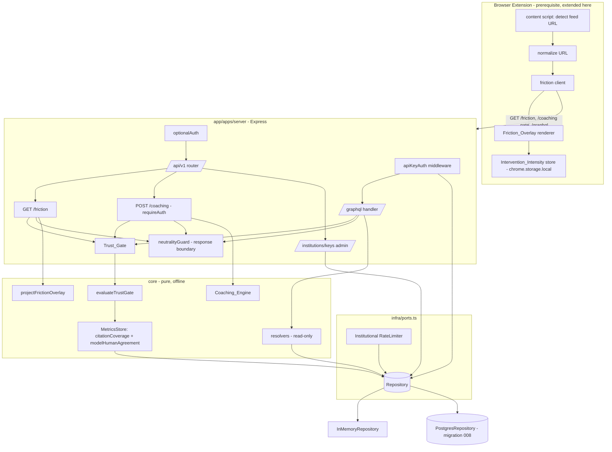
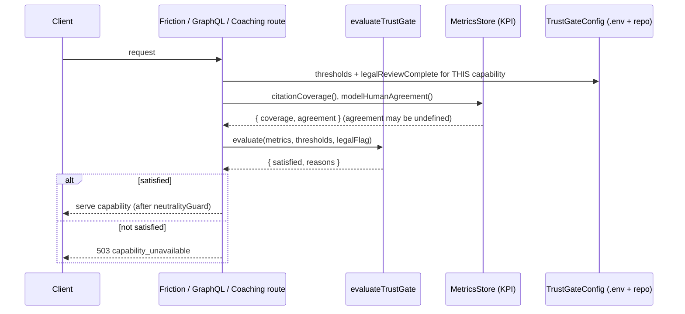

# Design Document

## Overview

"Intervention & scale" is the final roadmap phase. It extends the **proven, unchanged** analysis engine onto three new surfaces, each individually gated on trust metrics + legal review:

1. **Feed Friction Dial** — the read-only browser Extension surfaces a lens-safe overlay (framing signals + evidence summary + "learn more" link) on already-analyzed feed content, at a reader-configurable intensity.
2. **Institutional API** — an API-key-authenticated, rate-limited GraphQL endpoint letting institutions query the normalized Report_Graph (claims / citations / perspective links / cross-report aggregates).
3. **Creator pre-publish coaching** — an authenticated, advisory-only endpoint that analyzes a draft for framing techniques and unsupported claims, persisting nothing.

The whole feature is **read-mostly and additive by construction**. It never touches `core/assemble.ts` or `pipeline/stages.ts`; it only ever *consumes* the readiness state those produce. Three design rules carry the compass and the moat through every capability:

- **Satisfy the gate by construction.** Friction overlays are served only for reports the Invariant_Gate already marked `ready`; GraphQL reads the Report_Graph the dual-write already produced; coaching analyzes an ephemeral draft and writes nothing. No new code path can promote, demote, or recompute readiness because none of them call `assembleReport`.
- **Lens, not judge, at every boundary.** Every outbound payload from all three capabilities passes the existing `neutralityGuard` (`infra/telemetry/neutrality.ts`) before it leaves the process. A payload that fuses a person identity with a rating dimension, or carries a truth verdict, is withheld. Source tiers ride only on sources/citations, never beside a creator.
- **DI through `ports.ts`, persistence through the Repository.** New state (API keys, per-key rate-limit windows, trust-gate config/metrics, legal-review flags) is reached only through new `Repository` / port methods with in-memory + Postgres parity, selected by `.env` in `compose.ts`. The offline-first path (zero keys → in-memory + mocks) keeps working.

### Research notes informing the design

- **GraphQL execution (Req 7.6, 7.8).** Standards-compliant GraphQL parsing/validation/execution and the structured `errors` response for invalid queries cannot be hand-rolled cheaply or correctly. The design adds the **`graphql` reference implementation (graphql-js)** as the single new runtime dependency — pinned, widely used, no server framework. We mount it as one Express handler calling `graphql({ schema, source, ... })`; we do **not** add Apollo/yoga/express-graphql. This is the lazy-but-correct rung: the spec literally requires "standard GraphQL query syntax", and graphql-js *is* the spec. ([graphql-js](https://github.com/graphql/graphql-js))
- **API-key entropy/format (Req 6.1).** `node:crypto.randomBytes(32).toString('base64url')` yields ≥32 cryptographically-random bytes in a URL-safe string with no new dependency (stdlib rung). Only a **hash** of the key (SHA-256 via `node:crypto`) is persisted; the plaintext is shown once and is unrecoverable (Req 6.8), mirroring how the repo already treats secrets.
- **Per-key fixed-window rate limiting (Req 8.x).** The existing `RateLimiter` port + `InMemoryRateLimiter`/`RedisRateLimiter` already implement a fixed-window counter returning `{ allowed, remaining, limit, resetSeconds }`. The Institutional rate limiter is the same shape with a **per-key configurable** limit/window, so the `Retry-After` / `X-RateLimit-*` headers reuse the pattern already in `routes.ts`.
- **Trust metrics already exist.** `core/kpi.ts` exposes pure `citationCoverage(audits)` and `modelHumanAgreement(outcomes, signals)` returning values in `[0,1]` (and `undefined` for lack of signal). The Trust_Gate is a thin pure predicate over those two numbers + per-capability config + a legal flag — no new metric math.

## Architecture



### How each capability satisfies the moat by construction

- The Friction handler calls `repo.getReport(id)` and serves only when `report.status === 'ready'` — it reads the field, never recomputes it (Req 13.2). The overlay is a pure projection of an already-assembled report; the persisted row is never written (Req 13.3).
- The GraphQL resolvers call **only** existing read-side Repository methods over the Report_Graph tables; there is no resolver-side SQL and no write path (Req 9.1, 9.2, 9.4).
- The Coaching_Engine takes a transient string, returns advisory text, and has **no Repository, queue, telemetry-of-content, or pipeline reference** capable of persisting the draft (Req 11.5, 11.6).
- A **CI guard** (added to `test:build` / a tiny check script) fails the build if the feature's diff touches `core/assemble.ts` or `pipeline/stages.ts` (Req 13.1, 13.6), and `test/invariant.test.ts` continues to pin gate behavior.

### Trust gate: hot, per-capability, fail-closed



The gate is **re-evaluated on each request** (Friction, GraphQL) and on a `≤60s` interval for coaching, reading live metric values + config every time, so a not-satisfied→satisfied transition (or a regression back) takes effect **without redeploy/restart** (Req 1.9, 12.3, 12.5). Metrics/config are never hard-coded passing values (Req 1.8, 12.6). An `undefined`/unavailable metric is treated as **not satisfied** (Req 1.6, fail-closed).

## Components and Interfaces

### 1. Trust gate (`core/trustGate.ts` — new, pure)

```typescript
export type Capability = 'feed_friction' | 'institutional_api' | 'coaching';

export interface TrustThresholds {
  citationCoverageMin: number;      // [0,1], default 0.0
  modelHumanAgreementMin: number;   // [0,1], default 0.0
  legalReviewComplete: boolean;     // default false
}

export interface TrustMetrics {
  citationCoverage: number | undefined;     // from kpi.citationCoverage
  modelHumanAgreement: number | undefined;  // from kpi.modelHumanAgreement (undefined = no signal)
}

export interface TrustGateResult {
  satisfied: boolean;
  reasons: string[]; // empty iff satisfied
}

// Pure, total. Satisfied IFF every condition holds with STRICT exceedance:
//   coverage !== undefined && coverage > citationCoverageMin
//   agreement !== undefined && agreement > modelHumanAgreementMin
//   legalReviewComplete === true
// Any undefined metric => not satisfied (Req 1.6). Never throws.
export function evaluateTrustGate(m: TrustMetrics, t: TrustThresholds): TrustGateResult;
```

Thresholds are per-capability and independent (Req 1.7, 12.4): config carries a `Record<Capability, TrustThresholds>`. The function reads only its inputs, so changing one capability's thresholds cannot move another's verdict.

### 2. Metrics source (`core/metricsStore.ts` + Repository methods)

The "observability-derived KPI store" is the live aggregate of the per-claim Evidence_Outcomes and human signals already persisted. New **read-only** Repository methods enumerate them; `metricsStore` feeds them to the existing pure KPI functions:

```typescript
// ports.ts additions (read-only aggregates over already-persisted data)
listEvidenceOutcomes(): Promise<Array<{ reportId: string; claimId: string; evidenceOutcome: EvidenceOutcome }>>;
listHumanSignals(): Promise<HumanSignal[]>; // from disputes/flags/review rows, id-only (no submitter identity)

// metricsStore.ts
export function buildTrustMetrics(deps: { repo: Repository }): Promise<TrustMetrics>;
//   coverage = citationCoverage(outcomes)              // [0,1], 0 when empty
//   agreement = modelHumanAgreement(outcomes, signals) // number | undefined
```

`MetricsStore` reuses `kpi.ts` verbatim; it adds **no** new metric math and never mutates the audits (the kpi functions already guarantee this). Offline (no data) → `coverage = 0`, `agreement = undefined` → gate not satisfied (fail-closed, Req 14.6).

### 3. Trust-gate config (`config.ts` additions)

Per-capability thresholds + legal flags read from `.env`, defaulting to `0.0` / `false` (Req 1.5, 12.2). The legal flag lives in a **config source** (env), so it can be flipped without code change; the numeric thresholds likewise. (Optionally overridable per-capability via a `trust_gate_config` repo row for runtime tuning; env is the floor.)

```
TRUST_FEED_COVERAGE_MIN, TRUST_FEED_AGREEMENT_MIN, TRUST_FEED_LEGAL_OK
TRUST_API_COVERAGE_MIN,  TRUST_API_AGREEMENT_MIN,  TRUST_API_LEGAL_OK
TRUST_COACH_COVERAGE_MIN, TRUST_COACH_AGREEMENT_MIN, TRUST_COACH_LEGAL_OK
```

Unset/invalid → `0.0` / `false` (parsed like the existing `boolEnv`/numeric env helpers). Because defaults are `legalReviewComplete=false`, **every capability is dark until explicitly enabled** — the safe default.

### 4. Feed Friction Dial — server (`http/routes.ts` + `core/frictionOverlay.ts`)

```typescript
// GET /api/v1/friction?url=<encoded feed URL>   (PUBLIC — overlay data is lens-safe)
//   1. evaluate Feed_Friction trust gate; not satisfied => 503 capability_unavailable (Req 1.4, 5.6)
//   2. normalize url via existing cacheKey/hash; repo.findContentByHash -> report
//   3. report missing OR status !== 'ready' => 404 (Req 2.3)
//   4. payload = projectFrictionOverlay(report); run neutralityGuard; fail => withhold 404 (Req 15.7)
//   5. 200 { reportId, framingSignals[], evidenceSummary[], reportUrl }

// core/frictionOverlay.ts — PURE projection of a ready AnalysisReport
export interface FrictionSignal { technique: string; severity: 'low'|'medium'|'high'; quote: string; explanation: string; }
export interface FrictionEvidenceItem { claimText: string; evidenceStrength: EvidenceStrength; } // labels only
export interface FrictionOverlayData {
  reportId: string;
  framingSignals: FrictionSignal[];   // highest-severity first; tie => report-data order (Req 3.3)
  evidenceSummary: FrictionEvidenceItem[];
  reportUrl: string;                  // full report view (share slug)
}
export function projectFrictionOverlay(report: AnalysisReport, baseUrl: string): FrictionOverlayData;
```

`projectFrictionOverlay` copies only technique/quote/explanation and per-claim `evidenceStrength` labels + the report URL. It **structurally cannot** emit a verdict or creator rating: there is no creator field on the input it reads, and it never computes an aggregate score (Req 2.4, 4.1, 4.2, 4.6, 15.1–15.3, 15.6). Severity ordering uses a stable sort keyed on severity rank with report-data order as the tie-break (Req 3.3).

### 5. Feed Friction Dial — Extension friction module (extends the prerequisite extension)

The Extension is a prior-phase package (not in this monorepo snapshot); this feature adds a **friction module** to it. Pure, property-testable logic is isolated from DOM rendering:

```typescript
// pure (unit/property tested)
normalizeFeedUrl(raw: string): string;                  // same normalization the server hashes on
resolveIntensity(stored: string | null): Intensity;     // default 'moderate'; unknown/null -> 'moderate' (Req 3.6, 3.7)
type Intensity = 'subtle' | 'moderate' | 'interruptive';

// side-effecting (component/integration tested)
intensityStore: { get(): Promise<Intensity>; set(v: Intensity): Promise<void>; subscribe(cb): void };
//   persists to chrome.storage.local (survives restart, syncs across tabs) (Req 3.5);
//   storage unavailable => in-memory 'moderate' for the session, no disruptive error (Req 3.7)
frictionClient.fetchOverlay(url): Promise<FrictionOverlayData | null>;
//   503 (gate) | 404 | network error | >5s timeout => null => render nothing, no error UI (Req 2.7, 5.2, 5.6)
//   gate-dark: poll status at most every 5 min (Req 5.4); on reconnect, re-check viewport items within 10s (Req 5.5)
```

Overlay rendering is intensity-driven (Req 3.2–3.4), wires the accessibility contract (Req 16.x), and links "learn more" to `reportUrl` in a new tab (Req 2.6). It runs **only inside the Extension** (Req 5.1) and never triggers new analysis (Req 5.3).

### 6. Institutional API — key management & auth

```typescript
// Admin endpoints (separate auth path from reader JWT; Req 6.5)
// POST   /api/v1/institutions/:institutionId/keys   -> { apiKey } (plaintext ONCE; Req 6.1)
// DELETE /api/v1/institutions/:institutionId/keys/:keyId  -> revoke (Req 6.4)
// GET    /api/v1/institutions/:institutionId/keys/:keyId/value -> 404 always (Req 6.8)

// apiKeyAuth middleware (Institutional_API only; Req 6.2, 6.3)
//   reads Authorization header, hashes presented key (SHA-256), repo.findApiKeyByHash
//   missing/malformed/revoked/unknown => 401, query not executed, not rate-counted (Req 6.3, 8.7)

// ports.ts additions
createApiKey(institutionId: string): Promise<{ keyId: string; plaintext: string }>; // stores hash only; enforces <=10 active => throws ActiveKeyLimit (Req 6.7)
findApiKeyByHash(hash: string): Promise<{ keyId: string; institutionId: string; rateLimit?: RateLimitConfig } | undefined>; // undefined if revoked/unknown
revokeApiKey(keyId: string): Promise<void>;
countActiveApiKeys(institutionId: string): Promise<number>;
```

Key generation: `randomBytes(32).toString('base64url')`; persist `sha256(plaintext)` + `keyId` + `institutionId` + optional rate-limit tier; return plaintext once. The 10-active-key limit is enforced inside `createApiKey` (count → 409 mapped at the route, Req 6.7). Revocation flips an `revoked_at` timestamp so `findApiKeyByHash` returns `undefined` within the same request (≤60s, Req 6.4).

### 7. Institutional API — GraphQL schema & resolvers (`graphql/` — new)

A single `POST /api/v1/graphql` handler behind `apiKeyAuth` + the per-key rate limiter. Schema (graphql-js `buildSchema`) exposes read-only queries; resolvers call only Report_Graph Repository read methods (Req 9.4):

```graphql
type Citation { sourceUrl: String!  sourceName: String!  sourceTier: SourceTier!  excerpt: String  supports: SupportValue!  claimUid: String! }
type Claim { claimUid: String!  reportId: String!  claimText: String!  evidenceStrength: EvidenceStrength!  citationCount: Int!  verifiability: Verifiability!  citations: [Citation!]! }
type PerspectiveLink { reportId: String!  issueFrameLabel: String!  divergence: Float!  dehumanization: Float!  sourceName: String!  sourceTier: SourceTier! }
type ClaimPage { items: [Claim!]!  totalCount: Int!  pageOffset: Int!  hasNextPage: Boolean! }
type DomainAggregate { domain: String!  reportCount: Int!  claimCount: Int!  meanCitedClaimRatio: Float! }
type TopicAggregate { issueFrameLabel: String!  reportCount: Int! }
type Query {
  claims(reportId: String, keyword: String, fromDate: String, toDate: String, topic: String, page: Int = 0, pageSize: Int = 50): ClaimPage!
  citations(claimUid: String!): [Citation!]!
  perspectiveLinks(reportId: String!): [PerspectiveLink!]!
  claimFrequency(keyword: String, topic: String): Int!
  sourceDomainFrequency: [DomainAggregate!]!
  topicDistribution: [TopicAggregate!]!
  domainAggregates: [DomainAggregate!]!
  topicAggregates: [TopicAggregate!]!
}
```

There is **no** type or field that associates a reliability metric with a person/channel (Req 7.7, 15.5). `pageSize` is clamped to `[1, 200]` with default `50` (Req 7.1); the response carries `totalCount/pageOffset/hasNextPage` (Req 7.10). Empty matches → `items: [], totalCount: 0`, no error (Req 7.9, 9.3). graphql-js produces the structured `errors` response for invalid syntax/unknown fields and does not run resolvers (Req 7.8). The serialized GraphQL **data** result passes `neutralityGuard` before send (Req 15.7).

New Report_Graph **read** Repository methods (parameterized SQL; in-memory parity):

```typescript
queryClaims(filter): Promise<{ items: ClaimRow[]; totalCount: number }>;
listCitationsForClaim(claimUid): Promise<CitationRow[]>;
listPerspectivesForReport(reportId): Promise<PerspectiveRow[]>;
aggregateByDomain(): Promise<DomainAggregate[]>;
aggregateByTopic(): Promise<TopicAggregate[]>;
```

### 8. Institutional API — per-key rate limiting

A second `RateLimiter`-shaped component keyed by `keyId`, configurable per key (limit + window seconds, window ∈ [1, 86400]); default `100 / 60s` when no config (Req 8.4, 8.5). On each in-limit request: decrement, set `X-RateLimit-Remaining` / `X-RateLimit-Limit` (Req 8.3). Over limit → `429` + `Retry-After` = whole seconds to window reset (Req 8.1). Windows are per-key and reset on expiry (Req 8.2, 8.6). A revoked/unknown key is rejected at `apiKeyAuth` (401) **before** the limiter, so it never counts (Req 8.7).

```typescript
// ports.ts: reuse RateLimitResult; add a per-key variant carrying config
institutionalHit(keyId: string, cfg: RateLimitConfig): Promise<RateLimitResult>;
interface RateLimitConfig { maxRequests: number; windowSeconds: number; } // validated 1..86400
```

### 9. Creator pre-publish coaching (`core/coaching.ts` + `http/routes.ts`)

```typescript
// POST /api/v1/coaching  (requireAuth; Req 10.6)
//   1. zod: trimmed length 1..50000 else 400 (Req 10.5) — engine NOT invoked
//   2. coaching trust gate not satisfied => 503 (Req 12.1)
//   3. per-user rolling limit 10 / 60s => 429 (Req 10.8)
//   4. analyze (<=30s budget); timeout/internal error => 500 coaching_unavailable, nothing persisted (Req 10.7, 11.7)
//   5. neutralityGuard(response) fail => withhold (Req 15.7); else 200

export interface CoachingIssue {
  kind: 'framing' | 'unsupported_claim';
  technique?: string;            // framing only
  quote: string;                 // <=300 chars (Req 10.2, 10.3)
  explanation: string;           // advisory phrasing only (Req 11.4)
  suggestion: string;            // advisory phrasing only (Req 11.4)
}
export interface CoachingResponse {
  issues: CoachingIssue[];       // <=20 (Req 10.1); [] => "no issues identified" (Req 10.4)
  noIssues: boolean;
}
// Pure analysis over the draft text + (optionally) the LLM provider seam already in providers/.
// Holds NO Repository/Queue/Telemetry-of-content handle => cannot persist (Req 11.5, 11.6).
export function analyzeDraft(draft: string, deps: { llm: LLMProvider }): Promise<CoachingResponse>;
```

Coaching reuses the framing/evidence vocabulary the engine already speaks; it frames every issue as *technique present* or *no supporting source found* and uses advisory language (a fixed advisory phrasing helper guarantees no imperative/mandatory wording, Req 11.1, 11.3, 11.4). It assigns no rating to the creator and never reads creator history (Req 11.2, 15.4). The per-user 10/60s window reuses the rolling-window limiter pattern keyed by `user:<jwt sub>`.

## Data Models

### Migration `008_intervention_and_scale.sql` (additive only; sorts after 007 — Req 14.3, 14.4)

```sql
-- Institutional API keys: store a HASH only; plaintext never persisted (Req 6.8).
CREATE TABLE IF NOT EXISTS api_keys (
  id             UUID        PRIMARY KEY,
  institution_id TEXT        NOT NULL,
  key_hash       TEXT        NOT NULL UNIQUE,          -- sha256(plaintext)
  rate_max       INTEGER,                              -- null => default 100 (Req 8.5)
  rate_window_s  INTEGER,                              -- null => default 60; CHECK 1..86400 (Req 8.4)
  created_at     TIMESTAMPTZ NOT NULL DEFAULT now(),
  revoked_at     TIMESTAMPTZ,                          -- non-null => revoked (Req 6.4)
  CHECK (rate_window_s IS NULL OR (rate_window_s BETWEEN 1 AND 86400))
);
CREATE INDEX IF NOT EXISTS idx_api_keys_active ON api_keys (institution_id) WHERE revoked_at IS NULL; -- <=10 active (Req 6.7)

-- Per-key fixed-window rate counter (Postgres driver; Redis driver uses its own keyspace).
CREATE TABLE IF NOT EXISTS api_key_rate_windows (
  key_id        UUID        PRIMARY KEY REFERENCES api_keys(id) ON DELETE CASCADE,
  window_start  TIMESTAMPTZ NOT NULL,
  count         INTEGER     NOT NULL DEFAULT 0
);

-- Optional runtime trust-gate overrides (env remains the floor/source of truth).
CREATE TABLE IF NOT EXISTS trust_gate_config (
  capability        TEXT PRIMARY KEY CHECK (capability IN ('feed_friction','institutional_api','coaching')),
  coverage_min      DOUBLE PRECISION NOT NULL DEFAULT 0.0 CHECK (coverage_min BETWEEN 0 AND 1),
  agreement_min     DOUBLE PRECISION NOT NULL DEFAULT 0.0 CHECK (agreement_min BETWEEN 0 AND 1),
  legal_review_ok   BOOLEAN          NOT NULL DEFAULT false,
  updated_at        TIMESTAMPTZ      NOT NULL DEFAULT now()
);
```

No column expresses a creator rating or truth verdict. No pre-existing table/row/route shape is altered (Req 14.3). The Report_Graph tables (`claims`/`citations`/`perspective_links`) are referenced **read-only** (Req 9.1, 9.2). Coaching has **no table** — it is stateless by construction (Req 11.5).

### In-memory parity

`InMemoryRepository` gains the same methods backed by `Map`s: `apiKeysById`, `apiKeyHashIndex`, per-key window map, and a `trustGateConfig` map. Both drivers return identical TypeScript types with identical field/array ordering for identical inputs (Req 14.2). Offline (no keys/config) → empty/default results, no throw, no error logs (Req 14.6). Postgres methods use parameterized SQL only (Req 14.5) and propagate DB errors to the caller (Req 14.8).

### Lens-safe payload shapes (carried by construction)

`FrictionOverlayData`, the GraphQL `Claim/Citation/PerspectiveLink` types, and `CoachingResponse` each contain identifiers, framing text, evidence-strength labels, and source tiers attached to sources only. None contains a field name or value fusing a person token with a rating dimension, and none carries a truth verdict — and the `neutralityGuard` at the boundary is the runtime backstop that withholds any payload that somehow violates this (Req 15.1–15.3, 15.7).

## Correctness Properties

*A property is a characteristic or behavior that should hold true across all valid executions of a system — essentially, a formal statement about what the system should do. Properties serve as the bridge between human-readable specifications and machine-verifiable correctness guarantees.*

The prework classified each acceptance criterion. UI rendering/layout, ARIA wiring, timing windows, CSS contrast, CI diff guards, and migration shape are covered by example/component/integration/smoke tests (see Testing Strategy), not property tests. The criteria whose behavior varies meaningfully with input — the trust-gate predicate, the neutrality boundary, the overlay/coaching projections, key management, rate-limit math, GraphQL filtering/pagination/aggregation, and the read-only invariant — are captured by the following consolidated properties.

### Property 1: Trust gate is the strict three-way conjunction over defined metrics

*For all* metric pairs (citationCoverage, modelHumanAgreement — each either a number in [0,1] or undefined) and all thresholds (citationCoverageMin, modelHumanAgreementMin in [0,1], legalReviewComplete boolean), `evaluateTrustGate` returns `satisfied === true` **iff** citationCoverage is defined and `> citationCoverageMin` AND modelHumanAgreement is defined and `> modelHumanAgreementMin` AND legalReviewComplete is true; in every other case (including any undefined metric) it returns `satisfied === false`, and it never throws.

**Validates: Requirements 1.1, 1.2, 1.3, 1.5, 1.6, 12.1, 12.2**

### Property 2: Per-capability trust thresholds are independent

*For all* pairs of distinct capabilities and all metric values, changing one capability's thresholds or legal flag leaves the evaluated verdict of the other capability unchanged.

**Validates: Requirements 1.7, 12.4**

### Property 3: Trust gate hot-reloads — verdict always reflects current values

*For all* sequences of metric/config updates, evaluating the gate after each update equals `evaluateTrustGate` applied to the **current** metrics and config (no cached/stale verdict survives an update), so a not-satisfied→satisfied transition and a satisfied→not-satisfied regression both take effect on the next evaluation.

**Validates: Requirements 1.9, 12.3, 12.5**

### Property 4: Neutrality is enforced at every outbound boundary

*For all* payloads produced by the Feed Friction Dial, the Institutional API (GraphQL `data`), or the Coaching Engine, `neutralityGuard(payload).pass` is true — the payload contains no content-truthfulness verdict and no field (by name or value) that fuses a person identity with a rating dimension, and any source tier appears only on a source/citation object, never co-located with a creator/author/person/channel identifier.

**Validates: Requirements 2.4, 4.1, 4.2, 4.5, 4.6, 7.7, 11.2, 11.3, 15.1, 15.2, 15.3, 15.4, 15.5, 15.6**

### Property 5: The neutrality guard withholds any failing payload

*For all* candidate payloads, the response boundary delivers the payload unchanged when `neutralityGuard` passes, and withholds it entirely (no partial delivery) when the guard fails.

**Validates: Requirements 15.7**

### Property 6: The neutrality guard is total

*For all* inputs — null, undefined, primitives, arrays, deeply nested objects, and cyclic references — `neutralityGuard` returns a result without throwing.

**Validates: Requirements 15.8**

### Property 7: Friction overlay projection is faithful and label-bounded

*For all* `ready` reports, `projectFrictionOverlay` produces one framing signal per report framing signal (each carrying exactly the verbatim technique, quote, and explanation from a report example, with no added editorializing) ordered highest-severity-first with report-data order as the tie-break, one evidence item per claim whose `evidenceStrength` is one of `none|weak|moderate|strong`, the honest-none display for `evidenceStrength === 'none'` (never a true/false/misleading word), the report URL, and no aggregate/composite score field.

**Validates: Requirements 2.2, 3.3, 4.3, 4.4, 4.6**

### Property 8: Friction is served only for existing, ready reports

*For all* friction requests, the API returns overlay data only when the referenced report exists and `report.status === 'ready'`; for a missing report or any non-`ready` status it returns 404 with no overlay payload.

**Validates: Requirements 2.3**

### Property 9: Feed URL normalization matches the stored content hash

*For all* analyzed-content URLs and their equivalent feed-surface variants, `normalizeFeedUrl` followed by the existing content hash resolves to the same stored content (and thus report) the analysis was keyed under.

**Validates: Requirements 2.1**

### Property 10: Friction client renders nothing on any non-success outcome and never triggers analysis

*For all* API outcomes that are not a 200 overlay (HTTP 404, 503, network error, or timeout beyond 5 seconds), `fetchOverlay` resolves to `null` and the client renders neither an overlay nor an error indicator; and *for all* detected feed URLs the client issues only the read-only friction GET and never a `POST /analyses` (no new analysis is triggered).

**Validates: Requirements 2.7, 5.2, 5.3, 5.6**

### Property 11: Intervention intensity resolves to a valid level and round-trips

*For all* stored values (including null, unknown strings, and storage-unavailable errors), `resolveIntensity` returns a member of `{subtle, moderate, interruptive}`, defaulting to `moderate` for any null/unknown/error case, and never throws; and *for all* valid intensities `v`, `set(v)` followed by `get()` returns `v`.

**Validates: Requirements 3.5, 3.6, 3.7**

### Property 12: API keys are URL-safe, high-entropy, unique, and hash-only persisted

*For all* key generations, the issued plaintext is a URL-safe string decoding to at least 32 bytes, all issued keys in a run are distinct, the value returned in the creation response is the only time the plaintext is exposed, and the persisted record stores a hash (never the plaintext) bound to the issuing institution and its rate-limit tier — so no read path or value endpoint ever returns the plaintext.

**Validates: Requirements 6.1, 6.6, 6.8**

### Property 13: API-key authentication accepts only live issued keys

*For all* presented credentials, `apiKeyAuth` authenticates the request iff the credential hashes to an issued, non-revoked key; a missing, malformed, unknown, or revoked key is rejected with 401, the GraphQL resolvers are not executed, and the rate limiter is not consulted (revoked/unknown keys are never counted against any quota).

**Validates: Requirements 6.2, 6.3, 6.4, 8.7**

### Property 14: Active-key limit holds at the boundary

*For all* creation sequences for one institution, creation succeeds while the institution has fewer than 10 active (non-revoked) keys and is rejected with 409 — persisting no new key — when it already has exactly 10.

**Validates: Requirements 6.7**

### Property 15: GraphQL claim queries respect filters, pagination, and metadata

*For all* Report_Graph datasets and claim-query filters (reportId, keyword substring, date range, topic) with a requested page/pageSize, every returned item satisfies all supplied filters, the returned item count is at most `clamp(pageSize, 1, 200)` (default 50 when unspecified), `totalCount` equals the count of all matching claims, `pageOffset` equals the requested offset, and `hasNextPage` is true iff `pageOffset + items.length < totalCount`; a filter matching nothing yields `items: []` and `totalCount: 0` with no error.

**Validates: Requirements 7.1, 7.9, 7.10, 9.3**

### Property 16: GraphQL citation and perspective results carry their required fields

*For all* claims, every returned citation carries sourceUrl, sourceName, sourceTier, supports, and the owning claimUid; and *for all* reports, every returned perspective link carries issueFrameLabel, divergence, dehumanization, sourceName, sourceTier, and the owning reportId.

**Validates: Requirements 7.2, 7.3**

### Property 17: GraphQL aggregates equal a direct recomputation

*For all* Report_Graph datasets, the resolver-computed cross-report aggregates (claim frequency, source-domain frequency, topic distribution, and per-domain/per-topic summary stats including the mean ratio of claims with ≥1 citation to total claims per report) equal a straightforward reference recomputation over the same rows.

**Validates: Requirements 7.4, 7.5**

### Property 18: Per-key rate limiting is correct and isolated

*For all* hit sequences against a key with a configured `(maxRequests, windowSeconds)` where `windowSeconds ∈ [1, 86400]` (defaulting to 100/60 when unconfigured): `remaining === max(0, maxRequests - count)` within a window, the request is allowed while `count <= maxRequests` and rejected (429 with `Retry-After` equal to the whole seconds until reset) once exceeded, the count resets to a fresh window after `windowSeconds` elapse, and hits on one key never change another key's remaining count.

**Validates: Requirements 8.1, 8.2, 8.3, 8.4, 8.6**

### Property 19: Coaching responses are well-formed, honest, and advisory

*For all* valid drafts (trimmed length 1..50000), the Coaching Engine returns at most 20 issues; every framing issue carries a technique, a quote of at most 300 characters, an explanation, and a suggestion, and every unsupported-claim issue carries a quote of at most 300 characters, an explanation, and a suggestion; when no issues are found `noIssues` is true and `issues` is empty (no fabricated issues); and every issue's explanation and suggestion use advisory phrasing and contain no imperative/mandatory wording (e.g. "you must", "do not", "fix this", "change this") and no blocking/gating instruction.

**Validates: Requirements 10.1, 10.2, 10.3, 10.4, 11.1, 11.4, 15.4**

### Property 20: Coaching persists nothing

*For all* drafts, handling a coaching request performs no Repository write, no queue enqueue, no report creation, and no telemetry/log emission carrying the draft text, the response, or a creator-identity association — the only output is the HTTP response.

**Validates: Requirements 11.5, 11.6, 13.5**

### Property 21: Serving leaves readiness and the persisted report unchanged

*For all* reports and all serving operations (friction overlay, GraphQL query, coaching), the status reported/consumed equals the stored status with no call to `assembleReport` (no recompute/override/upgrade/downgrade), the persisted `analysis_reports` row and its Report_Graph rows remain byte-for-byte unchanged, and the Report_Graph is never written by any GraphQL path.

**Validates: Requirements 9.2, 13.2, 13.3**

### Property 22: Repository drivers agree, and offline operations are safe

*For all* identical input sequences, the in-memory and Postgres Repository implementations return deep-equal results with identical field and array ordering; and *for all* API-key, rate-limit, and trust-gate operations executed with the in-memory driver and no configured keys, each returns a successful default/empty result without throwing or emitting an error-level log.

**Validates: Requirements 14.2, 14.6**

## Error Handling

Error handling follows the repo's established posture: validate at the trust boundary with zod, fail **closed** for access/trust decisions, fail **soft** for degradations, and never let an error leak content or weaken the gate.

| Condition | Handling | Status / Result |
|---|---|---|
| Trust gate not satisfied (any capability) | Evaluate before any work; serve nothing | `503 { error: 'capability_unavailable' }` (Req 1.4, 12.1) |
| Trust metric undefined/unavailable | Treated as not satisfied (fail-closed) | `503` (Req 1.6) |
| Friction: report missing or not `ready` | Lookup-then-guard | `404` (Req 2.3) |
| Friction: payload fails neutrality guard | Withhold entirely | `404` (treated as no overlay; Req 15.7) |
| Friction client: 404 / 503 / network / >5s timeout | Resolve `null`, render nothing | no overlay, no error UI (Req 2.7, 5.2, 5.6) |
| Intensity storage unavailable | In-memory `moderate` for the session | no disruptive error (Req 3.7) |
| API key missing/malformed/revoked/unknown | `apiKeyAuth` rejects before resolvers/limiter | `401`, not rate-counted (Req 6.3, 8.7) |
| 11th active key creation | Count check in `createApiKey` → mapped at route | `409 { error: 'active_key_limit' }` (Req 6.7) |
| Key value retrieval after issuance | No read path exists | `404` always (Req 6.8) |
| GraphQL: invalid syntax / unknown field | graphql-js validation, resolvers not run | structured `{ errors: [...] }` (Req 7.8) |
| GraphQL: no matching data | Normal empty result | `{ items: [], totalCount: 0 }`, no error (Req 7.9, 9.3) |
| Rate limit exceeded | Limiter returns `allowed:false` | `429` + `Retry-After` whole seconds + `X-RateLimit-*` (Req 8.1, 8.3) |
| Coaching: invalid draft (empty/whitespace/>50000 trimmed) | zod boundary, engine not invoked | `400` (Req 10.5) |
| Coaching: no/invalid token | `requireAuth` | `401`, engine not invoked (Req 10.6) |
| Coaching: timeout (>30s) or internal error | Abort, persist nothing | `500 { error: 'coaching_unavailable' }`, no partial/fabricated body, publishing unaffected (Req 10.7, 11.7) |
| Coaching: per-user >10/60s | Rolling-window limiter | `429` (Req 10.8) |
| Postgres error on new key/rate/gate op | Propagate to caller, no partial write | route returns error indication, nothing persisted (Req 14.8) |
| Express-level uncaught error | Existing error handler captures (no PII) | `500 { error: 'internal_error' }` |

Two cross-cutting backstops protect the compass and the moat at runtime regardless of any upstream logic error:
- **Neutrality boundary** — every outbound payload from all three capabilities passes `neutralityGuard`; a failure withholds the payload (Req 15.7). Because the guard is total (Property 6), this backstop itself cannot throw.
- **Gate-by-construction** — no serving path imports or calls `assembleReport`; the only readiness value in play is the one already persisted (Property 21).

## Testing Strategy

Property-based testing applies to the substantial pure/input-varying logic in this feature and is the right tool for the 22 properties above. UI rendering, ARIA/keyboard/contrast accessibility, timing windows, CI diff guards, and migration shape are **not** property-tested — they use the appropriate alternative (component, integration, smoke) tests described below.

### Dual approach

- **Property tests** verify the universal properties across generated inputs (gate predicate, neutrality, projections, key/rate math, GraphQL filtering/pagination/aggregation, coaching constraints, driver parity).
- **Unit / example tests** verify concrete wiring and edge cases (per-capability 503 routing, default 100/60 rate config, no-token 401, induced timeout/DB error, schema introspection for forbidden fields).
- **Component tests** (web/Vitest + React Testing Library) verify the Extension overlay rendering per intensity level and the accessibility contract.
- **Integration tests** verify graphql-js end-to-end through the Express handler and Postgres-driver parity when a database is available.
- **Smoke / CI guards** verify the invariant-protected files are untouched and the migration is additive.

### Property-based testing setup

- Library: **`fast-check`** (already the repo standard), minimum **100 runs** per property.
- Server properties run under `node:test` + `node:assert`; new files added to the explicit `test/*.test.ts` list in `apps/server/package.json`. Extension/web pure-logic properties run under Vitest.
- Each property test carries the required comment, e.g.:
  `// Feature: intervention-and-scale, Property 1: Trust gate is the strict three-way conjunction over defined metrics`
  plus a `Validates: Requirements 1.1, 1.2, 1.3, 1.5, 1.6, 12.1, 12.2` reference.
- Generators reuse existing arbitraries where possible. `test/reportGraph.arb.ts` already builds **gate-valid `AnalysisReport`s** (a non-`none` claim with a citation plus an honest `none`/zero-citation claim, framing signals with evidenced examples) — this is the backbone generator for the friction-overlay, readiness-immutability, and GraphQL/aggregate properties, ensuring inputs are always reports the real gate would mark `ready`.
- The neutrality properties (4, 5, 6) extend the existing `neutrality.ts` coverage to the **response boundary** for all three capabilities, generating adversarial payloads (creator+tier co-location, truth-verdict keys, cyclic structures) alongside the legitimate generated payloads.

### Test mapping (highlights)

| Test | Type | Requirements |
|---|---|---|
| `trustGate.prop.test.ts` (Properties 1–3) | property | 1.1–1.3, 1.5–1.7, 1.9, 12.2–12.5 |
| `frictionOverlay.prop.test.ts` (Properties 7, 8) | property | 2.2, 2.3, 3.3, 4.3, 4.4, 4.6 |
| `frictionClient.prop.test.ts` (Properties 9, 10, 11) | property | 2.1, 2.7, 3.5–3.7, 5.2, 5.3, 5.6 |
| `neutralityBoundary.prop.test.ts` (Properties 4, 5, 6) | property | 2.4, 4.x, 7.7, 11.2–11.3, 15.1–15.8 |
| `apiKey.prop.test.ts` (Properties 12, 13, 14) | property | 6.1–6.4, 6.6–6.8, 8.7 |
| `graphqlQuery.prop.test.ts` (Properties 15, 16, 17) | property | 7.1–7.5, 7.9, 7.10, 9.3 |
| `institutionalRateLimit.prop.test.ts` (Property 18) | property | 8.1–8.4, 8.6 |
| `coaching.prop.test.ts` (Properties 19, 20) | property | 10.1–10.4, 11.1, 11.4–11.6, 13.5, 15.4 |
| `readinessImmutability.prop.test.ts` (Property 21) | property | 9.2, 13.2, 13.3 |
| `repositoryParity.prop.test.ts` (Property 22) | property | 14.2, 14.6 |
| `friction.route.test.ts`, `coaching.route.test.ts`, `graphql.route.test.ts` | example | 1.4, 1.8, 5.1, 6.5, 7.6, 7.8, 9.1, 9.4, 9.5, 10.6, 10.7, 12.1, 12.6, 14.1, 14.5, 14.7, 14.8, 15.5 |
| `rateLimit.default.test.ts`, `activeKeyLimit.test.ts`, `coachingValidation.test.ts` | example/edge | 6.7, 8.5, 10.5, 10.8 |
| Extension overlay component tests (Vitest) | component | 2.5, 2.6, 3.1–3.4, 3.8, 5.4, 5.5, 16.1–16.5, 16.7 |
| CSS-variable contrast audit | smoke | 16.6 |
| `invariant.test.ts` (existing) + CI diff guard on `assemble.ts`/`stages.ts` | smoke | 13.1, 13.4, 13.6 |
| migration 008 review + existing-route response snapshot | smoke | 14.3, 14.4 |

### Verification before "done"

Per the project steering: run `npm test` + `npm run typecheck` in `apps/server` and `npx vitest run` + `tsc -b` in `apps/web` before claiming completion. New server test files must be added to the `package.json` test list. The CI guard that fails the build on any diff to `core/assemble.ts` or `pipeline/stages.ts` (Req 13.6) runs alongside the existing `invariant.test.ts`.
