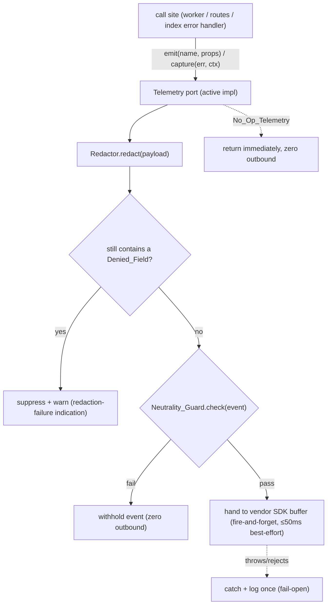
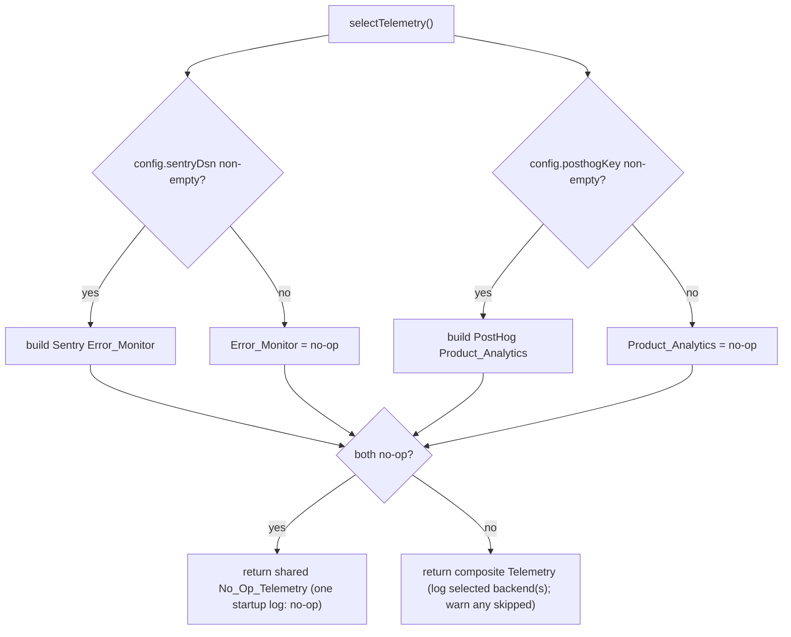

# Design Document

## Overview

This feature adds an **additive observability layer** to the existing modular monolith: error/exception monitoring (Sentry) and product/event analytics (PostHog), wired into the two long-running server processes that share one composition root (`index.ts` API + `worker.ts` worker via `compose.ts`) and into the web app (`apps/web`). It exists to make the two **red-line trust KPIs** — **Citation_Coverage** and **Model_Human_Agreement** — measurable before pilots, and to give operators visibility into throughput, cache hit/miss, latency, Evidence_Outcome distribution, and dispute/flag rates.

The whole layer **only ever observes and verifies**. It never alters analysis behavior, never touches `core/assemble.ts`, and the offline-first / zero-API-key path runs exactly as it does today. The design is shaped end to end by five non-negotiable invariants from the steering Compass and the existing seams:

1. **Lens, not a judge.** No telemetry payload may carry a creator-reliability or content-truth verdict, or attach any reliability dimension to a person/channel. Enforced by a pure `Neutrality_Guard` at the emission boundary.
2. **The invariant gate is untouched.** `core/assemble.ts` is never edited; telemetry is emitted *after* the pipeline produces a report, in the worker — never inside the gate path. The existing `assertInvariantGateIntact` boot guard still runs.
3. **Offline-first / zero-API-key keeps working.** With no `SENTRY_DSN` / `POSTHOG_KEY`, the composition root selects `No_Op_Telemetry` — accepts every call, emits nothing, never throws — mirroring the degrade-and-warn pattern already in `index.ts`/`config.ts`. Telemetry is **fail-open**: it never blocks startup, the HTTP path, or the pipeline.
4. **Established wiring pattern.** Telemetry sits behind a `Telemetry` port in `src/infra/ports.ts` (alongside `Cache`/`Queue`/`Repository`/`RateLimiter`) and is selected in `compose.ts` by a `selectTelemetry()` function. Config is read once in `src/config.ts` using the existing `process.env.X ?? default` / `boolEnv` pattern.
5. **PII / secret hygiene.** A pure `Redactor` shapes every payload before emission; transcripts, raw claim text, JWTs, API keys, and user identifiers can never reach a telemetry endpoint.

**Rung climbed (ponytail).** Two thin vendor SDKs (`@sentry/node`, `posthog-node` on the server; `posthog-js` on the web) sit *only* inside the active port implementation modules — nothing else imports them, so the rest of the server speaks only the `Telemetry` interface. Everything novel here is **pure logic**: `Redactor`, `Neutrality_Guard`, and the two `KPI_Deriver` functions. That logic is the smallest thing that satisfies the requirements, and it is exactly what property tests can pin. No new persistence, no new routes, no change to the analysis flow.

## Architecture

### Where telemetry attaches (and where it deliberately does not)

| Site | Today | After | Concern |
| --- | --- | --- | --- |
| `infra/ports.ts` | Cache/Queue/Repository/RateLimiter | **+ `Telemetry` port** | new interface |
| `config.ts` | `process.env.X ?? default` reads | **+ `sentryDsn`, `posthogKey`** (trimmed) | config (read once) |
| `compose.ts` | `select*()` per infra driver | **+ `selectTelemetry()`**, `telemetry` on `AppContext` | selection |
| `index.ts` Express error handler | `console.error` only | **+ `telemetry.capture(err, ctx)`** | Error_Monitor |
| `worker.ts` `handleJob` catch | persist `failed` | **+ `telemetry.capture(err, {reportId, stage, providerCategory})`** | Error_Monitor |
| `worker.ts` after a run completes | persist report | **+ `telemetry.emit('pipeline_complete', …)`** (status, durationMs, outcome distribution, citationCoverage) | Product_Analytics |
| `http/routes.ts` cache hit / miss | serve / queue | **+ `telemetry.emit('cache_hit'|'cache_miss', …)`** | Product_Analytics |
| `http/routes.ts` dispute / flag | persist | **+ `telemetry.emit('dispute'|'flag', …)`** | Product_Analytics |
| `core/assemble.ts` (the gate) | invariant gate | **unchanged** — no telemetry on the gate path | invariant 2 |
| `apps/web` views & interactions | render / submit | **+ `analytics.track(…)`** (consent-gated, no-op without key) | Web_Analytics |

Telemetry is emitted **after** `runPipeline` returns inside `handleJob`, never inside `runPipeline`/`assembleReport`. So the gate path makes zero telemetry calls **by construction** — Req 11.5 (gate never awaits telemetry) and 11.7 (a telemetry error never changes the report) hold structurally, and Req 11.6's "≤50 ms best-effort on the gate path" is satisfied vacuously (nothing is emitted there) and reinforced by the fire-and-forget design below.

### Fire-and-forget, fail-open by construction

The `Telemetry` port methods are **synchronous `void`** (`emit`, `capture`). They never return a promise the caller can await, so no call site can block on telemetry — the non-blocking guarantee is structural, not a discipline. Internally the active implementation hands the payload to the vendor SDK's background buffer; any synchronous throw or async rejection is caught inside the port and swallowed (logged once), so a telemetry fault never propagates into the request path, the pipeline, or startup (Req 3.5, 9.7, 11.7). As defense in depth, the active send wrapper abandons any synchronous work after a best-effort budget (≤50 ms) so even a pathological SDK can't stall a caller (Req 11.6).



`capture` payloads pass through the `Redactor` (PII hygiene) but not the `Neutrality_Guard` (an error context is not a product event). `emit` payloads (Telemetry_Events) pass through **both** the `Redactor` and the `Neutrality_Guard`.

### Selection in the composition root

`selectTelemetry()` mirrors the existing `selectRepo`/`selectCache`/`selectQueue` shape exactly: read the relevant `config` values, log one `[infra]`-style line naming the selected backend (or `no-op`), warn-and-continue when a backend is requested-but-uncredentialed, and never abort. Each concern (Error_Monitor / Product_Analytics) is independently active or no-op, so "exactly one of the two configured" activates only that one (Req 3.6).



Because both `index.ts` and `worker.ts` obtain telemetry exclusively through `buildContext()`, and `config` is a single module evaluated once per process from the same env, the two processes resolve the **identical** selection and effective values — no drift (Req 2.7, 10.1–10.3), consistent with how `config.concurrencyCap` is already shared.

### Web side

`apps/web/src/analytics.ts` is a tiny consent-gated wrapper over `posthog-js`. It reads `import.meta.env.VITE_POSTHOG_KEY`; absent ⇒ no-op (returns within the same tick, zero outbound, never blocks render — Req 12.4). It exposes `track(name, props)` used by the hash-route effect (view events) and the dispute/flag/share handlers (interaction events). Events carry route + report id + category only; a pure `buildWebEvent` helper (the web analogue of `Redactor` + `Neutrality_Guard`) guarantees no claim/transcript text, no JWT, no user id, and no creator/channel dimension (Req 12.3). Consent gates emission: until granted, `track` emits nothing (Req 12.5); after grant, subsequent views/interactions emit (Req 12.6). Whether active or no-op, the rendered DOM, hash navigation, and accessibility tree are identical (Req 12.8) because `track` has no render side effects.

## Components and Interfaces

### 1. The port — `src/infra/ports.ts` (new interface)

```ts
// Telemetry: error monitoring (Error_Monitor) + product analytics (Product_Analytics)
// behind one port, mirroring Cache/Queue/Repository/RateLimiter. Methods are
// synchronous void and fire-and-forget: callers never block or await telemetry, and
// a telemetry fault never propagates (fail-open). The composition root picks the
// concrete impl from .env (compose.ts selectTelemetry).
export interface Telemetry {
  // Product_Analytics. `name` is a Telemetry_Event name; `props` is a bag of ids and
  // metrics only. Passed through Redactor AND Neutrality_Guard before emission.
  emit(name: string, props?: Record<string, unknown>): void;
  // Error_Monitor. Captures an error with structured context (reportId, stage,
  // providerCategory, …). Passed through Redactor before emission.
  capture(error: unknown, context?: Record<string, unknown>): void;
}
```

`AppContext` (in `compose.ts`) gains `telemetry: Telemetry`. `makeWorker` and `makeRouter` gain a `telemetry` dependency, threaded from `buildContext()` exactly like `repo`/`cache`/`queue`/`limiter` are today.

### 2. No-op implementation — `src/infra/telemetry/noop.ts` (new)

```ts
// Accepts every call, emits nothing, never throws, opens zero connections. The
// offline/zero-key default and the universal fail-safe (any activation failure falls
// back to this). A frozen singleton — no per-process state.
export const noopTelemetry: Telemetry = Object.freeze({
  emit() {},
  capture() {},
});
```

### 3. Active implementation — `src/infra/telemetry/active.ts` (new)

A composite that holds an optional Sentry client (for `capture`) and an optional PostHog client (for `emit`); a concern with no client behaves as a no-op for that method. Every payload is funneled through the shared pure helpers before it reaches a vendor SDK, and every send is wrapped in the fail-open / best-effort budget.

```ts
export function makeActiveTelemetry(deps: {
  sentry?: { captureException(e: unknown, ctx?: unknown): void };
  posthog?: { capture(args: { event: string; properties: Record<string, unknown> }): void };
}): Telemetry {
  return {
    emit(name, props = {}) {
      safe(() => {
        const redacted = redact(props);                 // Req 5.4 (PII boundary)
        if (containsDeniedField(redacted)) return warnSuppressed(name); // Req 5.7
        if (!neutralityGuard({ name, props: redacted }).pass) return;   // Req 6.6
        deps.posthog?.capture({ event: name, properties: redacted });
      });
    },
    capture(error, context = {}) {
      safe(() => deps.sentry?.captureException(error, redact(context)));  // Req 4.4, 5.4
    },
  };
}
// safe(): runs fn, swallows any throw (logs once), abandons after a ~50ms best-effort
// budget. Fail-open (Req 3.5, 9.7, 11.6, 11.7).
```

`@sentry/node` is initialized once with `config.sentryDsn` (and `sendDefaultPii: false`); `posthog-node` once with `config.posthogKey`. Those `init` calls are the *only* vendor-SDK touch points in the server (Req 1.5).

### 4. Redactor — `src/infra/telemetry/redact.ts` (new, pure)

```ts
// Pure, total. Returns a sanitized DEEP COPY; never mutates input, never reads/writes
// external state (Req 5.1). Removes any Denied_Field by key (case-insensitive match
// against DENIED_KEYS) at every depth, and scrubs any value equal to a supplied denied
// literal (Req 5.2). Non-denied fields are preserved key-and-value unchanged (Req 5.5).
// Total over null/undefined/primitives/arrays/nested/cyclic input (Req 5.6): a WeakSet
// tracks visited objects so a cycle resolves to a marker instead of recursing forever.
export function redact(payload: unknown, deniedValues?: ReadonlySet<string>): unknown;

// DENIED_KEYS (case-insensitive substring): transcript, claimtext, rawclaim, jwt,
// token, apikey, api_key, authorization, secret, password, userid, user_id, email.
// containsDeniedField(p): post-redaction assertion used for Req 5.7.
export function containsDeniedField(payload: unknown): boolean;
```

The deny-list is **key-based** (structural) plus an optional **value-based** scrub (so a caller can pass the known JWT/transcript string to strip it even if it slipped into a free-text field). Idempotence (Req 5.3) is immediate: a first pass removes every denied key and denied value, so a second pass finds nothing to change and returns a deep-equal payload.

### 5. Neutrality_Guard — `src/infra/telemetry/neutrality.ts` (new, pure)

```ts
// Pure, total. Returns { pass: true } when neither a creator-reliability dimension nor
// a content-truth verdict is present, else { pass: false, offendingKey } (Req 6.4).
// Never throws for any input incl. null/undefined/cyclic (Req 6.7).
export function neutralityGuard(event: unknown): { pass: boolean; offendingKey?: string };

// Fails on keys matching creator/channel reliability or truth-verdict patterns, e.g.
// creatorReliability, channelTrust, authorTier, *Credibility tied to a person/channel,
// truthVerdict, accuracyRating, isTrue, factVerdict. A sourceTier key is allowed ONLY
// when it is not co-located with a creator/channel/author/person identifier (Req 6.3).
```

A failing event is withheld from Product_Analytics entirely (Req 6.6); nothing about the offending field goes out. Source tiers describing a *source/citation* (the only place tiers legitimately appear) pass; a tier keyed by or adjacent to a creator/channel/author/person identity fails.

### 6. KPI_Deriver — `src/core/kpi.ts` (new, pure)

Two pure, total, deterministic functions over **already-produced** report data — no external calls, no recomputation of any Evidence_Outcome (Req 7.1, 7.7, 8.1).

```ts
const CITED_OUTCOMES = new Set<EvidenceOutcome>([
  'matched_fact_check', 'matched_primary_source', 'matched_institutional_source',
]);
const HONEST_NONE_OUTCOMES = new Set<EvidenceOutcome>([
  'relevant_context_only', 'no_sufficient_evidence', 'not_fact_checkable',
]);

// Citation_Coverage = |Cited_Outcome claims| / |verified claims|, in [0,1] (Req 7.3,7.5).
// Zero verified claims ⇒ 0, a valid honest-none result (Req 7.4). An outcome outside the
// six defined values is excluded from BOTH numerator and denominator so the ratio stays
// bounded and the source report is left unchanged (Req 7.5, 7.8). Derives purely from the
// per-claim audit evidenceOutcome (Req 7.2, 7.6).
export function citationCoverage(audits: ReadonlyArray<Pick<AuditRecord, 'evidenceOutcome'>>): number;

// Model_Human_Agreement: pair model outcomes with Human_Signals by (reportId, claimId);
// agreeing/compared in [0,1] (Req 8.3, 8.5). Zero signals OR no shared (reportId,claimId)
// ⇒ undefined-for-lack-of-signal (Req 8.4, 8.6). References disputes/flags by report+claim
// id ONLY — never the disputing/flagging user's identity (Req 8.7) — and attaches no result
// to any creator/channel (Req 8.8).
export interface ModelOutcome { reportId: string; claimId: string; outcome: EvidenceOutcome }
export type HumanSignal =
  | { kind: 'expert_review'; reportId: string; claimId: string; reviewStatus: Provenance['reviewStatus'] }
  | { kind: 'flag'; reportId: string; claimId: string }
  | { kind: 'dispute'; reportId: string; claimId: string };
export function modelHumanAgreement(
  outcomes: ReadonlyArray<ModelOutcome>,
  signals: ReadonlyArray<HumanSignal>,
): number | undefined;
```

**Concurrence rule (deterministic, pure).** A `dispute` or `flag` paired to a claim is a human *disagreement* with that claim's model outcome; an `expert_review` with `reviewStatus === 'expert-reviewed'` *agrees*, while `'under-dispute'` *disagrees* (and `'ai-generated'` is not a human signal and is never paired). This is the only place the mapping lives; it derives the boolean per pair, then `agreement = agreeing / compared`.

### 7. Operator-metric call sites (no new modules)

- **`http/routes.ts`** — on cache hit: `telemetry.emit('cache_hit', { submissionId, cached: true })`; on a queued miss: `telemetry.emit('cache_miss', { submissionId })`. On dispute/flag creation (after the existing persist): `telemetry.emit('dispute'|'flag', { reportId, claimId })`. `submissionId` is the existing `urlHash`/`report.id`; no user id is emitted (Req 9.5, 8.7).
- **`worker.ts handleJob`** — after a run completes: one `pipeline_complete` event carrying `{ reportId, status, durationMs, outcomeDistribution, citationCoverage }`. `durationMs` is a non-negative integer measured with an injected/`Date.now()` clock around `runPipeline`; `outcomeDistribution` is one non-negative integer per Evidence_Outcome derived from `result.audits`; `citationCoverage` is `citationCoverage(result.audits)`. On catch: `telemetry.capture(err, { reportId, stage, providerCategory })` exactly once, alongside the existing `failed` persist — the persisted `status`/`error` are unchanged (Req 4.2, 4.5).
- **`index.ts`** — in the Express error handler, after the existing `console.error`: `telemetry.capture(err, { … })` once; the HTTP status/body returned to the client is unchanged (Req 4.1, 4.8).

Context fields that cannot be determined (report id, stage, provider category) are set to the literal string `'unknown'`, never omitted and never a Denied_Field value (Req 4.7).

### 8. Web analytics — `apps/web/src/analytics.ts` (new)

```ts
// Consent-gated wrapper over posthog-js. No key ⇒ no-op (Req 12.4). track() is
// fire-and-forget and has no render side effects (Req 12.7, 12.8).
export function track(name: string, props: Record<string, unknown>): void;
export function grantConsent(): void;     // Req 12.6
export function hasConsent(): boolean;     // gates emission (Req 12.5)
export function buildWebEvent(name: string, props: Record<string, unknown>): { name: string; props: Record<string, unknown> }; // pure: strips denied keys + creator dimension (Req 12.3)
```

Call sites: the hash-route `useEffect` in `App.tsx` (`track('view', { route, reportId })` once per view — Req 12.1); the dispute submit in `DisputeModal.tsx`, the flag submit, and the share action in `Report.tsx` (`track('dispute'|'flag'|'share', { reportId })` — Req 12.2).

## Data Models

No persisted schema changes. All new state is in-process, transient, or vendor-side.

- **`Telemetry` port** (`infra/ports.ts`): two void methods; no state.
- **`AppContext.telemetry: Telemetry`**: one instance per process, built in `buildContext()`.
- **`config.sentryDsn: string`, `config.posthogKey: string`**: verbatim trimmed env values, `''` when unset or whitespace-only (Req 2.2, 2.3, 2.4). Empty ⇒ backend classified "not configured" (Req 2.5).
- **Telemetry_Event** (transient payload to Product_Analytics): `{ name: string; props: Record<string, unknown> }` where `props` holds only ids, categorical labels, non-negative integer counts, and non-negative millisecond durations (Req 9.5).
- **Error_Monitor context** (transient): `{ reportId: string; stage: string; providerCategory: 'llm'|'evidence'|'perspective'|'transcript'|'unknown'; … }` (Req 4.3, 4.7).
- **`ModelOutcome` / `HumanSignal`** (`core/kpi.ts`): pure inputs derived from existing `AuditRecord.evidenceOutcome`, `Provenance.reviewStatus`, and the `createFlag`/`createDispute` rows (by report+claim id only).
- **Web consent flag**: a single boolean persisted in `localStorage` (`fs_analytics_consent`); read by `hasConsent()`.

`AnalysisReport`, `Claim`, `Citation`, `AuditRecord`, `EvidenceOutcome`, and the gate in `core/assemble.ts` are all **unchanged** — telemetry reads them, never rewrites them (Req 11.1, 11.3).

## Correctness Properties

*A property is a characteristic or behavior that should hold true across all valid executions of a system — essentially, a formal statement about what the system should do. Properties serve as the bridge between human-readable specifications and machine-verifiable correctness guarantees.*

PBT applies squarely here: the novel logic (`Redactor`, `Neutrality_Guard`, `KPI_Deriver`, `No_Op_Telemetry`, the fail-open wrapper, and the offline output-equivalence of the pipeline) is pure or input-driven, with universal guarantees — totality, idempotence, removal/preservation, boundedness, and equivalence. The vendor wiring, startup ordering, and call-site presence are not PBT material and are covered by example/integration/smoke tests in the Testing Strategy. All properties run offline against in-memory infra and stub backends with zero outbound network (Req 13.1, 13.5).

### Property 1: Redaction never emits a Denied_Field

*For any* candidate payload — including arbitrarily nested objects and arrays seeded with Denied_Field keys and Denied_Field literal values at any depth — the payload returned by the `Redactor` SHALL contain no Denied_Field key and no value equal to a supplied Denied_Field value, at every depth.

**Validates: Requirements 5.2, 4.4, 9.5**

### Property 2: Redaction idempotence

*For any* candidate payload, applying the `Redactor` to an already-redacted payload SHALL return a payload deeply equal to that already-redacted payload.

**Validates: Requirements 5.3**

### Property 3: Redactor preserves non-denied fields and never mutates input

*For any* candidate payload, the `Redactor` SHALL preserve every non-denied field with its key and value unchanged (report ids, content ids, hashes, Stage names, provider categories, counts, durations, and Evidence_Outcome labels included), and the caller's input object SHALL be deeply equal before and after the call.

**Validates: Requirements 5.5, 5.1**

### Property 4: Redactor totality

*For any* input whatsoever — null, undefined, primitives, arrays, deeply nested objects, and objects containing cyclic references — the `Redactor` SHALL return a sanitized payload without throwing.

**Validates: Requirements 5.6**

### Property 5: Neutrality_Guard correctness and totality

*For any* candidate Telemetry_Event payload, the `Neutrality_Guard` SHALL return a pass-or-fail result without throwing (for any input including null, undefined, and cyclic references), returning a pass result when neither a creator/person/channel reliability dimension nor a content-truth verdict is present and a fail result when one is present — and a source tier SHALL pass only when it describes a source/citation and is not keyed by or co-located with a creator/channel/author/person identifier.

**Validates: Requirements 6.4, 6.7, 6.1, 6.2, 6.3, 6.5, 8.8, 11.4**

### Property 6: No_Op_Telemetry performs zero outbound emission and never throws

*For any* finite sequence of `emit` and `capture` calls with arbitrary names, contexts, and payloads, `No_Op_Telemetry` SHALL perform zero outbound network connections to a telemetry endpoint and SHALL return from every call without throwing.

**Validates: Requirements 3.4, 4.6, 9.6**

### Property 7: Active telemetry is fail-open

*For any* call payload, when the underlying backend throws synchronously or rejects a promise on every `emit`/`capture`, the active `Telemetry_Port` SHALL contain the fault and return without throwing, and SHALL NOT propagate it to the caller.

**Validates: Requirements 3.5, 9.7, 11.7**

### Property 8: Offline / telemetry-invariance of the pipeline report

*For any* analysis input and deterministic provider set, the report produced by the worker under `No_Op_Telemetry` (or with telemetry absent) SHALL be field-by-field equal to the report produced under an active `Telemetry_Port` — equal in `status`, `reasons`, claims, citations, audits, and context — excluding only fields already non-deterministic today (per-claim `randomUUID` ids and timestamps).

**Validates: Requirements 3.7, 11.2, 11.3, 11.7**

### Property 9: Citation_Coverage is bounded, total, and classifies correctly

*For any* list of per-claim audits (including an empty list and audits carrying an out-of-enum Evidence_Outcome), `citationCoverage` SHALL return a finite real number in the inclusive range 0 to 1, computed as the count of Cited_Outcome (`matched_*`) claims divided by the count of claims carrying one of the six defined outcomes, where the three Honest_None outcomes count toward the denominator but never the numerator, an empty list yields exactly 0, an out-of-enum outcome is excluded from both numerator and denominator, and the input audits are left unchanged.

**Validates: Requirements 7.1, 7.2, 7.3, 7.4, 7.5, 7.7, 7.8**

### Property 10: Model_Human_Agreement is bounded when paired and undefined otherwise

*For any* set of model Evidence_Outcomes and any set of Human_Signals (expert review, flag, dispute), `modelHumanAgreement` SHALL return `undefined` when there are zero signals or when no signal shares a `(reportId, claimId)` with any model outcome, and otherwise SHALL return a finite real number in the inclusive range 0 to 1 equal to the count of agreeing pairs divided by the count of compared pairs — producing identical output for identical input and referencing disputes/flags by report and claim id only.

**Validates: Requirements 8.1, 8.3, 8.4, 8.5, 8.6**

### Property 11: Unknown-context substitution is total and safe

*For any* partial error-context object, the context builder SHALL output an object carrying the report id, Stage name, and provider category keys, with any field that cannot be determined set to the literal string `'unknown'` rather than omitted, and the substituted value SHALL never equal a Denied_Field value.

**Validates: Requirements 4.7, 4.3**

### Property 12: Telemetry config never blocks startup

*For any* environment, `missingRequiredConfig(env, mode)` SHALL NOT include `SENTRY_DSN` or `POSTHOG_KEY` in its result, in any mode, and the telemetry config values exposed on `config` SHALL equal the verbatim trimmed env string (or `''` when unset or whitespace-only).

**Validates: Requirements 3.3, 2.2, 2.3, 2.4**

### Property 13: Web events carry no PII or creator dimension and degrade to a no-op

*For any* event name and property bag, `buildWebEvent` SHALL return an event containing no raw claim text, transcript text, JWT, or user identifier and no creator/channel reliability dimension; and *for any* sequence of `track` calls made while `VITE_POSTHOG_KEY` is unset, the web analytics SHALL perform zero outbound emission and return synchronously without throwing.

**Validates: Requirements 12.3, 12.4**

## Error Handling

Telemetry is **fail-open everywhere**: a telemetry fault is always contained, logged once, and never allowed to change product behavior. The mapping:

| Failure | Behavior | Mechanism |
| --- | --- | --- |
| Backend SDK `emit`/`capture` throws or rejects | swallowed; caller unaffected; report/HTTP path unchanged | `safe()` wrapper try/catch + ≤50 ms best-effort budget (Property 7; Req 3.5, 9.7, 11.7) |
| Payload still contains a Denied_Field after redaction | emission suppressed; one warning naming the offending key (no value) | `containsDeniedField` check at the port (Req 5.7) |
| Event fails the Neutrality_Guard | event withheld from Product_Analytics; zero outbound carrying the field | guard check at the port (Req 6.6) |
| Backend requested but uncredentialed | `No_Op_Telemetry` selected; warn naming the skipped backend; startup continues | `selectTelemetry()` (Req 1.7, 3.6) |
| Telemetry init throws in a process | warn "telemetry initialization failure"; continue with `No_Op_Telemetry`; other process unaffected | try/catch in `selectTelemetry()` (Req 10.5) |
| Both backends unconfigured | `No_Op_Telemetry`; one warning naming each absent var; reach `app.listen` | offline-first default (Req 3.1, 3.2) |
| Worker pipeline failure | captured once with `{reportId, stage, providerCategory}`; existing `failed` persist unchanged | `handleJob` catch (Req 4.2, 4.5) |
| Express error | captured once after `console.error`; identical HTTP status/body returned | error handler (Req 4.1, 4.8) |
| Web outbound event fails | discarded silently; render/routing/a11y unaffected | web `track` try/catch (Req 12.7) |
| Undeterminable context field | set to `'unknown'`, never omitted, never a Denied_Field value | context builder (Property 11; Req 4.7) |

The invariant gate (`core/assemble.ts`) is never edited; the existing `assertInvariantGateIntact` boot guard in `worker.ts` still runs and still refuses startup on a weakened gate (Req 11.1). No telemetry is emitted on the gate path, so a telemetry fault cannot reach it (Req 11.5, 11.6, 11.7).

## Testing Strategy

**Dual approach.** Property tests carry the universal guarantees (Properties 1–13); example, integration, and smoke tests cover the wiring, startup ordering, call-site presence, and UI invariance that PBT is the wrong tool for.

**Library and conventions.** Server: `fast-check` under `node:test` + `node:assert`, **minimum 100 runs** per property; new `test/*.test.ts` files added to the explicit list in `app/apps/server/package.json` (Req 13.1, 13.2). Web: `fast-check` under Vitest + React Testing Library, **minimum 100 runs** (Req 13.3). Every property test carries the leading comment `// Feature: observability-instrumentation, Property <n>: <description>` immediately followed by a `Validates: Requirements …` reference (Req 13.4). Non-trivial pure units (`redact.ts`, `neutrality.ts`, `kpi.ts`) each leave one runnable assert-based self-check runnable via `node --import tsx <file>`, matching the existing `audit.ts`/`index.ts` convention (Req 13.6, ponytail).

**Test substrate.** In-memory infra + mock providers + stub backends (a recording stub that counts outbound calls, a throwing stub for fail-open). Every property runs offline with zero network (Req 13.1, 13.5).

Planned tests, mapped to properties and requirements:

| Test file | Property / kind | Validates |
| --- | --- | --- |
| `test/telemetry.redact.noDenied.test.ts` | Property 1 | 5.2, 4.4, 9.5 |
| `test/telemetry.redact.idempotent.test.ts` | Property 2 | 5.3 |
| `test/telemetry.redact.preserve.test.ts` | Property 3 | 5.5, 5.1 |
| `test/telemetry.redact.totality.test.ts` | Property 4 | 5.6 |
| `test/telemetry.neutrality.test.ts` | Property 5 | 6.1–6.5, 6.7, 8.8, 11.4 |
| `test/telemetry.noop.test.ts` | Property 6 | 3.4, 4.6, 9.6 |
| `test/telemetry.failopen.test.ts` | Property 7 | 3.5, 9.7, 11.7 |
| `test/telemetry.invariance.test.ts` | Property 8 | 3.7, 11.2, 11.3 |
| `test/kpi.citationCoverage.test.ts` | Property 9 | 7.1–7.5, 7.7, 7.8 |
| `test/kpi.agreement.test.ts` | Property 10 | 8.1, 8.3–8.6 |
| `test/telemetry.context.test.ts` | Property 11 | 4.7, 4.3 |
| `test/config.test.ts` (extend) | Property 12 | 3.3, 2.2, 2.3, 2.4 |
| `apps/web` `analytics.event.test.ts` | Property 13 | 12.3, 12.4 |
| `test/telemetry.select.test.ts` | example: selection branches, startup logs/warnings | 1.2–1.4, 1.6, 1.7, 2.5, 2.7, 3.2, 3.6, 10.3, 10.5 |
| `test/telemetry.port.wiring.test.ts` | example: Redactor+Guard wired into emit/capture; suppress-on-residual; withhold-on-fail | 5.4, 5.7, 6.6 |
| `test/telemetry.callsites.test.ts` | example: cache hit/miss, dispute/flag, worker complete + capture-once, error handler | 4.1, 4.2, 4.5, 4.8, 9.1–9.4, 8.2, 8.7 |
| `test/build.smoke.test.ts` (extend) | smoke/integration: boot with no keys reaches listen; only impl modules import SDKs; assemble.ts unchanged; init-before-serve | 1.1, 1.5, 3.1, 10.1, 10.2, 10.4, 10.6, 11.1, 11.5 |
| `apps/web` `analytics.consent.test.tsx` | example: consent gate, view/interaction events, fail-open, identical DOM/a11y | 12.1, 12.2, 12.5–12.8 |

Notes:

- **Property 8 (telemetry-invariance)** compares the worker's persisted report under active vs no-op telemetry for the same deterministic input, excluding the per-claim `randomUUID` ids and timestamps that are already non-deterministic today (mirroring the parallel-evidence-lookups equivalence approach).
- **Cyclic-input generators** (Properties 4, 5) build a normal `fast-check` object then assign a self-reference on one branch, asserting the function returns rather than asserting a specific shape for the cyclic branch.
- The 50 ms best-effort budget (Req 11.6) is asserted by an example on `safe()` (a deliberately slow stub is abandoned), not a property — wall-clock timing is not PBT material.

## Requirements Traceability

| Requirement | Design elements | Verified by |
| --- | --- | --- |
| **1 — Port + selection** | `Telemetry` in `ports.ts`; `selectTelemetry()` in `compose.ts`; `AppContext.telemetry`; SDKs only in impl modules | Examples (select/wiring); smoke (1.1, 1.5) |
| **2 — Config read once** | `config.sentryDsn`/`posthogKey` trimmed in `config.ts`; `isConfigured` predicate | Property 12; examples (2.1, 2.5, 2.7) |
| **3 — Offline degrade, never block** | `No_Op_Telemetry`; `safe()` fail-open; offline default + warnings | Properties 6, 7, 8; examples/smoke (3.1, 3.2, 3.6) |
| **4 — Error/pipeline capture** | `capture` at error handler + `handleJob`; context builder; Redactor on capture | Properties 1, 11; examples (4.1, 4.2, 4.5, 4.8) |
| **5 — Redaction** | `Redactor` pure fn; port runs it pre-emission; residual check suppresses | Properties 1, 2, 3, 4; example (5.4, 5.7) |
| **6 — Neutrality** | `Neutrality_Guard` pure fn; port withholds on fail | Property 5; example (6.6) |
| **7 — Citation_Coverage** | `citationCoverage` over audit outcomes | Property 9; example (7.6) |
| **8 — Model_Human_Agreement** | `modelHumanAgreement` over outcomes + signals, ids only | Property 10; examples (8.2, 8.7) |
| **9 — Operator metrics** | `emit` at cache/dispute/flag/worker-complete; ids+counts+durations only | Properties 1, 6, 7; examples (9.1–9.4) |
| **10 — Dual-process no drift** | both via `buildContext`; deterministic `selectTelemetry`; init-fail → no-op | Examples (10.3, 10.5); smoke (10.1, 10.2, 10.4, 10.6) |
| **11 — Gate/pipeline preserved** | `assemble.ts` untouched; telemetry only after `runPipeline`; void fire-and-forget | Properties 5, 8; smoke (11.1, 11.5); example (11.6) |
| **12 — Web analytics** | `analytics.ts` consent-gated over `posthog-js`; pure `buildWebEvent`; call sites in `App.tsx`/`Report.tsx`/`DisputeModal.tsx` | Property 13; examples (12.1, 12.2, 12.5–12.8) |
| **13 — Test coverage** | `fast-check` ≥100 runs; package.json list; tagged comments; self-checks | This Testing Strategy; smoke (13.1–13.6) |
