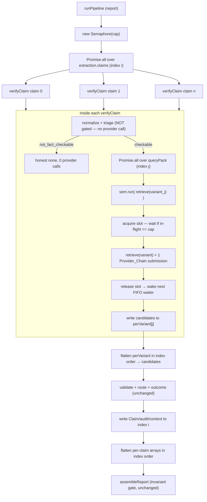

# Design Document

## Overview

Stage 3 of the pipeline verifies each extracted Claim serially (`for (const c of extraction.claims)` in `pipeline/stages.ts`), and inside each Claim the router (`router/index.ts`) submits each Query_Variant serially (`for (const variant of queryPack)`). Only the innermost layer — collecting candidates across providers for one variant in `makeRetrieve` — is concurrent. On a Cache_Miss this serial structure dominates latency: up to *claims × 6 variants* round-trips happen one after another.

This feature makes both the claim loop and the variant loop run in parallel, but bounds the number of in-flight evidence lookups with **one shared counting semaphore per report** (the `Concurrency_Cap`). The semaphore is the `Bounded_Scheduler`. It is created once in `runPipeline`, threaded into every Claim's `verifyClaim`, and acquired immediately before each `retrieve(variant)` call and released immediately after. Because the pipeline wires the Provider_Chain as a single retrieval source, **one gated `retrieve` call = one Provider_Chain submission**, so capping concurrent retrieve calls caps concurrent provider submissions directly.

The design holds three things invariant:

- **Determinism by construction.** Lookups are *scheduled* in parallel but their results are *written back into pre-sized arrays at their original index* (claims by extraction index, candidates by Query_Variant position). Completion order never touches output order. `retrievalRank` stays a per-variant position assigned inside `makeRetrieve`. This is the core trick.
- **Error isolation that reproduces the existing serial defaults exactly.** No new retries, no new provider calls.
- **The invariant gate is untouched.** `core/assemble.ts` is only verified (via the existing `assertInvariantGateIntact` boot guard and the gate property tests), never edited. The parallel path changes *when* claims/citations are produced, never *which*.

Rung climbed (ponytail): no dependency is added. There is no `p-limit`/`p-map` in the tree and none is introduced. A ~30-LOC in-house counting semaphore with a FIFO waiter queue is the smallest thing that bounds concurrency globally while remaining starvation-free; `Promise.all` over index-preserving maps does the rest. We reuse the existing `makeRetrieve` (unchanged), the existing `verifyClaim` error defaults, and the existing `config.ts` `Number(process.env.X ?? default)` pattern.

## Architecture

### Where parallelism is introduced

Two loops change; one helper is added; `makeRetrieve` and `assemble.ts` are untouched.

| Site | Today | After |
| --- | --- | --- |
| `pipeline/stages.ts` claim loop | serial `for await` | `Promise.all` over claims, results written by extraction index |
| `router/index.ts` variant loop | serial `for await` | `Promise.all` over variants, candidates written by variant index, each `retrieve` gated by the shared semaphore |
| `router/retrieve.ts` `makeRetrieve` | concurrent across providers, `DEFAULT_PER_VARIANT_CAP` | **unchanged** (Req 1.6) |
| `core/assemble.ts` | invariant gate | **unchanged** (Req 6.1) |

### One shared scheduler vs. nested independent caps — decision

Two shapes were considered:

1. **Nested independent caps.** A cap-`C_claim` scheduler over claims, and inside each claim an independent cap-`C_variant` scheduler over variants. Simple to reason about per-level, but the *global* in-flight provider count is `C_claim × C_variant` in the worst case — exactly the cost/rate-limit quantity we must bound. To bound it globally you must solve `C_claim × C_variant ≤ cap`, which forces awkward factoring (e.g. cap=4 → 2×2, but cap=5 is prime → 5×1 or 1×5, losing one level of parallelism). Two knobs, coupled, for one budget.

2. **One shared scheduler (chosen).** A single counting semaphore of size `cap`, shared by *both* loops, acquired around each `retrieve(variant)` call. Claims and variants are all launched in parallel; the semaphore alone decides how many retrieve calls are in flight at once. The global in-flight provider count is `≤ cap` **by construction**, independent of how the work splits across the two levels. One knob, one budget, the cost boundary bounded exactly where it lives (the provider submission).

We pick (2). It is the simplest sufficient option: it bounds the real cost/rate-limit quantity (concurrent Provider_Chain submissions) globally with a single integer, parallelizes both levels so a report with few claims still overlaps its variants (and vice-versa), and collapses to the exact serial baseline at `cap = 1`. The cost is that the two loops share mutable scheduler state (the semaphore instance) — acceptable, because the semaphore is the only shared state and it is small, self-contained, and the sole synchronization point.

### Bounded scheduler flow



The semaphore is the only thing that ever blocks. Everything else is launched eagerly; the `acquire()` inside `sem.run` is what throttles the eager fan-out down to `cap` concurrent provider submissions.

## Components and Interfaces

### 1. The bounded-concurrency helper — `src/concurrency.ts` (new, ~30 LOC)

A counting semaphore with a FIFO waiter queue. Placed at the server `src` root because both `pipeline/stages.ts` and `router/index.ts` consume it. No dependency, no abstraction beyond what the two call sites need.

```ts
// A counting semaphore: at most `cap` holders concurrently. acquire() resolves when a
// slot is free; release() hands the freed slot directly to the longest-waiting acquirer
// (FIFO), so no scheduled lookup is starved (Req 5.4). run() is the ergonomic wrapper
// the call sites use: acquire → task → release-in-finally (release even if task throws).
export class Semaphore {
  private avail: number;
  private readonly waiters: Array<() => void> = [];

  constructor(cap: number) {
    // cap is already validated by config (Req 2.2/2.3); floor+max is belt-and-suspenders
    // so a stray non-positive value can never deadlock the scheduler.
    this.avail = Math.max(1, Math.floor(cap));
  }

  private acquire(): Promise<void> {
    if (this.avail > 0) {
      this.avail--;
      return Promise.resolve();
    }
    return new Promise<void>((resolve) => this.waiters.push(resolve));
  }

  private release(): void {
    const next = this.waiters.shift();
    if (next) next();        // hand the slot straight to the next waiter (count stays "taken")
    else this.avail++;       // nobody waiting → return the slot to the pool
  }

  async run<T>(task: () => Promise<T>): Promise<T> {
    await this.acquire();
    try {
      return await task();
    } finally {
      this.release();        // released on success AND on throw, so a failing lookup frees its slot (Req 4.6)
    }
  }
}
```

Properties this gives us directly:

- **In-flight ≤ cap at every instant** (Req 1.3, 5.1): `avail` starts at `cap`, every `run` decrements before the task and increments after, and a slot is never double-counted (a freed slot is either handed to a waiter or returned to the pool, never both).
- **No starvation** (Req 5.4): FIFO `waiters` queue; `release` always wakes the head, so every queued lookup eventually starts.
- **`cap = 1` ⇒ strictly serial** (Req 2.5): only one slot, so exactly one retrieve is ever in flight; the next acquirer waits until the current releases.
- **Releases on throw** (Req 4.6): `finally` guarantees a rejected lookup frees its slot for siblings.

### 2. Router orchestration — `src/router/index.ts`

`VerifyDeps` gains one optional field; the variant loop becomes an index-preserving parallel map.

```ts
export interface VerifyDeps {
  normalizer: ClaimNormalizer;
  validator: CandidateValidator;
  retrieve: (variant: QueryVariant) => Promise<Candidate[]>;
  classifyTier: (sourceUrl: string) => SourceTier;
  semaphore?: Semaphore;   // shared per-report scheduler; absent ⇒ standalone cap-1 (back-compat)
}
```

Inside `verifyClaim`, Stage 4 changes from a serial accumulate to a pre-sized parallel write:

```ts
// Stage 4: retrieve per variant, in parallel, gated by the shared semaphore. Results are
// written into perVariant[j] so completion order never affects candidate order (Req 3.4).
const sem = deps.semaphore ?? new Semaphore(1);
const perVariant: Candidate[][] = new Array(queryPack.length);
await Promise.all(
  queryPack.map(async (variant, j) => {
    try {
      perVariant[j] = await sem.run(() => deps.retrieve(variant)); // 1 acquire = 1 Provider_Chain submission
    } catch {
      perVariant[j] = []; // a variant whose retrieval throws contributes zero candidates (Req 4.2)
    }
  }),
);
const candidates: Candidate[] = perVariant.flat(); // variant-index order, then in-variant order (Req 3.4)
```

Everything downstream (validate → route → assignEvidenceOutcome → assemble) is unchanged: `candidates` arrives in exactly the order the serial loop produced, so `retrievalRank` (assigned inside `makeRetrieve` from in-variant position) and every routed-candidate ordering are identical. `normalize`/`triage` run *before* and *outside* the semaphore — they make zero Provider_Chain submissions, so a `not_fact_checkable` claim still short-circuits with zero acquisitions (Req 5.3).

### 3. Verification stage — `src/pipeline/stages.ts`

`runPipeline` gains a `concurrencyCap` parameter (default `1`, which keeps every existing caller behaviorally identical to today's serial code). It creates the one shared semaphore, threads it into `verifyDeps`, and replaces the serial loop with a pre-sized parallel map.

```ts
export async function runPipeline(
  input: RawInput,
  providers: Providers,
  concurrencyCap = 1, // serial baseline by default; worker passes config.concurrencyCap
): Promise<PipelineResult> {
  // ... stages 1–2 unchanged ...
  const semaphore = new Semaphore(concurrencyCap);
  const verifyDeps: VerifyDeps = { /* ...existing... */, semaphore };

  const n = extraction.claims.length;
  const claims: Claim[] = new Array(n);
  const audits: AuditRecord[] = new Array(n);
  const perClaimUseful: Candidate[][] = new Array(n);
  const perClaimCards: ContextCard[][] = new Array(n);

  await Promise.all(
    extraction.claims.map(async (c, i) => {
      const verified = await verifyClaim(c.claimText, verifyDeps);
      claims[i] = { id: randomUUID(), claimText: c.claimText, /* ...as today... */
        evidenceStrength: verified.evidenceStrength, citations: verified.citations };
      audits[i] = verified.audit;
      perClaimUseful[i] = verified.usefulContext;
      perClaimCards[i] = verified.contextCards;
    }),
  );

  const usefulContext = perClaimUseful.flat();        // grouped by claim index asc, in-group order kept (Req 3.3)
  const routerContextCards = perClaimCards.flat();
  // ... framing, perspectives, assembleReport unchanged ...
}
```

`randomUUID()` for `claims[i].id` is non-deterministic in both the serial and parallel code — it was already non-deterministic, so it is excluded from the output-equivalence comparison (see Testing Strategy). Everything else is a pure function of the input plus the (deterministic, in tests) providers.

### 4. Config — `src/config.ts`

A pure, testable resolver (mirroring `missingRequiredConfig`) plus one field on `config`.

```ts
export const CONCURRENCY_CAP_DEFAULT = 4;
const CONCURRENCY_CAP_MIN = 1;
const CONCURRENCY_CAP_MAX = 32;

// Resolve CONCURRENCY_CAP from its raw env string. Valid = an integer in [1,32]; anything
// absent, non-numeric, non-integer, or out of range falls back to the documented default 4
// and returns a warning naming the variable (Req 2.2, 2.3, 2.4). Pure → unit/property tested.
export function resolveConcurrencyCap(raw: string | undefined): { value: number; warning?: string } {
  const n = Number(raw);
  const valid =
    raw !== undefined && raw.trim() !== '' &&
    Number.isInteger(n) && n >= CONCURRENCY_CAP_MIN && n <= CONCURRENCY_CAP_MAX;
  if (valid) return { value: n };
  return {
    value: CONCURRENCY_CAP_DEFAULT,
    warning: `CONCURRENCY_CAP invalid or unset (${String(raw)}); using default ${CONCURRENCY_CAP_DEFAULT}`,
  };
}

const concurrency = resolveConcurrencyCap(process.env.CONCURRENCY_CAP);
if (concurrency.warning) console.warn(`[config] ${concurrency.warning}`); // warn, do not abort (Req 2.4)

export const config = {
  // ...existing...
  concurrencyCap: concurrency.value,
};
```

Note on "clamp vs. default": Req 2.3 lists "greater than 32" and "less than 1" as values that trigger the **default of 4**, not a clamp to the nearest bound. So out-of-range is rejected to 4 (with a warning), not clamped. The valid set is the integer interval `[1,32]`.

Both the API process and the worker process read the same `config.concurrencyCap` (config is a single module evaluated once per process from the same env), so the effective cap is identical across them (Req 2.6). `worker.ts` passes `config.concurrencyCap` into `runPipeline`; the API process does not run the pipeline directly but shares the value through the same module.

### 5. Benchmark p95 reporting — `src/router/benchmark/runner.ts`

Add a small pure percentile helper and a cache-miss latency harness alongside the existing FER machinery (FER logic untouched).

```ts
// Nearest-rank p95 over a non-empty sample of millisecond latencies. Pure → property tested.
export function percentile(sortedAscMs: number[], p: number): number { /* nearest-rank */ }

export interface LatencyBenchmarkReport {
  latenciesMs: number[];   // per-run end-to-end latency, run order (Req 7.3)
  p95Ms: number;           // aggregate cache-miss 95th percentile (Req 7.3)
  thresholdMs: number;     // 30_000
  passed: boolean;         // p95Ms <= thresholdMs (Req 7.1 ship gate)
}

// Run `runOnce` (a Cache_Miss pipeline execution with the cache cleared) at least `runs`
// (≥20) times, timing each with an injected clock, and report latencies + p95 + pass/fail.
// A run whose lookups fail still contributes its measured latency (Req 7.4): runOnce is the
// whole pipeline, which never throws on a lookup failure (verifyClaim is total), so the run
// completes and is timed regardless.
export async function runLatencyBenchmark(
  runOnce: () => Promise<void>,
  opts: { runs: number; thresholdMs?: number; now?: () => number },
): Promise<LatencyBenchmarkReport> { /* loop, time each, sort, percentile */ }
```

The clock is injected (`now` defaults to `performance.now()`) so the percentile/aggregation logic is deterministically testable without real time. The actual ≥20-run execution against the fixture set (Req 7.1) is an offline integration run wired to mock providers with the cache cleared before each run; its pass/fail verdict is produced by the pure `passed` field.

## Data Models

No persisted schema changes. All new state is in-process and transient:

- **`Semaphore`** (`concurrency.ts`): `avail: number`, `waiters: Array<() => void>`. One instance per report, lives only for the duration of `runPipeline`.
- **`VerifyDeps.semaphore?: Semaphore`**: optional injection point on the existing deps object.
- **Index-keyed staging arrays** (transient, inside `runPipeline` and `verifyClaim`): `claims[]`, `audits[]`, `perClaimUseful[][]`, `perClaimCards[][]` keyed by extraction index; `perVariant[][]` keyed by Query_Variant position. Pre-sized to their loop length, written by index, flattened in index order.
- **`config.concurrencyCap: number`**: a finite integer in `[1,32]`, default `4`.
- **`LatencyBenchmarkReport`**: `{ latenciesMs: number[]; p95Ms: number; thresholdMs: number; passed: boolean }`.

`Candidate.retrievalRank`, `Citation`, `AuditRecord`, `AnalysisReport`, and the `EvidenceOutcome`/`EvidenceStrength` taxonomies are all unchanged.

## Correctness Properties

*A property is a characteristic or behavior that should hold true across all valid executions of a system — essentially, a formal statement about what the system should do. Properties serve as the bridge between human-readable specifications and machine-verifiable correctness guarantees.*

The reference implementation (`Serial_Baseline`) is operationalized as **`runPipeline(..., cap = 1)`**: by the semaphore's `cap = 1` behavior (Req 2.5) this executes exactly one provider submission at a time, in extraction-then-variant order, which is the serial behavior shipped today. Every equivalence property compares `cap = 1` against `cap = N` for random `N > 1`. All properties run offline against mock providers + in-memory infra (Req 8.1, 8.2, 8.5), which is the natural test substrate.

### Property 1: Output-equivalence (parallel ≡ serial)

*For any* extraction (claims, framing signals, context cards) and any deterministic provider set, and *for any* concurrency cap `N ≥ 1`, the report produced by `runPipeline` at cap `N` SHALL be deep-structurally equal to the report at cap `1` — equal in `status`, `reasons` (same elements, same order), claim order, each claim's `evidenceStrength` and citation content and order, audit content and order (audit at index *i* describing claim *i*), useful-context order (grouped by claim index ascending, in-group order preserved), and context-card order — excluding only the per-claim `randomUUID` ids, which were already non-deterministic in the serial code.

**Validates: Requirements 1.4, 3.1, 3.2, 3.3, 3.4, 3.5, 3.6, 6.2, 6.4, 6.5, 6.6, 8.2**

### Property 2: Error isolation reproduces serial defaults

*For any* extraction and *for any* set of injected retrieval failures (any subset of variants and/or claims whose `retrieve` throws or rejects), the report produced at cap `N` SHALL be deep-structurally equal to the report at cap `1` for the same input and the same injected failures — so a failing variant contributes exactly zero candidates, remaining variants and claims are processed independently and keep their indices, and a claim whose every variant fails resolves to `no_sufficient_evidence` with zero citations.

**Validates: Requirements 1.5, 4.1, 4.2, 4.3, 4.4, 4.5**

### Property 3: In-flight submissions never exceed the cap

*For any* extraction and *for any* cap `N ≥ 1`, when every `retrieve` call is instrumented to increment a counter on entry and decrement on exit, the maximum observed value of that counter over the whole report SHALL be at most `N` (and exactly `1` when `N = 1`).

**Validates: Requirements 1.3, 2.5, 5.1**

### Property 4: Cost-neutral and complete (no dropped, starved, or extra calls)

*For any* extraction (including claims that triage rejects as `not_fact_checkable`) and *for any* cap `N ≥ 1`, with or without injected retrieval failures, the total number of Provider_Chain `gather` calls made at cap `N` SHALL equal the total made at cap `1` for the identical input — every scheduled lookup runs exactly once (none dropped or starved), triage-rejected claims issue zero calls on both paths, and a failure triggers no additional retry call.

**Validates: Requirements 4.6, 5.2, 5.3, 5.4, 5.5**

### Property 5: Honest-none preserved

*For any* claim that resolves to the Honest_None_State, the parallel path SHALL deliver it to the invariant gate with `evidenceStrength` equal to `none` and zero citations, identically to the serial path.

**Validates: Requirements 6.3, 8.3**

### Property 6: Latency reduction under bounded parallelism

*For any* report with at least two independent claims, when retrieval uses deterministic mock providers with a fixed identical per-lookup latency and the cap `N` satisfies `1 < N ≤ (number of independent claims)`, the wall-clock time to complete the report at cap `N` SHALL be strictly less than at cap `1`, and the maximum observed in-flight retrieve count SHALL be greater than `1`.

**Validates: Requirements 1.1, 1.2, 7.2**

### Property 7: p95 latency reporting is correct

*For any* non-empty sample of per-run latencies and any threshold, the benchmark report SHALL expose the per-run latencies, a nearest-rank 95th-percentile value computed from them, and a `passed` flag equal to (`p95 ≤ threshold`).

**Validates: Requirements 7.3**

### Property 8: Concurrency-cap resolution

*For any* raw environment value, `resolveConcurrencyCap` SHALL return that value when it is an integer in the inclusive range `[1, 32]` with no warning, and SHALL otherwise return the default `4` together with a warning naming the `CONCURRENCY_CAP` variable — for every absent, empty, non-numeric, non-integer, less-than-1, or greater-than-32 input.

**Validates: Requirements 2.2, 2.3, 2.4**

## Error Handling

The parallel path reproduces the serial router's error defaults **exactly** — same outcomes, same citations, no new provider calls, no retries. The mapping:

| Failure | Serial behavior (today) | Parallel behavior | Mechanism |
| --- | --- | --- | --- |
| Normalizer throws/times out | `not_fact_checkable`, no search, honest none | identical | `normalizeSafe` runs before the semaphore — unchanged |
| One Query_Variant's `retrieve` throws | that variant contributes zero candidates | identical | per-variant `try/catch` sets `perVariant[j] = []` |
| Every Query_Variant fails | `no_sufficient_evidence`, zero citations | identical | all `perVariant[j] = []` ⇒ empty `candidates` ⇒ unchanged `routeCandidates`/`assignEvidenceOutcome` |
| Validator throws | candidate treated as `irrelevant` | identical | `safeValidate` — unchanged |
| One claim's `verifyClaim` rejects unexpectedly | propagates → `runPipeline` throws → worker marks report `failed` | identical | `verifyClaim` is total by construction (the three rows above), so this is not reachable in practice; `Promise.all` does not cancel siblings, and the worker's outer `try/catch` is the same failure sink |

Two scheduler-specific guarantees:

- **`sem.run` releases in `finally`**, so a rejected lookup frees its slot for siblings — a failure never deadlocks the scheduler or starves queued lookups (Req 4.6, 5.4).
- **No new retries.** `sem.run(() => retrieve(variant))` calls `retrieve` exactly once per variant, the same count as the serial loop, so failure handling adds zero Provider_Chain calls (Req 5.5, verified by Property 4 under failure injection).

The invariant gate (`core/assemble.ts`) is never edited; the existing `assertInvariantGateIntact` boot guard in `worker.ts` still runs, and a weakened gate still refuses startup (Req 6.1).

## Testing Strategy

Property-based testing applies: the verification stage and router orchestration are deterministic given their (mockable) providers, and the central guarantees are universal — output-equivalence, an invariant (in-flight ≤ cap), a conservation law (call-count equality), and a pure resolver. PBT is the right tool here.

**Dual approach.** Property tests carry the universal guarantees (Properties 1–8 above); a handful of example/edge assertions and the existing suites cover the non-PBT criteria (gate untouched, per-variant cap preserved, offline network-free, the 20-run benchmark).

**Library and conventions.** `fast-check` (already a devDependency) under `node:test` + `node:assert`, **minimum 100 runs** per property. Each property test carries the comment `// Feature: parallel-evidence-lookups, Property <n>: <description>` plus a `Validates: Requirements …` reference. New test files live under `test/router/` (already globbed by `"test/router/**/*.test.ts"` in `package.json`) or are added by name to the explicit `test` list; the config-resolver test sits beside the existing `test/config.test.ts` and is added to the list (Req 8.4).

**Test substrate.** Deterministic mock providers + in-memory infra (zero API keys), so every property runs offline with no outbound network (Req 8.1, 8.2, 8.5). The `Serial_Baseline` reference is `runPipeline(..., cap = 1)`.

Planned tests, mapped to properties and requirements:

| Test file | Property | Approach | Validates |
| --- | --- | --- | --- |
| `test/router/parallel.equivalence.test.ts` | P1 | random extraction + deterministic mocks; `deepEqual(report(cap=1), report(cap=N))`, `N ∈ 2..8`, ids excluded | 1.4, 3.1–3.6, 6.2, 6.4–6.6, 8.2 |
| `test/router/parallel.isolation.test.ts` | P2 | inject random variant/claim retrieval throws; `deepEqual` to cap=1 with same failures; degenerate all-fail ⇒ `no_sufficient_evidence` | 1.5, 4.1–4.5 |
| `test/router/parallel.cap.test.ts` | P3 | instrumented retrieve counter; assert max in-flight ≤ N (and =1 at N=1) over random reports/caps | 1.3, 2.5, 5.1 |
| `test/router/parallel.cost.test.ts` | P4 | counting provider; assert `calls(cap=1) === calls(cap=N)` incl. not_fact_checkable claims and injected failures | 4.6, 5.2–5.5 |
| `test/router/parallel.honestNone.test.ts` | P5 | claims engineered to resolve none; assert `evidenceStrength==='none'` + 0 citations, equal to serial | 6.3, 8.3 |
| `test/router/parallel.latency.test.ts` | P6 | fixed-delay mock retrieve; assert `elapsed(cap=N) < elapsed(cap=1)` for ≥2 claims; observe max in-flight > 1 | 1.1, 1.2, 7.2 |
| `test/router/benchmark.p95.test.ts` | P7 | `percentile` over random samples + report shape; `passed === (p95 ≤ threshold)` | 7.3 |
| `test/config.test.ts` (extend) | P8 | random raw env values across all invalid classes; valid integers pass, else default 4 + warning | 2.2, 2.3, 2.4 |

Notes on the timing-sensitive tests:

- **P6 (latency)** compares wall-clock, which is inherently noisy. *ponytail:* use a generous fixed per-lookup delay (e.g. 40–50 ms) and few claims so the serial total dwarfs the parallel total by a wide margin; the assertion is strict-less, not a ratio. Ceiling: a pathologically loaded CI box could still flake; upgrade path is a logical-clock fake-timer harness if it ever does.
- **P7 (p95)** tests only the pure percentile/verdict logic with an injected clock — deterministic, no real time. The full **Req 7.1** 20-run cache-miss benchmark is an offline integration run (cache cleared per run) under `test:integration`/the benchmark entrypoint, reporting `LatencyBenchmarkReport`; its `passed` field is the ship-gate verdict. Because `runOnce` is the whole pipeline and `verifyClaim` is total, a run with failed lookups still completes and contributes its latency (Req 7.4).

**Runnable self-checks (ponytail).** `concurrency.ts` carries an assert-based self-check (`cap=1` serializes; `cap=2` lets two overlap; `run` releases on throw) runnable via `node --import tsx src/concurrency.ts`, matching the existing `index.ts`/`runner.ts` self-check convention.

## Requirements Traceability

| Requirement | Design elements |
| --- | --- |
| **1 — Bounded-concurrency parallelization** | Shared `Semaphore` (`concurrency.ts`); parallel maps in `stages.ts` (claims) and `index.ts` (variants); `makeRetrieve` and `DEFAULT_PER_VARIANT_CAP` untouched (1.6). Verified by Properties 1, 2, 3, 6. |
| **2 — Configurable cap** | `resolveConcurrencyCap` + `config.concurrencyCap` (default 4, `[1,32]`, warn-and-default); `Semaphore(cap)`, `cap=1` ⇒ serial; single config module read by API and worker (2.6). Verified by Properties 8, 3 (cap=1). |
| **3 — Deterministic ordering** | Pre-sized index-write arrays (`claims[i]`, `audits[i]`, `perClaimUseful[i]`, `perClaimCards[i]`, `perVariant[j]`) + `.flat()` in index order; `retrievalRank` unchanged in `makeRetrieve`. Verified by Property 1. |
| **4 — Error isolation** | Per-variant `try/catch → []`; `normalizeSafe`/`safeValidate` unchanged; total `verifyClaim`; `sem.run` releases in `finally`. Error-handling mapping table. Verified by Properties 2, 4. |
| **5 — Cost & rate-limit safety** | Semaphore caps in-flight retrieve calls globally; one gated retrieve = one Provider_Chain submission; exactly one `retrieve` per variant, no retries; triage short-circuits before any acquire. Verified by Properties 3, 4. |
| **6 — Invariant gate & honest-none** | `assemble.ts` not modified; `assertInvariantGateIntact` boot guard retained; routing/citation separation unchanged; honest-none flows by index-write. Verified by Properties 1, 5. |
| **7 — Cache-miss latency target** | Two-level bounded parallelism for overlap; `percentile` + `runLatencyBenchmark` (`LatencyBenchmarkReport` with `latenciesMs`, `p95Ms`, `passed`) added to `runner.ts`. Verified by Properties 6, 7; ship gate by the offline 20-run benchmark (7.1). |
| **8 — Offline-first parallel path** | Same code path under mock providers + in-memory infra; all property tests run offline with zero network; tests under `node:test`+`fast-check` ≥100 runs added to `package.json`. Verified by Properties 1, 5 (offline substrate). |
