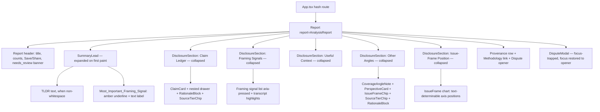

# Design Document

## Overview

This feature re-presents the data the live report page (`app/apps/web/src/components/Report.tsx`) already renders, reorganizing it for progressive disclosure and reduced cognitive load. It is a **presentation-layer change only**: it touches no API client, no report schema, and never re-runs the invariant gate.

The current page paints everything at once — a TLDR card, an always-visible issue-frame chart, an always-visible "most important framing signal" card, and four mutually-exclusive tabs (Claim Ledger, Framing Signals, Useful Context, Other Angles) whose claim rows already have per-claim expandable drawers. The redesign keeps every piece of data but changes *when* it is shown:

- A **Summary_Lead** renders expanded on first paint — the TLDR plus the single Most_Important_Framing_Signal, the latter marked with a soft amber underline **and an adjacent text label** so the emphasis never relies on color alone.
- Every other section — claim ledger, framing detail, useful context, other angles, and the issue-frame position — moves behind an independent, keyboard-operable **Disclosure_Drawer**, collapsed on first paint.
- The calmer card styling and the **Rationale_Block** ("Why included" / "Why this is here") from the prototype mockup are ported onto the live wiring, drawing only from fields already in the report.
- Three lens-aligned borrowings are added as descriptive (never evaluative) presentation: a **Coverage_Angle_Note** ("covered from one angle"), spatial **Issue_Frame_Chips**, and **Source_Tier_Chips** on citations and perspective sources.

### Compass and scope guardrails (binding on every component)

- **Lens, not judge.** No surface displays a verdict on the truthfulness of content, and no surface attaches a reliability rating to a Creator. Source-tier chips attach to *sources and citations only*.
- **No schema change, no mutation.** Components read the `AnalysisReport` they are given; they never add, remove, rename, or write back fields.
- **The invariant gate is untouched.** This feature reads `report.status`; it never calls `assemble.ts` and never alters the `ready` / `needs_review` decision. A `needs_review` report is shown transparently with a text label, never suppressed.
- **Honest absence over implied judgment.** When a field is missing the corresponding chip/note/block is omitted entirely — no placeholder, no empty chip.

### Reuse-first posture (ponytail ladder)

The live file already contains most of the logic this feature needs. The design **reuses** rather than rebuilds:

| Need | Already exists in `Report.tsx` | Action |
|------|--------------------------------|--------|
| Select most-important signal | `topFramingSignal(signals)` (highest severity, first-wins on ties) | Reuse as-is |
| Issue-frame axis text | `issueFrameAxisText`, `issueFramePositionText` (total over all numbers) | Reuse; derive pole names from them |
| Tier display label | `TIER` map (human-readable, not the internal id) | Reuse as the Source_Tier_Chip label |
| Severity tag class + color-with-text | `severityTagCls`, `STRENGTH`, `VERIFIABILITY` maps | Reuse |
| Drawer toggle + `aria-expanded` + Enter/Space | `ClaimCard` head pattern | Extract into a reusable `DisclosureSection` |
| Modal focus trap + focus restore | `DisputeModal` (trap) + opener `ref` in `Report` | Reuse unchanged (satisfies 7.4, 7.5) |
| `≤768px` single column | `@media (max-width: 768px)` collapsing `.framing-layout`, `.grid-2` | Reuse; extend to drawer layout |
| Teal `#0d9488` accent, lucide icons | CSS `--accent` (light theme) + `lucide-react` imports | Reuse |

New code is limited to: one reusable `DisclosureSection` wrapper, small pure helpers (pole naming, label truncation, rationale-field selection), and the `Coverage_Angle_Note` / `Issue_Frame_Chip` / `Source_Tier_Chip` presentational pieces.

## Architecture

The report page stays a single client-rendered React tree under hash routing. The change is structural within `Report.tsx`, not architectural: the four-tab mutually-exclusive switcher is replaced by a stack of independent disclosure drawers, and a dedicated `SummaryLead` block leads the page.



### Disclosure model: independent drawers, not tabs

Requirement 2.7 mandates that toggling one drawer leaves every other drawer's state unchanged. The current tab bar is mutually exclusive (selecting one section hides the previously selected one), which cannot satisfy 2.7. The design therefore replaces the mutually-exclusive `tab` state with **one independent boolean of expansion per section**, each owned by its own `DisclosureSection`. No section's state is coupled to another's.

Consequence for Requirement 7.8 (`aria-pressed` on tab controls): the page-level tab bar is removed, so there are no page-level tab controls. The one remaining tab-like control is the **framing-signal selector** inside the Framing drawer, which already carries `aria-pressed={i === active}` and is preserved unchanged. 7.8 is satisfied by that control; it is vacuously satisfied at the page level since no page tabs remain.

### State ownership

- Each `DisclosureSection` owns its own `open: boolean`, defaulting to `false` (collapsed on first paint). Independence is structural — sibling drawers share no state.
- `ClaimCard` keeps its own nested `open` drawer state (the per-claim "what was said / evidence review / sources" detail), unchanged.
- `Report` keeps the existing `disputeOpen`, `authPrompt`, `saved` state and the `disputeOpenerRef` for focus restore.
- The framing-signal selector keeps its `active` index local to the Framing drawer.

No global store, no context, no new dependency. Pure derivations (top signal, pole names, truncation, counts) are computed during render from the immutable `report` prop.

## Components and Interfaces

### `SummaryLead`

```ts
function SummaryLead({ report }: { report: AnalysisReport }): JSX.Element
```

Renders expanded, above all drawers, before any interaction (Req 1.1, 1.2, 1.5).

- TLDR portion: rendered only `WHEN report.tldr` has at least one non-whitespace character (`report.tldr?.trim()` truthy). Otherwise omitted (Req 1.7, 1.8).
- Most_Important_Framing_Signal portion: computed via the existing `topFramingSignal(report.framingSignals)`. Rendered when a signal exists; omitted otherwise (Req 1.6).
- The signal text carries a soft amber underline (`.mis-underline`, styled from `--amber`) **and** a visible adjacent label, e.g. `Most important framing signal`, so the meaning is conveyed by text, not the underline color (Req 1.4, 7.1).
- Honest-absence case: when there is neither a non-whitespace TLDR nor any framing signal, `SummaryLead` renders a single plain statement — "No summary available for this analysis." — and both portions are omitted (Req 1.8). All other sections remain collapsed regardless (Req 1.5, 1.8).

### `DisclosureSection` (new, reusable)

```ts
function DisclosureSection({
  title,
  count,          // optional badge count shown in the control label
  defaultOpen,    // always false for this feature; param kept for reuse
  children,
}: {
  title: string;
  count?: number;
  defaultOpen?: boolean;
  children: ReactNode;
}): JSX.Element
```

Extracted from the existing `ClaimCard` head pattern so the drawer mechanics live in one place (ponytail: reuse the pattern already proven in the codebase).

- The control is a focusable element with `role="button"`, `tabIndex={0}`, reachable by Tab (Req 2.4, 7.2).
- `onClick` toggles `open`; `onKeyDown` toggles on `Enter` and `Space` with `preventDefault` to stop page scroll (Req 2.2, 2.3, 2.4).
- Sets `aria-expanded={open}` — `true` while expanded, `false` while collapsed (Req 2.5, 7.7).
- Children render only while `open`; collapsing removes them from the DOM, returning the drawer to its first-paint state (Req 2.1, 2.3, 2.6).
- A `lucide-react` `ChevronDown` chevron rotates with `open` for an affordance; the visible focus ring (`:focus-visible` outline in `--accent`) satisfies Req 7.3.

The five supporting sections are each wrapped in a `DisclosureSection`: Claim Ledger, Framing Signals, Useful Context, Other Angles, and Issue-Frame Position (Req 2.1).

### `RationaleBlock` (new, presentational)

```ts
function RationaleBlock({ label, text }: { label: 'Why included' | 'Why this is here'; text?: string }): JSX.Element | null
```

- Returns `null` when `text` is absent, empty, or whitespace-only — no placeholder rendered (Req 3.5).
- Renders the **unaltered** field text under the given label; it never appends or substitutes wording (Req 3.4).
- Usage:
  - Perspective card: `<RationaleBlock label="Why included" text={p.whyIncluded} />` (Req 3.1).
  - Claim drawer: the rationale text is selected by a pure helper `claimRationale(claim)` that returns `evidenceDescription` when non-whitespace, else `sourceBasis` when non-whitespace, else `undefined`; rendered as `<RationaleBlock label="Why this is here" text={claimRationale(claim)} />` (Req 3.2, 3.3, 3.5).

### `CoverageAngleNote` (new, presentational)

```ts
function CoverageAngleNote({ issueFrame, hasPerspectives }: {
  issueFrame?: IssueFrame;
  hasPerspectives: boolean;
}): JSX.Element | null
```

Rendered inside the Other Angles drawer.

- Returns `null` when `issueFrame` is absent (Req 4.4) or when no axis has magnitude `> 0.8` (Req 4.2).
- When at least one axis of `issueFrame` has `|value| > 0.8`, renders a descriptive note that states the content is covered from one angle and names the **pole** of each strong axis, via the pure helper `strongAxisPoles(issueFrame)` (Req 4.1).
- Phrasing is descriptive and never a verdict: it asserts nothing about truth/accuracy and attaches no rating to the Creator (Req 4.3). Fixed copy template: *"This content frames the topic from one angle — leaning toward {poles}. Seeking other perspectives can round out the picture."*
- When `hasPerspectives` is true the note ends with a directive to the available other-angle perspectives; when false the directive clause is dropped (Req 4.5, 4.6).

### `IssueFrameChip` (new, presentational)

```ts
function IssueFrameChip({ label }: { label?: string }): JSX.Element | null
```

- Returns `null` when `label` is absent/empty — no placeholder marker (Req 5.2, 5.4).
- Renders up to 120 characters via the pure helper `truncateLabel(label, 120)`; beyond 120 it shows an ellipsis and exposes the **full** label through `title` (hover) and is keyboard-focusable so the full text is reachable on focus (Req 5.1, 5.3).
- Presented as a descriptive position chip; never a verdict, truthfulness/reliability rating, ranking, or numeric score (Req 5.7).
- Used at the report level with `report.issueFrame?.label` and per perspective with `p.issueFrameLabel`.

The existing `IssueFrame` chart (inside the Issue-Frame Position drawer) keeps its text-determinable axis positions: each axis renders `issueFrameAxisText(...)` in `.axis-pos`, so the position is readable from text independent of marker placement or color (Req 5.5). If an axis's text cannot be produced — which the total `issueFrameAxisText` never fails to produce for finite or non-finite input — the spatial marker for that axis is omitted rather than shown alone (Req 5.6).

### `SourceTierChip` (new, presentational)

```ts
function SourceTierChip({ tier }: { tier?: SourceTier }): JSX.Element | null
```

- Returns `null` when `tier` is absent — no empty/placeholder chip (Req 6.5).
- Renders the human-readable label from the existing `TIER` map (e.g. `Tier 1 · Primary`), never the internal identifier (Req 6.1, 6.2).
- The text label sits adjacent to any color indicator; the tier is conveyed by text, never color alone (Req 6.4, 7.1).
- Attached **only** to citations (`cit.sourceTier`) and perspective sources (`p.sourceTier`). It is never rendered against the Creator; there is structurally no Creator tier in the schema, so no creator chip can exist (Req 6.3).

### Report header, neutrality, and status (existing, preserved)

- The header keeps the live counts row, rendering counts equal to `report.claims.length`, `report.framingSignals.length`, `report.contextCards.length`, and `report.perspectives.length` (Req 8.2). Each `DisclosureSection` also surfaces its section's count from the same arrays.
- The `needs_review` banner stays: it shows a visible text label that the analysis is awaiting human review and suppresses no content (Req 8.6). A `ready` report shows no review notice (Req 8.7).
- The page reads `report` immutably and writes nothing back to it (Req 8.1, 8.5). No verdict text and no creator rating is rendered anywhere (Req 8.3, 8.4).

### Accessibility wiring (existing patterns, preserved and extended)

- Color-never-alone: every color-coded signal — severity tags, evidence-strength chips, source-tier chips, the amber Summary_Lead underline — carries an adjacent text label (Req 7.1). Existing `STRENGTH`/`VERIFIABILITY`/`TIER` maps already pair color with text.
- Keyboard: every `DisclosureSection` control and the framing-signal selector are Tab-reachable and Enter/Space-operable (Req 7.2); a visible focus indicator renders on focus (Req 7.3).
- Modal focus: `DisputeModal` already traps Tab/Shift+Tab within the dialog (Req 7.4) and `Report` restores focus to `disputeOpenerRef` on close (Req 7.5). Unchanged.
- Responsive: the `@media (max-width: 768px)` rule collapses multi-column layouts to a single column with no horizontal content scroll; the drawer stack is single-column by construction (Req 7.6).
- Accent + icons: interactive affordances use the muted teal `--accent: #0d9488`; all icons come from `lucide-react` (Req 7.9).

## Data Models

This feature introduces **no new persisted data and no schema change**. It consumes the existing `AnalysisReport` contract (`app/apps/web/src/api/types.ts`) exactly as defined. The relevant read-only shapes:

```ts
interface AnalysisReport {
  status: ReportStatus;                 // drives needs_review/ready notice (8.6, 8.7)
  tldr?: string;                        // Summary_Lead TLDR portion (1.1, 1.6–1.8)
  issueFrame?: IssueFrame;              // Coverage_Angle_Note + report Issue_Frame_Chip (4.x, 5.1)
  claims: Claim[];                      // Claim Ledger drawer + counts (8.2)
  framingSignals: FramingSignal[];      // top signal + Framing drawer + counts (1.2, 8.2)
  contextCards: ContextCard[];          // Useful Context drawer + counts (8.2)
  perspectives: PerspectiveLink[];      // Other Angles drawer + counts (4.5, 8.2)
  // ...all other fields read but unmodified
}

interface Claim {
  evidenceDescription?: string;         // Rationale_Block first choice (3.2)
  sourceBasis?: string;                 // Rationale_Block fallback (3.3)
  citations: Citation[];                // Source_Tier_Chip per citation (6.1)
}
interface Citation { sourceTier: SourceTier; /* ... */ }   // tier chip (6.1, 6.5)
interface PerspectiveLink {
  sourceTier: SourceTier;               // Source_Tier_Chip (6.2, 6.5)
  issueFrameLabel: string;              // per-perspective Issue_Frame_Chip (5.3, 5.4)
  whyIncluded?: string;                 // Rationale_Block "Why included" (3.1, 3.5)
}
interface IssueFrame { label: string; x: number; y: number; }  // chip + angle note (4.1, 5.1)
type SourceTier = 'tier1_primary' | 'tier2_institutional' | 'tier3_viewpoint' | 'excluded';
```

### Derived (in-memory, pure) view models

These are computed during render from the immutable report; none are stored or written back.

| Helper | Signature | Purpose | Requirements |
|--------|-----------|---------|--------------|
| `topFramingSignal` (existing) | `(signals: FramingSignal[]) => FramingSignal \| undefined` | Highest severity, first-wins on tie | 1.2, 1.3 |
| `claimRationale` (new) | `(claim: Claim) => string \| undefined` | `evidenceDescription` else `sourceBasis` else `undefined`, ignoring whitespace-only | 3.2, 3.3, 3.5 |
| `strongAxisPoles` (new) | `(f: IssueFrame) => string[]` | Pole names for each axis with `\|value\| > 0.8` | 4.1, 4.2 |
| `truncateLabel` (new) | `(label: string, max=120) => { shown: string; truncated: boolean }` | ≤120 chars with ellipsis flag; full label preserved | 5.1, 5.3 |
| `tierLabel` (existing `TIER`) | `(t: SourceTier) => string` | Human-readable tier text | 6.1, 6.2 |
| `sectionCounts` (new, trivial) | `(r: AnalysisReport) => Record<section, number>` | Equals each collection length | 8.2 |

The amber Summary_Lead emphasis, the chip text, and the angle note are derived presentation; the underlying arrays and fields are never reordered or mutated (Req 8.1).

## Correctness Properties

*A property is a characteristic or behavior that should hold true across all valid executions of a system — essentially, a formal statement about what the system should do. Properties serve as the bridge between human-readable specifications and machine-verifiable correctness guarantees.*

This feature is a React presentation layer, so its keyboard, focus-trap, responsive, and theming criteria are verified by example/interaction tests (see Testing Strategy). The criteria below are the ones backed by **pure, universally-quantified logic** — selection, precedence, truncation, mapping, counts, and immutability — and are implemented as property-based tests with `fast-check` at a minimum of 100 runs. The set has been deduplicated per the prework reflection so each property carries unique validation value.

### Property 1: Most-important framing signal is the highest-severity, earliest-on-tie signal

*For any* non-empty array of framing signals, `topFramingSignal` returns a signal whose severity rank equals the maximum severity rank in the array, and among signals sharing that maximum rank it returns the one at the lowest index (first in report order).

**Validates: Requirements 1.2, 1.3**

### Property 2: Every supporting section is collapsed on first paint

*For any* valid `AnalysisReport`, when the report is rendered with no user interaction, every Disclosure_Drawer control reports `aria-expanded="false"` and none of the five supporting sections' contents are present in the DOM, while the Summary_Lead remains expanded.

**Validates: Requirements 1.5, 2.1**

### Property 3: Expand-then-collapse round-trips a drawer to its first-paint state

*For any* Disclosure_Drawer, activating it to expand and then activating it again to collapse returns the drawer to exactly its first-paint state: its content is absent from the DOM and its control's `aria-expanded` is `false`.

**Validates: Requirements 2.3, 2.6**

### Property 4: Toggling one drawer leaves every other drawer unchanged

*For any* set of Disclosure_Drawers and any single target drawer chosen from that set, toggling the target's control changes only the target's expanded/collapsed state; every other drawer's `aria-expanded` and content visibility are unchanged.

**Validates: Requirements 2.7**

### Property 5: Claim rationale follows the evidence→source precedence and omits on absence

*For any* claim, `claimRationale` returns the `evidenceDescription` when it has at least one non-whitespace character; otherwise it returns the `sourceBasis` when that has at least one non-whitespace character; otherwise it returns `undefined`, and `RationaleBlock` renders nothing (no placeholder node) for an `undefined`/whitespace-only value.

**Validates: Requirements 3.2, 3.3, 3.5**

### Property 6: Rationale blocks render the source field verbatim

*For any* non-whitespace rationale field text, the rendered Rationale_Block's text content equals that field's text exactly, with no prefix, suffix, or substituted wording added.

**Validates: Requirements 3.4**

### Property 7: Coverage-angle note triggers exactly on a strong axis and names its poles

*For any* issue-frame position `(x, y)`: when at least one axis has magnitude greater than `0.8`, `strongAxisPoles` returns exactly the pole names of the axes exceeding `0.8` (the correct pole for each axis's sign) and the Coverage_Angle_Note renders; when every axis has magnitude at most `0.8`, or when no issue-frame position is present, `strongAxisPoles` returns an empty list and the Coverage_Angle_Note is omitted.

**Validates: Requirements 4.1, 4.2, 4.4**

### Property 8: Issue-frame chip truncation preserves the full label

*For any* label string, `truncateLabel(label, 120)` produces shown text whose length is at most 120 characters, marks the result as truncated if and only if the input exceeds 120 characters (appending an ellipsis in that case), and preserves the complete original label for the hover/focus title so no characters are lost.

**Validates: Requirements 5.1, 5.3**

### Property 9: Every issue-frame position has text, and no marker renders without it

*For any* coordinates `x` and `y` (including out-of-range and non-finite values), the per-axis text from `issueFrameAxisText` is a non-empty string, so the full position is determinable from text alone; and a spatial axis marker is rendered only when its axis text is present (never marker-only).

**Validates: Requirements 5.5, 5.6**

### Property 10: Source-tier labels are human-readable and never the raw identifier

*For any* `SourceTier` value, `tierLabel` returns a non-empty human-readable string that is not equal to the internal tier identifier, and this label is what renders on both citation and perspective Source_Tier_Chips.

**Validates: Requirements 6.1, 6.2**

### Property 11: Tier chips attach only to sources, never to the creator

*For any* valid `AnalysisReport`, the number of rendered Source_Tier_Chips equals the number of citations carrying a tier plus the number of perspectives carrying a tier, and no tier chip is rendered in any creator- or header-scoped region.

**Validates: Requirements 6.3, 8.4**

### Property 12: Rendering never mutates the report

*For any* valid `AnalysisReport`, rendering the Report_View leaves the report object deeply equal to a clone taken before render — no field is added, removed, renamed, reordered, or written back — and the rendered status notice matches `report.status` exactly without any gate re-evaluation.

**Validates: Requirements 8.1, 8.5**

### Property 13: Section counts equal their collection lengths

*For any* valid `AnalysisReport`, the rendered counts for claims, framing signals, context cards, and perspectives each equal the length of the corresponding collection in the report.

**Validates: Requirements 8.2**

## Error Handling

This is a read-only presentation layer over a validated contract; "errors" are missing or malformed fields, not exceptions. The strategy is **honest omission**, never a thrown error or a placeholder that implies a judgment.

- **Absent / empty / whitespace-only optional fields** (`tldr`, `whyIncluded`, `evidenceDescription`, `sourceBasis`, `issueFrame.label`, `issueFrameLabel`, `sourceTier`): the corresponding portion, chip, note, or rationale block is omitted entirely. No placeholder text or empty chip is rendered (Req 1.6–1.8, 3.5, 4.4, 5.2, 5.4, 6.5).
- **No summary at all** (no non-whitespace TLDR and no framing signals): the Summary_Lead shows a single honest "No summary available" statement and all other sections stay collapsed (Req 1.8) — matching the project's honest-absence compass rather than implying anything about the content.
- **Out-of-range or non-finite issue-frame coordinates**: `issueFrameAxisText` clamps to `[-1, 1]` and is total, so it always returns non-empty text; `NaN`/`±Infinity` fall back to the centered phrase. No coordinate input can produce a marker without accompanying text (Req 5.5, 5.6).
- **Overly long labels**: truncated to 120 characters with an ellipsis; the full label remains reachable via hover (`title`) and keyboard focus, so no information is silently dropped (Req 5.1, 5.3).
- **Unknown / unexpected `sourceTier`**: `TIER` covers the four contract values; the chip renders the mapped label. A value outside the union (a contract violation upstream) is treated as "no tier" and the chip is omitted rather than echoing a raw identifier (Req 6.1, 6.5).
- **`needs_review` status**: shown transparently with a visible "held for human review" text label; no content is suppressed and the gate is never re-evaluated (Req 8.5, 8.6).
- **Network / data-fetch failures** are out of scope for this component — `App.tsx` owns fetching and passes a fully-formed `AnalysisReport` (or its own error/loading state) to `Report`. This component assumes a validated report.

## Testing Strategy

Web tests run under **Vitest + React Testing Library**, executed with `npx vitest run` (single run, never watch). New `*.test.tsx` files live beside the component in `app/apps/web/src/components/`, matching the existing suite (`aboveFold.test.tsx`, `issueFrame.test.tsx`, `framingHighlight.test.tsx`, etc.). The type gate is `tsc -b` in `apps/web`.

### Dual approach

- **Property-based tests** (`fast-check`, **minimum 100 runs** each) cover the universal pure-logic properties (Properties 1–13). Each carries the project's required comment header:
  `// Feature: progressive-disclosure-report-ui, Property <n>: <description>` plus a `Validates: Requirements …` line. Each correctness property is implemented by a **single** property-based test (a property over generated reports/coordinates/labels/tiers may assert several facets, but it is one test per property). Generators reuse the patterns already in `aboveFold.test.tsx` / `issueFrame.test.tsx` (a `framingSignal` record arbitrary, in-range and any-number coordinate arbitraries, non-blank string filters), extended with arbitraries for claims, citations (with optional tiers), perspectives, and full reports.
- **Example / interaction tests** cover the rendering, keyboard, focus-trap, status, and color-never-alone criteria that are not universally quantified:
  - First-paint Summary_Lead content and branch cases (1.1, 1.4, 1.6, 1.7, 1.8).
  - Drawer expand/collapse via click **and** keyboard (Enter and Space), `aria-expanded` reflection, Tab-reachability, visible focus indicator (2.2, 2.4, 2.5, 7.2, 7.3, 7.7, 7.8).
  - Rationale-block "Why included" rendering (3.1); coverage-note descriptive copy and the perspectives-directive branch (4.3, 4.5, 4.6); issue-frame and tier chips' adjacent text labels (5.7, 6.4, 7.1); verdict-token absence in feature-owned copy (8.3).
  - Modal focus trap and focus restore — reverifying the existing `DisputeModal` behavior in this layout (7.4, 7.5).
  - Status branches: `needs_review` label with all content intact, and `ready` with no notice (8.6, 8.7).
- **Smoke checks** cover one-time configuration: the `≤768px` single-column rule (7.6, with full pixel-contrast/AT review noted as the existing manual limit) and the teal `#0d9488` accent + `lucide-react` icon sourcing (7.9).

### Server side

No server tests change. The invariant gate and its property tests (`test/invariant.test.ts`, the gate suite) remain the source of truth for readiness and are only ever verified, never edited (Req 8.5). This feature adds nothing to the server suite's file list.

### Run before claiming done

In `app/apps/web`: `npx vitest run` and `tsc -b`. Per the steering, non-trivial logic leaves one runnable check behind; here every new pure helper is covered by a property test and every render branch by an example test.
