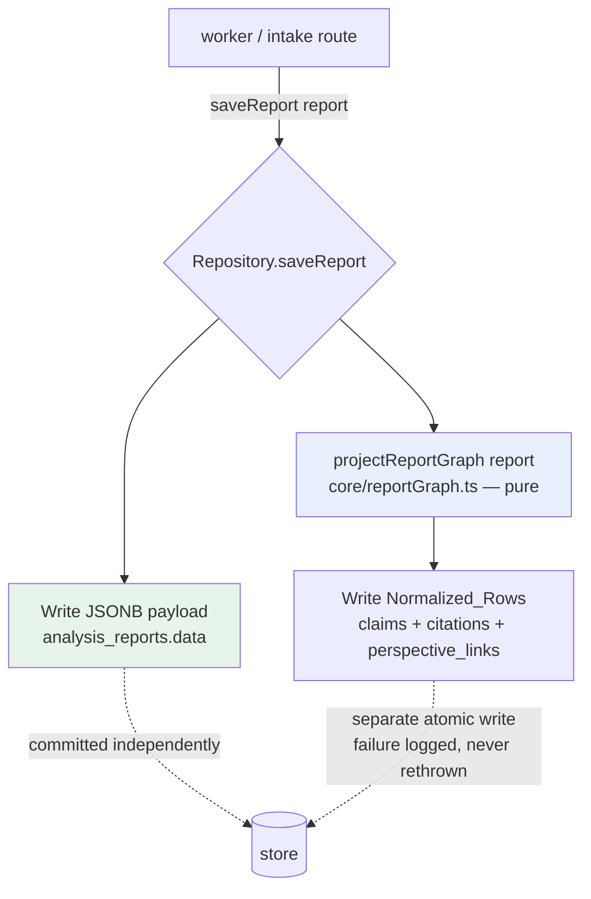

# Design Document

## Overview

Today a finished `AnalysisReport` is persisted as a single lossless JSONB blob in `analysis_reports.data`. The normalized `claims`, `citations`, and `perspective_links` tables exist (`db/migrations/001_init.sql`) but are reserved and empty. Every Ground-News-style aggregate on the roadmap — blindspot clustering, "this claim appeared in N reports," topic pages — needs cross-report joins that JSONB cannot serve cheaply.

This feature implements the roadmap's committed **dual-write** (`f-Socials-roadmap.md` §7): the JSONB payload stays the lossless render source of truth, AND the same report is projected into normalized rows for analytics. The projection is a pure, deterministic function; the two repository drivers (memory + Postgres) persist its output. Nothing in the render path changes shape, and the invariant gate is never touched.

Two compass constraints shape the whole design:

- **Lens, not judge.** Source-reliability tiers attach to `citations` and `perspective_links` only. The normalized schema carries no creator-reliability dimension, by construction — the projection has no creator input to read from, and the migration adds no such column.
- **The invariant gate is verified, never weakened.** `core/assemble.ts` is not modified. The normalized rows simply reflect the gate-satisfying state the report already carries (a `none`/zero-citation claim stays a valid honest state; a non-`none` claim already has ≥1 citation).

### Design goals

1. The dual-write is **additive**: a normalized-write failure can never roll back, lose, or corrupt the JSONB payload, and the report stays served from JSONB.
2. The projection is a **pure function** of the in-memory report — the same object that produced the JSONB — so the two writes can never disagree about a report's content.
3. Re-persisting a report **replaces** its normalized rows cleanly (idempotent: no duplicate or stale rows).
4. The **offline-first** zero-API-key path keeps working: the memory repository implements the same dual-write and exposes its rows for test assertion.
5. The normalized rows are **queryable across reports** through indexed columns.

### Non-goals

- No aggregate feature (blindspot clustering, topic pages) is built here — this lands the data layer those features will sit on.
- No change to the render path, the report shape, or the analysis pipeline.
- The `perspective_links.embedding` (pgvector) column is left `NULL`; perspective embedding is a separate concern.

## Architecture

The dual-write is folded into the existing `Repository.saveReport(report)` method rather than added as a parallel call site. This is deliberate and is the laziest correct option:

- The worker (`pipeline/worker.ts`) and intake route (`http/routes.ts`) already call `saveReport` with the in-memory report object. Folding the projection in means **zero call-site changes** and guarantees Req 1.3 (normalized rows derived from the same object that wrote the JSONB) by construction.
- `saveReport` already declared on the `Repository` interface in `ports.ts` becomes the single declared dual-write capability used by both drivers (Req 1.4, 6.1) — no ad-hoc queries anywhere else.

The projection itself is a new pure module, `core/reportGraph.ts`, sitting beside the other pure policies (`assemble.ts`, `sourceTier.ts`, `hash.ts`). Both repositories call it; neither contains projection logic.



### Write ordering and durability (Req 4)

The JSONB write and the normalized write are **separate, independently-committed operations**:

1. The JSONB payload is written first and committed on its own (exactly as today). It is never inside the same transaction as the normalized write, so a normalized failure cannot roll it back.
2. The normalized write runs second, in its own transaction, and is **best-effort**: on failure it logs the affected `report_id` and returns normally, mirroring the existing `saveAuditRecord` pattern in `postgres.ts`. The report stays served and readable from JSONB.

This means the only durability guarantee that flows "upward" is the safe one: if the normalized write succeeds, the JSONB is already persisted (Req 4.2). The reverse never holds — JSONB can be persisted without normalized rows, which is exactly the degraded state the backfill repairs.

### Idempotent replace (Req 5)

A single report's normalized write is **delete-then-insert within one transaction**:

```
BEGIN
  DELETE FROM citations        WHERE claim_id IN (SELECT id FROM claims WHERE report_id = $1)
  DELETE FROM perspective_links WHERE report_id = $1
  DELETE FROM claims            WHERE report_id = $1
  -- re-insert claims (RETURNING id), then citations linked to the new claim ids,
  -- then perspective_links
COMMIT
```

Deleting every row for `report_id` before inserting removes duplicates and stale rows regardless of how they originated (Req 5.2), and persisting the same report twice yields the same row counts as persisting it once (Req 5.3). The single transaction makes the rewrite atomic, so a reader never sees a partial set (Req 4.4). The memory driver achieves the same by replacing the report's entry in its row maps.

### Where the dual-write fires

`saveReport` is called for every report state transition (`processing`, `ready`/`needs_review`, `failed`). The projection of a claimless report (e.g. the `processing` save before analysis) is simply zero rows, so the dual-write is uniform and needs no status special-casing. When the finished report is saved with its claims, the idempotent replace populates the real rows (Req 1.5: a persisted report gets ≥1 dual-write). A subsequent `failed` save would clear the rows, which is correct — the served report no longer has that content.

> ponytail: dual-write is folded into `saveReport` rather than a new method. Ceiling: the `processing`/`failed` saves of a claimless report do a no-op zero-row replace. Upgrade path is a status guard if that churn ever matters; it does not today.

### Backfill (Req 8)

A one-shot command (`src/scripts/backfill.ts`, run via `tsx`, mirroring the `benchmark/runner.ts` direct-invocation idiom) iterates every persisted report, and for each report that has **no** normalized rows yet, projects its JSONB payload and writes the rows. Reports that already have rows are skipped (Req 8.3). It reads JSONB only and never mutates it (Req 8.4). A per-report failure is caught, the `report_id` reported, and processing continues (Req 8.5). Because it reuses the same idempotent write, re-running it creates no duplicates (Req 8.2).

## Components and Interfaces

### 1. `core/reportGraph.ts` — the pure projection (new)

The heart of the feature. A single pure function maps a report to its normalized rows. No I/O, fully deterministic, fully property-testable.

```typescript
export interface ReportGraph {
  claims: ClaimRow[];
  citations: CitationRow[];
  perspectives: PerspectiveRow[];
}

// Deterministic projection of an AnalysisReport into its normalized rows.
// Pure: no I/O, no clock, no randomness. Tiers are copied from sources only;
// there is structurally no creator input to read, so no creator dimension can exist.
export function projectReportGraph(report: AnalysisReport): ReportGraph;
```

Mapping rules:

- One `ClaimRow` per `Claim` in `report.claims`, carrying `claimUid = claim.id` for stable traceback (Req 2.6) and `ordinal` = array index (render order).
- One `CitationRow` per `Citation` of each claim, linked to its claim via `claimUid`. A claim with `evidenceStrength: 'none'` and zero citations projects to a claim row with **no** citation rows (Req 2.7); any other claim projects one citation row per citation (Req 2.8). This is read straight off the claim — the gate already guarantees the shape, so the projection never re-derives or weakens it (Req 10.2).
- One `PerspectiveRow` per `PerspectiveLink` in `report.perspectives`.
- Fields with no normalized column (`Claim.evidenceDescription`, `PerspectiveLink.whyIncluded`, `Citation` ordering metadata) are simply omitted from the projection and remain in the JSONB payload (Req 3.5).

### 2. `Repository.saveReport` — dual-write (changed semantics, same signature)

The interface in `ports.ts` is unchanged in shape; its contract gains the dual-write guarantee:

```typescript
// Persists the report: writes the lossless JSONB payload AND replaces the
// report's Normalized_Rows derived from the same object. The JSONB write is
// authoritative and durable; a Normalized_Rows failure is logged (with report_id)
// and never rethrown, so the report stays served. (Req 1, 4)
saveReport(report: AnalysisReport): Promise<void>;
```

### 3. `PostgresRepository` (changed)

- `saveReport` keeps its existing `analysis_reports` upsert (committed independently), then calls a private `writeReportGraph(report)` that runs the delete-then-insert transaction using `projectReportGraph(report)`. Parameterized SQL only (Req 6.2). Failures are caught and logged with the `report_id` (Req 4.5), never rethrown.
- A new `hasReportGraph(reportId): Promise<boolean>` (a `SELECT 1 FROM claims WHERE report_id = $1 LIMIT 1`) supports the backfill skip check.

### 4. `InMemoryRepository` (changed)

- Adds public, test-readable row stores mirroring `disputes`/`flags`/`auditRecords` (Req 6.4):
  ```typescript
  readonly claimRows = new Map<string, ClaimRow[]>();        // keyed by reportId
  readonly citationRows = new Map<string, CitationRow[]>();
  readonly perspectiveRows = new Map<string, PerspectiveRow[]>();
  ```
- `saveReport` stores the JSONB-equivalent report object (as today), then replaces the three map entries for `report.id` with `projectReportGraph(report)` output (Req 6.3, idempotent replace).
- `hasReportGraph(reportId)` checks the `claimRows` map.

### 5. `src/scripts/backfill.ts` — Backfill_Command (new)

A direct-invocation module reusing `projectReportGraph` and the repository. Pseudocode:

```
for each persisted report:
  if await repo.hasReportGraph(report.id): continue        // Req 8.3 skip
  try:   await repo.saveReport(report)                      // reuses idempotent dual-write
  catch: report.id -> failures[]  (continue)                // Req 8.5
log summary { processed, skipped, failed: [report_id...] }
```

> ponytail: the backfill reuses `saveReport` rather than a parallel write path, so backfill and live writes can never drift. It needs a way to enumerate reports; the Postgres driver gets a small `listReportIds()` helper (parameterized `SELECT id FROM analysis_reports`), the memory driver iterates its map.

### 6. `db/migrations/004_report_graph.sql` — Migration_004 (new)

Prepares the reserved tables for idempotent dual-write and cross-report queries. Adds only what's required; preserves all existing `analysis_reports` data and consumers (Req 7.3); standard DDL; no creator column (Req 7.4, 9.1).

## Data Models

### Normalized row types (TypeScript, `types.ts`)

These mirror the DB columns 1:1 (camelCase in TS, snake_case in SQL), reusing the existing `Verifiability`, `EvidenceStrength`, and `SourceTier` unions — no parallel vocabularies.

```typescript
export interface ClaimRow {
  claimUid: string;            // originating Claim.id — stable traceback (Req 2.6)
  reportId: string;            // owning report (Req 2.4)
  claimText: string;
  transcriptSpan?: string;
  verifiability: Verifiability;
  evidenceStrength: EvidenceStrength;
  sourceBasis?: string;
  confidence: number;
  ordinal: number;             // render order within the report
}

export interface CitationRow {
  claimUid: string;            // links to the ClaimRow it belongs to
  sourceUrl: string;
  sourceName: string;
  sourceTier: SourceTier;      // carried from the Citation; sources only (Req 2.5, 9.2)
  excerpt?: string;
  supports: boolean | null;
}

export interface PerspectiveRow {
  reportId: string;
  url: string;
  sourceName: string;
  sourceTier: SourceTier;      // sources only (Req 9.2)
  issueFrameLabel: string;
  divergence: number;          // -> divergence_score
  dehumanization: number;      // -> dehumanization_score
}
```

There is **no** `ClaimRow` field for an author/channel reliability rating, and no creator entity carries a tier — tiers live only on `CitationRow`/`PerspectiveRow`, which describe sources (Req 9).

### Migration_004 schema changes

The `claims`, `citations`, and `perspective_links` tables already exist (001_init). Migration_004 adds:

```sql
-- f-Socials report-graph-normalization — migration 004.
-- Activates the reserved claims/citations/perspective_links tables for the
-- dual-write. Additive only: preserves analysis_reports + its JSONB consumers.

-- Stable traceback from a normalized claim row to its Claim in the JSONB payload.
ALTER TABLE claims ADD COLUMN IF NOT EXISTS claim_uid TEXT;

-- Idempotent replace works by delete-by-report_id; this unique guard also makes
-- (report_id, claim_uid) a natural key and supports cross-report claim grouping.
CREATE UNIQUE INDEX IF NOT EXISTS uq_claims_report_claimuid
  ON claims (report_id, claim_uid);

-- Cross-report queryability (Req 11): group/count claims by source and by claim.
CREATE INDEX IF NOT EXISTS idx_citations_source_url  ON citations (source_url);
CREATE INDEX IF NOT EXISTS idx_citations_source_tier ON citations (source_tier);
CREATE INDEX IF NOT EXISTS idx_claims_claim_text     ON claims (claim_text);
CREATE INDEX IF NOT EXISTS idx_perspective_source_tier ON perspective_links (source_tier);
```

(`idx_claims_report`, `idx_citations_claim`, `idx_perspective_report` already exist from 001.) The migration introduces **no** creator-reliability column and uses only standard DDL, applied in order after `003_audit_records.sql` by `npm run migrate` (Req 7.1, 7.4).

### Field mapping (JSONB Claim/Citation/PerspectiveLink → normalized row → DB column)

| JSONB source field | Row field | DB column |
|---|---|---|
| `Claim.id` | `claimUid` | `claims.claim_uid` |
| `Claim.claimText` | `claimText` | `claims.claim_text` |
| `Claim.transcriptSpan` | `transcriptSpan` | `claims.transcript_span` |
| `Claim.verifiability` | `verifiability` | `claims.verifiability` |
| `Claim.evidenceStrength` | `evidenceStrength` | `claims.evidence_strength` |
| `Claim.sourceBasis` | `sourceBasis` | `claims.source_basis` |
| `Claim.confidence` | `confidence` | `claims.confidence` |
| `Claim.evidenceDescription` | *(omitted — stays in JSONB, Req 3.5)* | — |
| `Citation.sourceUrl` | `sourceUrl` | `citations.source_url` |
| `Citation.sourceName` | `sourceName` | `citations.source_name` |
| `Citation.sourceTier` | `sourceTier` | `citations.source_tier` |
| `Citation.excerpt` | `excerpt` | `citations.excerpt` |
| `Citation.supports` | `supports` | `citations.supports` |
| `PerspectiveLink.url` | `url` | `perspective_links.url` |
| `PerspectiveLink.sourceName` | `sourceName` | `perspective_links.source_name` |
| `PerspectiveLink.sourceTier` | `sourceTier` | `perspective_links.source_tier` |
| `PerspectiveLink.issueFrameLabel` | `issueFrameLabel` | `perspective_links.issue_frame_label` |
| `PerspectiveLink.divergence` | `divergence` | `perspective_links.divergence_score` |
| `PerspectiveLink.dehumanization` | `dehumanization` | `perspective_links.dehumanization_score` |
| `PerspectiveLink.whyIncluded` | *(omitted — stays in JSONB, Req 3.5)* | — |

## Correctness Properties

*A property is a characteristic or behavior that should hold true across all valid executions of a system — essentially, a formal statement about what the system should do. Properties serve as the bridge between human-readable specifications and machine-verifiable correctness guarantees.*

The pure projection `projectReportGraph` and the memory dual-write make almost every consistency guarantee a universal property over generated reports — round-trips, cardinality, and idempotence. The properties below were derived from the prework analysis and consolidated to remove redundancy (the round-trip property subsumes the per-field and linkage criteria; the cardinality property absorbs the `none`/zero-citation edge case). Schema/migration DDL, transactional atomicity, cross-report query shape, and fault-injection durability are covered by integration, smoke, and example tests in the Testing Strategy, not by property tests.

All property tests run against the `InMemoryRepository` (which exercises the same `projectReportGraph` and idempotent-replace path as Postgres), satisfying the offline-first driver-parity requirement (6.3). Generators produce **gate-valid** reports — the shape `assemble.ts` actually emits — so the properties verify the gate's output is faithfully projected, never re-derive it.

### Property 1: Dual-write populates normalized rows and keeps the JSONB retrievable

*For any* gate-valid report with at least one claim, after `saveReport` the report is still retrievable as its JSONB payload AND its normalized rows (claims, citations, perspectives) are present in the repository.

**Validates: Requirements 1.1, 1.5, 4.2, 6.3**

### Property 2: Exact cardinality and claim–citation linkage

*For any* gate-valid report, the projection produces exactly one claim row per `Claim`, exactly one citation row per `Citation` across all claims (each linked by `claimUid` to a present claim row), and exactly one perspective row per `PerspectiveLink`; a claim with `evidenceStrength: 'none'` and zero citations yields its claim row with zero linked citation rows.

**Validates: Requirements 2.1, 2.2, 2.3, 2.7, 2.8**

### Property 3: Round-trip projection consistency

*For any* gate-valid report, reading the normalized rows back and comparing them to the report's JSONB payload, every projected field matches the corresponding source field for every claim (`claim_text`, `verifiability`, `evidence_strength`, `confidence`, `transcript_span`, `source_basis`, `report_id`, and the `claim_uid` traceback to the originating `Claim.id`), every citation (`source_url`, `source_name`, `source_tier`, `excerpt`, `supports`), and every perspective (`url`, `source_name`, `source_tier`, `issue_frame_label`, `divergence_score`, `dehumanization_score`).

**Validates: Requirements 2.4, 2.5, 2.6, 3.1, 3.2, 3.3, 3.4**

### Property 4: Non-normalized fields are retained in JSONB and omitted from rows

*For any* gate-valid report carrying fields with no normalized column (`Claim.evidenceDescription`, `PerspectiveLink.whyIncluded`), after `saveReport` those fields still appear in the retrievable JSONB payload and never appear on any projected normalized row.

**Validates: Requirements 3.5**

### Property 5: Idempotent replace

*For any* gate-valid report, persisting it two or more times in succession yields the same claim, citation, and perspective row counts and contents as persisting it once; and persisting a report a second time with changed content replaces its rows so they match the latest JSONB payload, leaving no duplicate or stale rows.

**Validates: Requirements 5.1, 5.2, 5.3**

### Property 6: Backfill populates JSONB-only reports, skips populated ones, never mutates JSONB

*For any* set of persisted reports, running the backfill populates normalized rows (matching the projection) for every report that had none, leaves already-populated reports untouched, never alters any report's JSONB payload, and produces identical results when run repeatedly.

**Validates: Requirements 8.1, 8.2, 8.3, 8.4**

### Property 7: Tiers attach to sources only — no creator-reliability dimension

*For any* gate-valid report, no projected claim row carries a source-tier or any reliability/truthfulness rating; `sourceTier` appears only on citation and perspective rows, which describe sources.

**Validates: Requirements 9.2**

### Property 8: Faithful reflection of the gate-satisfying state without re-deriving the gate

*For any* gate-valid report, the projection reflects the report's evidence structure exactly as produced — every claim with `evidenceStrength` other than `none` has at least one linked citation row, and every claim with `none` and zero citations is projected as a valid claim row with zero citation rows — without the projection computing, asserting, or altering the report's readiness status.

**Validates: Requirements 10.2**

## Error Handling

The governing rule (Req 4) is that **analytics is additive**: a normalized-write failure must never damage the served report.

- **JSONB write is authoritative and committed first.** It runs exactly as today and is never wrapped in the same transaction as the normalized write, so no normalized failure can roll it back, lose it, or corrupt it (Req 4.1).
- **Normalized write is best-effort and isolated.** `writeReportGraph` runs in its own transaction. On any error it is caught, logged with the affected `report_id` via `console.error` (matching the existing `saveAuditRecord` pattern), and **not rethrown** — `saveReport` returns normally and the report stays served and readable from JSONB (Req 4.3, 4.5).
- **Atomic per report.** The delete-then-insert for one report's rows is a single Postgres transaction, so a failure mid-rewrite rolls back to the prior complete set and a reader never observes a partial set (Req 4.4). The memory driver replaces each report's map entry in one assignment, which is atomic for a single-process reader.
- **Backfill resilience.** Each report is backfilled inside its own try/catch; a single report's failure is recorded (its `report_id` reported) and the loop continues with the remaining reports (Req 8.5). The backfill reads JSONB only and never writes to `analysis_reports.data` (Req 8.4).
- **Input at the trust boundary.** The projection consumes an already-validated, gate-assembled `AnalysisReport` produced inside the server (not raw user input), so it performs no re-validation; it tolerates absent optional fields (`transcriptSpan`, `excerpt`, `sourceBasis`, `evidenceDescription`, `whyIncluded`) by omitting the corresponding nullable columns.
- **Invariant gate untouched.** `core/assemble.ts` is not modified (Req 10.1); the worker's existing `assertInvariantGateIntact()` boot guard continues to protect the moat.

## Testing Strategy

A dual approach: property-based tests for the universal projection/persistence guarantees, plus example, integration, and smoke tests for fault-injection, DDL, cross-report queries, and structural/neutrality invariants.

### Property-based tests (fast-check, ≥100 runs each)

Implemented with the already-installed `fast-check` under `node:test` + `node:assert`, run against `InMemoryRepository`. A shared arbitrary `gateValidReportArbitrary` generates reports in the shape `assemble.ts` emits — including claims with `evidenceStrength: 'none'` and zero citations, claims with each non-`none` strength carrying ≥1 citation, varied `sourceTier` values, unicode text, empty optional fields, and reports with zero perspectives — so the generators cover the edge cases (2.7) by construction. Each test carries the required tag comment:

```
// Feature: report-graph-normalization, Property <n>: <description>
// Validates: Requirements <X.Y...>
```

Eight property tests, one per correctness property (P1–P8 above), each exercising the memory dual-write and `projectReportGraph`. The round-trip property (P3) is the explicitly-required ≥100-run fast-check test of Req 3.4.

### Example / unit tests

- **Durability under normalized-write failure (Req 4.1, 4.3, 4.5):** a repository (or stubbed pool) forced to throw on the normalized write; assert `getReport`/`getReportBySlug` still serve the intact JSONB and `console.error` names the `report_id`.
- **Backfill failure continuation (Req 8.5):** a mix of good reports and one that throws on write; assert the good reports are populated and the failed `report_id` is reported.
- **Offline wiring (Req 6.5):** `selectRepo()` with no `DATABASE_URL` returns `InMemoryRepository` (the existing default path).

### Integration tests (test Postgres)

- **Migration applies and is non-destructive (Req 7.2, 7.3):** seed `analysis_reports`, apply `004_report_graph.sql`, assert `claim_uid` + new indexes exist and existing data + `getReport` are intact.
- **Transactional atomicity (Req 4.4):** force a failure mid-rewrite, assert the prior complete row set survives (no partial set).
- **Cross-report queryability (Req 11.1, 11.2):** seed several reports' rows, run `GROUP BY report_id` and group-by-source (`source_url`/`source_name`) joins on the indexed columns, assert correct counts without reading `analysis_reports.data`.

### Smoke / static tests

- **Neutrality_Check (Req 9.1, 9.3, 7.4):** a static test asserting the normalized row types, `projectReportGraph` source, and `004_report_graph.sql` contain no creator-reliability dimension (no column/field expressing a reliability rating or truthfulness verdict tied to a creator/channel/author). Pairs with Property 7's by-construction guarantee.
- **Invariant gate intact (Req 10.1):** `assertInvariantGateIntact()` passes and `assemble.ts` is unmodified.
- **Migration ordering (Req 7.1):** `004_*.sql` exists and lexically sorts after `003_audit_records.sql`.
- **Parameterized SQL (Req 6.2):** review/static check that `writeReportGraph` uses `$1..$n` placeholders only — no string interpolation.
- **Interface parity (Req 6.1, 6.4):** both drivers implement the `Repository` contract; the memory driver exposes `claimRows`/`citationRows`/`perspectiveRows` accessors.

### Self-check (ponytail)

`core/reportGraph.ts` carries a guarded inline self-check (the repo's standard `process.argv[1] === fileURLToPath(import.meta.url)` idiom) that projects one hand-built gate-valid report and asserts the cardinality and a couple of field matches — a dependency-free fast-fail if the projection regresses, ahead of the full property suite.

New `test/*.test.ts` files are added to the explicit list in `apps/server/package.json` (`test` script). Before claiming done: `npm test` + `npm run typecheck` in `apps/server`.
