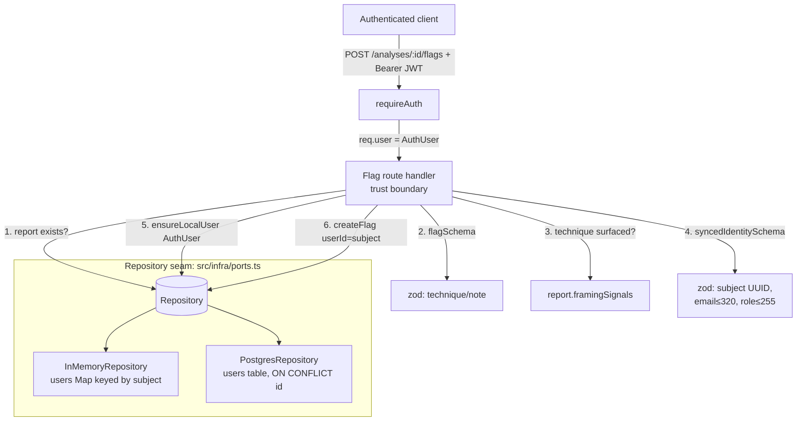

# Design Document

## Overview

f-Socials verifies a reader's Supabase JWT on the server (`verifyJwt` → `AuthUser` with `id` = the `sub` claim, optional `email`, optional `role`). One legacy persistence seam still keys on the original `users(id)` UUID: the authenticated community **flag**. The flag route persists `req.user.id` — the Supabase subject — into `flags.user_id UUID NOT NULL REFERENCES users(id)`. Under the Postgres driver that insert violates the foreign key because no `users` row exists for the subject; the in-memory driver has no FK and silently accepts it.

This feature introduces **User_Sync**: an idempotent upsert, exposed behind the `Repository` seam, that ensures a `users` row keyed to the JWT subject exists, derived **solely** from the already-verified token claims. The flag route invokes it at the trust boundary, after payload validation and before persisting the flag, so the FK resolves under both drivers. No Supabase round-trip is added, so the offline-first path (zero keys → mock providers + in-memory infra) keeps working.

The work is strictly bounded:

- **Additive** — new `Repository` methods (`ensureLocalUser`, `getLocalUser`), a route change in the flag handler, two new zod schemas, and one data-preserving migration.
- **In scope** — only the flag flow (the one Identity_Bearing_Action today).
- **Out of scope and untouched** — saved reports (subject as `TEXT`, migration 006), institutional workspaces (subject as `TEXT`, migration 007), and anonymous disputes (`raised_by` always `NULL`).
- **Moat preserved** — `core/assemble.ts` is never read or written by this feature; the existing `invariant.diffGuard.test.ts` CI guard fails the build if it changes. No synced field expresses a content verdict or a creator rating.

### Key design decision: relaxing `users.email` to nullable

Requirement 5.1 mandates that a synced Local_User whose claims carry **no email** be stored with `email` **null**. The existing `users` table (migration 001) declares `email TEXT UNIQUE NOT NULL`. Because the flag FK points at `users(id)`, the synced row must live in `users`, so the `NOT NULL` on `email` must be relaxed for the email-absent case to persist.

The chosen migration is the narrowest possible change — `ALTER TABLE users ALTER COLUMN email DROP NOT NULL`:

- **Data-preserving** (Req 9.3): every existing row keeps its non-null, valid email; nothing is deleted or modified.
- **Re-runnable** (Req 9.2): `DROP NOT NULL` is idempotent — a second application is a no-op, leaving the schema identical.
- **Non-destructive in shape** (Req 9.1): it does not drop, rename, or change the type of the column, and leaves the `UNIQUE(email)` constraint intact. Under that unique index Postgres treats `NULL`s as distinct, so multiple email-absent users never collide (this satisfies Req 5.2 for free).

> **Requirements tension (flagged for review):** Req 9.1 reads "SHALL NOT … remove a constraint." A `NOT NULL` is technically a column constraint, and `DROP NOT NULL` removes it. This is the single point where strict 9.1 is read as "data-preserving and re-runnable" rather than "zero constraint relaxation." The only alternatives are worse: a synthetic sentinel email violates Req 5.1 ("stored as null") and pollutes the `UNIQUE(email)` index. If the operator requires a CREATE-only migration with zero `ALTER`, this needs a requirements amendment (e.g., explicitly permitting a nullability relaxation, or re-keying the flag FK onto the subject as `TEXT` like saved reports). The design otherwise proceeds with `DROP NOT NULL`.

## Architecture



The change is confined to three layers, all behind existing seams:

1. **Trust boundary (`src/http/routes.ts`, `src/http/validation.ts`)** — the flag route validates the verified subject and claims with zod, then calls `ensureLocalUser` before `createFlag`. The subject is the only new validated identity value; payload validation is unchanged.
2. **Persistence seam (`src/infra/ports.ts` + `memory.ts` + `postgres.ts`)** — a new `ensureLocalUser` upsert and `getLocalUser` read, implemented in both drivers with observably identical semantics. No User_Sync SQL exists outside `postgres.ts` (Req 7.5).
3. **Schema (`db/migrations/009_user_sync.sql`)** — the nullability relaxation described above.

Ordering at the trust boundary (each step short-circuits before any side effect):

1. `:id` present and report exists → else 404.
2. `flagSchema` (technique non-empty ≤200, note ≤2000) → else 400; **no sync** (Req 3.4).
3. Technique was actually surfaced by the report → else 400; **no sync**.
4. `syncedIdentitySchema` on `{ id, email, role }` from `req.user` → else 400; **no sync, no persist** (Req 8.3, 8.5).
5. `ensureLocalUser(identity)` → on failure 500; **no flag persisted** (Req 6).
6. `createFlag({ userId: identity.id, … })` → 201 with the existing success body (Req 3.3).

## Components and Interfaces

### Repository interface additions (`src/infra/ports.ts`)

```ts
// Lens-safe local user projection. Carries identity-derived fields only — id
// (the Supabase subject), the optional email, the role, and the creation
// timestamp. No content-truthfulness verdict and no creator-reliability rating
// field, by construction (Req 10.2, 10.5).
export interface LocalUser {
  id: string;          // Supabase JWT subject (UUID), == users.id
  email: string | null;
  role: string;
  createdAt: string;   // ISO 8601
}

export interface Repository {
  // ... existing methods ...

  // User_Sync (supabase-user-sync). Idempotent upsert of the local users row
  // keyed to the Supabase subject, derived SOLELY from verified JWT claims — no
  // external call (Req 1.3, 7.4). At most one row per subject; on repeat it keeps
  // the row's id and original created_at and merges email/role from the claims,
  // retaining a prior value when the claim omits it (Req 2.1–2.6). The only
  // persistence path for User_Sync; both drivers are observably identical (Req 7.1,
  // 7.2). A backing-store failure rejects so the route maps it to 5xx with no
  // partial write and no dependent record (Req 6).
  ensureLocalUser(user: { id: string; email?: string; role?: string }): Promise<void>;

  // Read-only lookup of the synced Local_User by subject; undefined when none.
  // Supports parity/round-trip verification across drivers (Req 7.2).
  getLocalUser(id: string): Promise<LocalUser | undefined>;
}
```

`ensureLocalUser` takes the inline `{ id, email?, role? }` claim shape (mirroring the existing `createFlag`/`createDispute` style) rather than importing `AuthUser`, keeping `ports.ts` free of HTTP/auth-layer coupling.

### InMemoryRepository (`src/infra/memory.ts`)

A new private `Map<string, LocalUser>` keyed by subject. Because the in-memory driver runs on the single-threaded event loop with no `await` between read and write, each `ensureLocalUser` is atomic by construction — the same reasoning the existing saved-report/review methods rely on for concurrency safety (Req 2.6).

```ts
private users = new Map<string, LocalUser>();

async ensureLocalUser(u: { id: string; email?: string; role?: string }): Promise<void> {
  const existing = this.users.get(u.id);
  if (!existing) {
    // Create: email absent ⇒ null (Req 5.1); role absent ⇒ schema default 'user'.
    this.users.set(u.id, {
      id: u.id,
      email: u.email ?? null,
      role: u.role ?? 'user',
      createdAt: new Date().toISOString(),
    });
    return;
  }
  // Merge: overwrite only when the claim is present; id + createdAt preserved
  // (Req 2.3, 2.4, 2.5). Mirrors the Postgres COALESCE upsert.
  if (u.email !== undefined) existing.email = u.email;
  if (u.role !== undefined) existing.role = u.role;
}

async getLocalUser(id: string): Promise<LocalUser | undefined> {
  const u = this.users.get(id);
  return u ? { ...u } : undefined;
}
```

Distinct email-absent subjects never collide because the map is keyed by `id` only (Req 5.2). The existing `createFlag` is unchanged — it already stores `userId` verbatim and has no FK.

### PostgresRepository (`src/infra/postgres.ts`)

A single parameterized `INSERT … ON CONFLICT (id) DO UPDATE` (Req 8.1). The `id` primary key is the conflict target; `created_at` is never in the `SET` list, so it is preserved on repeat (Req 2.3). `email`/`role` parameters are bound `NULL` when the claim is absent, and `COALESCE` retains the stored value in that case (Req 2.5) while updating when the claim is present (Req 2.4).

```ts
async ensureLocalUser(u: { id: string; email?: string; role?: string }): Promise<void> {
  await this.pool.query(
    `INSERT INTO users (id, email, role)
     VALUES ($1, $2, COALESCE($3, 'user'))
     ON CONFLICT (id) DO UPDATE SET
       email = COALESCE($2, users.email),
       role  = COALESCE($3, users.role)`,
    [u.id, u.email ?? null, u.role ?? null],
  );
}

async getLocalUser(id: string): Promise<LocalUser | undefined> {
  const r = await this.pool.query(
    `SELECT id, email, role, created_at FROM users WHERE id = $1`,
    [id],
  );
  const row = r.rows[0];
  return row
    ? { id: row.id, email: row.email ?? null, role: row.role, createdAt: new Date(row.created_at).toISOString() }
    : undefined;
}
```

The upsert is atomic, so concurrent syncs of the same subject converge on exactly one row (Req 2.6). A failed insert (e.g., a transient pool error) rejects the promise with no partial row — a single statement either commits or does not (Req 6.3).

> **Cross-subject email collision (ponytail ceiling):** `ON CONFLICT (id)` does not catch a `UNIQUE(email)` violation if two *different* subjects ever present the *same* non-null email. Supabase enforces a unique email per user (subject), so two distinct subjects sharing a verified email does not occur in practice; were it to, the second sync would reject and the route would return 500 (failure isolation, Req 6), never a duplicate or wrong-user flag. Upgrade path: a dedicated subject-keyed identity table if email uniqueness ever decouples from the subject.

### Trust-boundary validation (`src/http/validation.ts`)

```ts
// Identity-sync trust boundary (Req 8.2–8.5). The subject must be a non-empty,
// UUID-formatted string; a present email must be a valid address ≤320 chars; a
// present role must be a non-empty string ≤255 chars. Built from the verified
// AuthUser and parsed before User_Sync runs or any record is persisted.
export const syncedIdentitySchema = z.object({
  id: z.string().uuid(),
  email: z.string().email().max(320).optional(),
  role: z.string().min(1).max(255).optional(),
});

export type SyncedIdentity = z.infer<typeof syncedIdentitySchema>;
```

### Flag route handler (`src/http/routes.ts`)

The existing handler gains two steps between the technique check and `createFlag` — identity validation, then sync — and threads the validated subject into the flag:

```ts
// ... after the technique-surfaced check ...

// Validate the verified identity at the trust boundary BEFORE syncing or
// persisting (Req 8.2). Malformed subject / out-of-bounds claim ⇒ 400, no
// side effect (Req 8.3, 8.5).
const identity = syncedIdentitySchema.safeParse({
  id: req.user!.id,
  email: req.user!.email,
  role: req.user!.role,
});
if (!identity.success) {
  return res.status(400).json({ error: 'invalid_identity', details: identity.error.flatten() });
}

// Ensure the local users row exists before the FK-bearing insert (Req 1.1, 3.1).
// A sync failure fails the action cleanly with no flag persisted (Req 6).
try {
  await deps.repo.ensureLocalUser(identity.data);
} catch (err) {
  deps.telemetry.capture(err, { stage: 'user_sync', reportId: id }); // report id only — no subject
  return res.status(500).json({ error: 'sync_failed' });             // generic, no internals (Req 6.1)
}

await deps.repo.createFlag({
  id: randomUUID(),
  reportId: id,
  userId: identity.data.id,   // == subject ⇒ resolves to the synced Local_User (Req 3.2)
  technique: parsed.data.technique,
  note: parsed.data.note,
  createdAt: new Date().toISOString(),
});
deps.telemetry.emit('flag', { reportId: id }); // unchanged — report id only
return res.status(201).json({ ok: true });     // unchanged success body (Req 3.3)
```

The dispute route and all saved-report / workspace routes are untouched: they never call `ensureLocalUser` (Req 4.3, 4.5).

### Migration (`db/migrations/009_user_sync.sql`)

```sql
-- f-Socials supabase-user-sync — migration 009.
-- Data-preserving + re-runnable: relax users.email to nullable so a Supabase user
-- synced from verified JWT claims that omit an email is storable with email NULL
-- (Req 5.1). DROP NOT NULL is idempotent — a second run is a no-op leaving an
-- identical schema (Req 9.2). Every existing row keeps its non-null email (Req 9.3).
-- The column is neither dropped, renamed, nor retyped, and UNIQUE(email) is left
-- intact — under that index Postgres treats NULLs as distinct, so multiple
-- email-absent users never collide (Req 5.2). No verdict/rating column (compass).
-- Sorts lexically after 008 so the runner applies it last (Req 9.4).
ALTER TABLE users ALTER COLUMN email DROP NOT NULL;
```

The `migrate.mjs` runner applies `*.sql` in lexical order; `009_` sorts after `008_` (Req 9.4). `DROP NOT NULL` raising no error on a second run is compatible with the runner's "already exists" tolerance.

## Data Models

### Local_User (existing `users` table, migration 001 — column nullability adjusted by 009)

| Column        | Type          | Notes after migration 009                                              |
|---------------|---------------|------------------------------------------------------------------------|
| `id`          | `UUID` PK     | Set equal to the Supabase subject by User_Sync (Req 1.2).              |
| `email`       | `TEXT UNIQUE` | **Now nullable.** Stores the claim email, or `NULL` when absent (Req 5.1). NULLs are distinct under the unique index (Req 5.2). |
| `display_name`| `TEXT`        | Untouched by User_Sync (no claim source); remains `NULL`.             |
| `role`        | `TEXT NOT NULL` default `'user'` | Stores the claim role, or `'user'` when absent (Req 1.5). |
| `org_id`      | `UUID`        | Untouched by User_Sync.                                                |
| `prefs`       | `JSONB`       | Untouched by User_Sync (schema default `{}`).                          |
| `created_at`  | `TIMESTAMPTZ` default `now()` | Set on first sync, preserved verbatim on every repeat (Req 2.3). |

No column carries a verdict or rating (Req 10.2). User_Sync writes only `id`, `email`, `role`; `created_at` is set by the default on insert and never updated.

### Flag (existing `flags` table) — unchanged

`flags.user_id UUID NOT NULL REFERENCES users(id)`. After User_Sync, this FK resolves because a `users` row with `id` = subject exists. The `UNIQUE (report_id, user_id, technique)` idempotency and `ON CONFLICT … DO NOTHING` insert are unchanged (Req 3.3).

### Inputs and claim mapping

| Source (verified `AuthUser`) | Validation (`syncedIdentitySchema`) | Local_User field |
|------------------------------|-------------------------------------|------------------|
| `id` (`sub` claim)           | non-empty UUID (required)           | `id`             |
| `email` (optional)           | valid email ≤320 chars              | `email` (or `NULL`) |
| `role` (optional)            | non-empty ≤255 chars                | `role` (or `'user'`) |

All Local_User fields derive solely from these verified claims; User_Sync issues no external request (Req 1.3, 7.4).

## Correctness Properties

*A property is a characteristic or behavior that should hold true across all valid executions of a system — essentially, a formal statement about what the system should do. Properties serve as the bridge between human-readable specifications and machine-verifiable correctness guarantees.*

User_Sync is pure repository logic with clear input/output behavior and universal invariants (idempotency, claim-merge, one-per-subject, round-trip resolution, cross-driver parity), so property-based testing applies. The migration, offline wiring, neutrality, SQL-safety, and the `assemble.ts` no-touch guarantee are covered by integration, smoke, and static tests instead (see Testing Strategy).

### Property 1: Idempotent identity

*For any* subject and *any* sequence of one or more `ensureLocalUser` calls for that subject, exactly one Local_User exists keyed to that subject, its `id` equals the subject, and its `created_at` equals the value set by the first call.

**Validates: Requirements 1.1, 1.2, 2.1, 2.2, 2.3**

### Property 2: Claim reflection with retain

*For any* sequence of `ensureLocalUser` calls for a single subject, the stored `email` and `role` each equal the most recent call whose claim provided that field, and remain unchanged across any later call that omits it (a present claim updates, an absent claim retains the prior value).

**Validates: Requirements 1.4, 1.5, 2.4, 2.5**

### Property 3: Concurrent convergence

*For any* subject, when N `ensureLocalUser` calls for that subject run concurrently, exactly one Local_User exists for the subject after they all settle.

**Validates: Requirements 2.6**

### Property 4: Email-absent validity and non-collision

*For any* set of distinct subjects whose claims all omit an email, each subject becomes its own Local_User with `email` null, persisted without error and without any uniqueness conflict between them.

**Validates: Requirements 5.1, 5.2**

### Property 5: Flag resolves to the synced user

*For any* valid flag submitted by an authenticated subject (with or without an email claim, naming a technique the report surfaced), the persisted flag's `user_id` equals the subject and resolves to the Local_User keyed to that subject, and the response is the existing flag success result.

**Validates: Requirements 1.2, 3.1, 3.2, 5.3**

### Property 6: Flag idempotency preserved

*For any* valid flag submitted two or more times, exactly one flag is persisted and every submission returns the existing success result.

**Validates: Requirements 3.3**

### Property 7: Malformed identity or claims rejected with no side effect

*For any* flag request whose verified subject is absent or not a UUID-formatted string, or whose present email or role violates the trust-boundary bounds (email a valid address ≤320 chars; role non-empty ≤255 chars), the system responds with a client error and persists neither a Local_User nor a flag.

**Validates: Requirements 3.4, 8.2, 8.3, 8.4, 8.5**

### Property 8: Sync-failure isolation

*For any* otherwise-valid flag, if `ensureLocalUser` fails, the system responds with a server error, persists neither a Local_User nor the flag, and leaves all previously persisted data in its pre-action state.

**Validates: Requirements 6.1, 6.2, 6.3**

### Property 9: Driver parity

*For any* identical sequence of `ensureLocalUser` inputs applied to the in-memory and Postgres Repositories, both yield equivalent Local_User state — one row per subject, matching `email` and `role`, and a `created_at` preserved across repeats.

**Validates: Requirements 7.2**

### Property 10: Readiness invariance

*For any* report inputs, the readiness classification produced by the invariant gate is identical whether or not a User_Sync has run, because User_Sync reads and writes no gate input.

**Validates: Requirements 10.3, 10.4**

## Error Handling

| Condition | Layer | Response / behavior | Requirement |
|-----------|-------|---------------------|-------------|
| Missing/invalid JWT | `requireAuth` | 401 `auth_required` / `invalid_token` (unchanged) | — |
| `:id` missing or report not found | route | 400 `missing_id` / 404 `not_found` (unchanged); no sync | — |
| Flag payload fails `flagSchema` or technique not surfaced | route | 400 `invalid_input` / `invalid_technique`; **no sync, no persist** | 3.4 |
| Subject absent or not a UUID | route (`syncedIdentitySchema`) | 400 `invalid_identity`; **no sync, no persist** | 8.2, 8.3 |
| Present email/role out of bounds | route (`syncedIdentitySchema`) | 400 `invalid_identity`; **no sync, no persist** | 8.4, 8.5 |
| `ensureLocalUser` rejects (backing-store error) | route try/catch | 500 `sync_failed` (generic, no internals); `telemetry.capture` with report id + stage only; **no flag persisted, no partial user** | 6.1, 6.2, 6.3 |
| `createFlag` rejects after a successful sync | Express async error handler | 500; the synced user row may exist (valid, harmless) but no flag persists | 6.2 |

Notes:

- The single-statement `INSERT … ON CONFLICT` (Postgres) and the no-`await` map mutation (in-memory) are atomic, so a sync failure never leaves a partial Local_User (Req 6.3).
- Error responses expose no subject, email, or internal sync detail. Telemetry events and captures carry the report id and stage only — never the subject — matching the existing flag-event convention (Req 10.5).
- Validation runs strictly before any side effect, so a rejected request mutates nothing (Req 3.4, 8.3, 8.5).

## Testing Strategy

### Dual approach

- **Property tests** (`fast-check`, **minimum 100 runs** each, under `node:test` + `node:assert`) verify the ten universal properties above.
- **Unit / example tests** cover concrete scenarios, scope-boundary non-interference, offline wiring, and neutrality.
- **Integration tests** (in `test:integration`, requiring a real Postgres) cover the migration and the Postgres half of driver parity, mirroring the existing `*.migration.test.ts` / `*.parity.test.ts` suites.
- **Static guard tests** assert SQL safety, the no-ad-hoc-query rule, neutrality of the Local_User shape, and the untouched invariant gate.

Each property test carries the project comment convention:

```ts
// Feature: supabase-user-sync, Property <n>: <description>
// Validates: Requirements <X.Y, …>
```

Implement each property with a **single** property-based test. Property generators must include the email-absent case, present/absent role, and repeated/interleaved sync sequences so edge cases (Req 5.1, 2.5) are covered by construction.

### Property → test mapping (new `test/*.test.ts`, added to the server `test` script)

| Property | Suggested test file | Runs in |
|----------|---------------------|---------|
| 1 Idempotent identity | `userSync.idempotent.prop.test.ts` | unit suite |
| 2 Claim reflection with retain | `userSync.claimMerge.prop.test.ts` | unit suite |
| 3 Concurrent convergence | `userSync.concurrent.prop.test.ts` (in-memory) + Postgres case in integration | unit + integration |
| 4 Email-absent validity & non-collision | `userSync.emailAbsent.prop.test.ts` | unit suite |
| 5 Flag resolves to synced user | `userSync.flagResolves.prop.test.ts` (route harness over in-memory) | unit suite |
| 6 Flag idempotency preserved | `userSync.flagIdempotent.prop.test.ts` | unit suite |
| 7 Malformed identity/claims rejected | `userSync.validation.prop.test.ts` | unit suite |
| 8 Sync-failure isolation | `userSync.failureIsolation.prop.test.ts` (failing-repo stub) | unit suite |
| 9 Driver parity | `userSync.parity.prop.test.ts` | `test:integration` |
| 10 Readiness invariance | `userSync.gatePreserve.prop.test.ts` | unit suite |

### Non-property tests

- **Offline wiring (Req 1.3, 7.3, 7.4):** `buildContext()` with zero keys composes the in-memory Repository, starts without error, and a flag submission succeeds end-to-end with no network seam in `ensureLocalUser`.
- **Scope isolation (Req 4.1–4.5):** exercising save, workspace-create, and dispute-intake creates **no** `users` row for the subject (`getLocalUser` undefined) and invokes no sync; the dispute persists with `raised_by` NULL.
- **Repository presence (Req 7.1):** both drivers implement `ensureLocalUser` / `getLocalUser` (type-level + a presence assertion).
- **Migration (Req 9.1–9.4):** integration test applies `009` to a populated DB twice — asserting no error, `email` nullable, and every seeded row unchanged — plus a filename-ordering smoke assertion (`009_…` sorts after `008_…`).
- **SQL safety & no ad-hoc query (Req 8.1, 7.5):** static guard that the `ensureLocalUser` SQL uses bound parameters only and that no User_Sync query exists outside `memory.ts` / `postgres.ts` (mirroring existing `*.guardsStatic.test.ts`).
- **Neutrality (Req 10.2, 10.5):** static check that `LocalUser` exposes only `id`, `email`, `role`, `createdAt`, and that no new response surface or telemetry field carries a verdict or creator rating.
- **Invariant gate untouched (Req 10.1):** the existing `invariant.diffGuard.test.ts` already fails the build if `core/assemble.ts` changes; this feature relies on it (and edits neither `assemble.ts` nor `pipeline/stages.ts`).

### Verification before "done"

Per project convention, run in `apps/server`: `npm test` and `npm run typecheck`. The Postgres-dependent migration and parity tests run via `npm run test:integration` against a configured `DATABASE_URL`.
