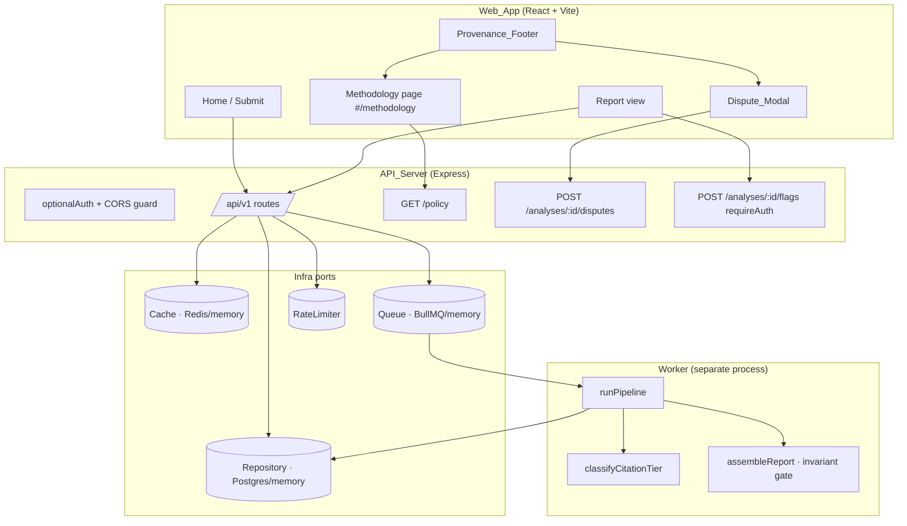
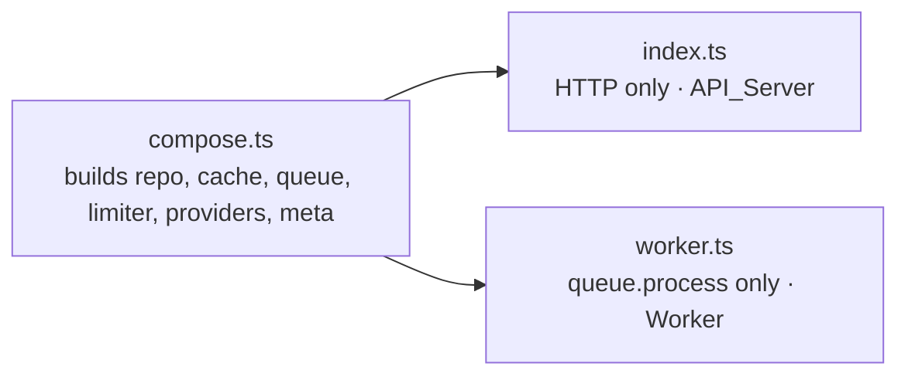

# Design Document

## Overview

The trust-and-launch-bundle hardens the existing f-Socials engine into a publicly shippable, defensibly trustworthy product. It is **additive** to the working slice — it introduces no new core abstractions and, above all, leaves the invariant gate in `core/assemble.ts` untouched. Every new surface obeys the compass: **a lens, not a judge.**

The bundle has five workstreams, mapped 1:1 to the five functional requirements plus the neutrality guarantee:

1. **Methodology page** — a public, static transparency page served by the existing SPA, linked from the provenance footer.
2. **Source-tier policy** — a versioned, pure classification module that derives a `SourceTier` for every citation from open signals only (IFCN, institutional domain registry, press-council membership). No commercially-encumbered datasets.
3. **Dispute & flag intake** — two new API routes (`POST /analyses/:id/disputes`, `POST /analyses/:id/flags`) plus a report-page modal. Human review is out of scope; this records intent only.
4. **UI polish & accessibility** — empty/error states, responsive single-column layout, WCAG 2.2 AA contrast in both themes, color-never-alone labelling, keyboard operability with focus management, and ARIA for the framing tooltips and issue-frame chart.
5. **Production build & safe deployment** — a real emitting build for the server, a split long-running worker process, startup config validation, and origin-checked CORS.

### Design Principles

- **Reuse the established patterns.** The server is dependency-injected through `infra/ports.ts`; new persistence goes through new `Repository` methods, not ad-hoc queries. The web app routes via the existing `#/...` hash convention (used today by `#/r/:slug`) — no router dependency is added. Icons come from the already-installed `lucide-react`.
- **The policy is pure and offline.** Source-tier classification is a pure function of `(sourceUrl, seeded signal data)`. It performs no network I/O at request time, which keeps it deterministic, fast, fully property-testable, and free of per-request cost.
- **One source of truth for the policy version.** A single `SOURCE_POLICY_VERSION` constant feeds the worker provenance, a public `GET /api/v1/policy` endpoint, and (through that endpoint) the methodology page.
- **The moat is read-only.** Tier classification *annotates* citations; it never adds or removes them. The invariant gate continues to count citations and inspect framing examples exactly as before, so no bundle item can weaken it.

## Architecture

### System Context



### Process Topology (Requirement 5.10)

Today `index.ts` is a single composition root that both serves HTTP and (via `queue.process(...)`) runs the worker in-process. For the deployed configuration the two are split into separate long-running processes that **share one composition module** so wiring never drifts:



- `compose.ts` (new) exports a single `buildContext()` returning `{ repo, cache, queue, limiter, providers, meta }`. The selection logic currently inline in `index.ts` moves here verbatim.
- `index.ts` imports `buildContext()`, mounts HTTP, and **does not** call `queue.process` when running as the API in the deployed configuration.
- `worker.ts` (new) imports `buildContext()` and calls `queue.process(makeWorker(...))` only.
- A dev convenience flag `RUN_WORKER_IN_PROCESS` (default `true` in dev, `false` in the deployed configuration) lets local dev keep the single-process experience.

ponytail: extracting `compose.ts` is a move-not-rewrite refactor; it removes duplication between the two entrypoints rather than adding it.

### Build Pipeline (Requirements 5.1–5.4)

| Target | Today | After |
| --- | --- | --- |
| Server | `start: tsx src/index.ts` (no build) | `build: tsc --noEmit && tsup src/index.ts src/worker.ts`, `start: node dist/index.js`, `start:worker: node dist/worker.js` |
| Web | `build: tsc -b && vite build` (already real) | unchanged — already satisfies 5.3/5.4 |

The server source uses extensionless ESM relative imports under `moduleResolution: "Bundler"`, which `tsc` cannot emit to runnable Node ESM without rewriting every import. `tsup` (an esbuild wrapper, one dev dependency) bundles both entrypoints to runnable `dist/*.js` that need no `tsx`. `tsc --noEmit` runs first purely as the type gate: a compilation error makes it exit non-zero and print the error before any bundle is produced (5.2). The web build already chains `tsc -b` (which fails non-zero on type errors, 5.4) before `vite build`.

### Startup Validation & Degraded Access Controls (Requirements 5.11, 5.12)

A pure helper `missingRequiredConfig(env, mode)` returns the names of required-but-absent configuration values for the deployed configuration (e.g. `DATABASE_URL` when `REPO_DRIVER=postgres`, `REDIS_URL` when a Redis driver is selected, `CORS_ORIGIN` for a public API). At startup:

- If `missingRequiredConfig` returns any names → the process logs each missing name and calls `process.exit(1)` **before** `app.listen` (5.11).
- Access controls degrade rather than block startup (5.12): if `SUPABASE_JWT_SECRET` is absent, auth cannot activate — the server still starts and logs a warning naming `requireAuth`; because `optionalAuth` then rejects any presented token (`auth_not_configured`) and `requireAuth` rejects all unauthenticated requests, protected routes **fail closed**. If the rate limiter cannot be constructed, the server starts and logs a warning naming the `Rate_Limiter`.

### CORS as an Origin Decision (Requirements 5.7, 5.8)

The current middleware unconditionally echoes `config.corsOrigin` into `Access-Control-Allow-Origin`. It is changed to a decision keyed on the request's `Origin` header:

```
allowOrigin(requestOrigin) =
  requestOrigin === config.corsOrigin  → set ACAO to requestOrigin, proceed
  otherwise (and requestOrigin present) → 403, no ACAO header, do not return the resource
```

Same-origin requests (no `Origin` header) are unaffected. This makes the allow/deny decision server-enforced and unit-testable as a pure predicate.

## Components and Interfaces

### 1. Source-Tier Policy (server, new — `core/sourceTier.ts`)

The heart of Requirement 2. A pure module with seeded, in-repo signal data.

```ts
export const SOURCE_POLICY_VERSION = 'v1';

// Ordered set, highest first. Rank is used for "highest matching signal wins".
export const TIER_RANK: Record<SourceTier, number> = {
  tier1_primary: 3,
  tier2_institutional: 2,
  tier3_viewpoint: 1,
  excluded: 0,
};

// Classify ONE citation's source URL into exactly one tier, from open signals only.
export function classifyCitationTier(sourceUrl: string): SourceTier;

// Exposed for the /policy endpoint and the methodology page.
export function policyDescriptor(): {
  version: string;
  tiers: { tier: SourceTier; label: string; meaning: string }[];
  openSignals: { name: string; raises: SourceTier }[];
};
```

Algorithm (`classifyCitationTier`):
1. Parse the host from `sourceUrl`. If the URL is unparseable or has no valid publishing host → `excluded` (2.11).
2. Collect every open signal whose data matches the host:
   - host (or registrable parent) is on the seeded **IFCN signatory** list → contributes `tier2_institutional` (2.3, "at least tier2");
   - host matches the seeded **institutional domain registry** (academic/governmental/institutional publishers, plus suffix rules such as `.gov`, `.gov.*`, `.mil`, `.edu`, `.ac.*`, `.int`); a curated primary-source subset contributes `tier1_primary`, the rest contribute `tier2_institutional` (2.4);
   - host is on the seeded **press-council membership** list → contributes `tier2_institutional`.
3. If at least one signal matched → return the tier of the **highest-ranked** matching signal (2.10).
4. If no signal matched → `tier3_viewpoint` (2.8).

The function reads only the URL and the seeded signal data. It has no parameter and no field for a content creator, structurally guaranteeing 2.7/2.9 (no creator rating can be produced). The seed data lives in `core/data/sourceSignals.ts` as plain arrays/sets and explicitly contains **no** Ad Fontes / AllSides / MBFC data (2.2). ponytail: seed lists are static and refreshed by editing the data file; the upgrade path is a scheduled job that regenerates them from the upstream open lists.

**Integration point:** `pipeline/stages.ts` Stage 3, where each claim's citations are built, sets `sourceTier: classifyCitationTier(citation.sourceUrl)` — the policy is authoritative over whatever a provider guessed. This guarantees every served citation carries a policy-assigned tier (2.6) and keeps providers out of the tiering business.

### 2. Policy Endpoint (server, new route in `http/routes.ts`)

```
GET /api/v1/policy   (public, no auth)
→ 200 { version, tiers[], openSignals[] }   // from policyDescriptor()
```

Single source of truth for the version shown on the methodology page (1.6) and in the provenance footer (2.5). The worker `meta.sourcePolicyVersion` is changed to import `SOURCE_POLICY_VERSION` instead of the hardcoded `'v1'`.

### 3. Dispute & Flag Routes (server, new routes in `http/routes.ts`)

```
POST /api/v1/analyses/:id/disputes   (public, anonymous)
  body: { reason: string (1..2000), claimId?: string }
  404 if report :id does not exist                       (3.6)
  400 if reason missing/empty or > 2000 chars            (3.7)
  201 { ok: true } and persists a Dispute (no user id)   (3.1, 3.2)

POST /api/v1/analyses/:id/flags      (requireAuth)
  body: { technique: string, note?: string }
  401 if unauthenticated, nothing persisted              (3.3, 3.4)
  404 if report :id does not exist                       (3.6)
  400 if technique does not match a framing technique
      present in the referenced report                   (3.7)
  201 { ok: true } and persists a Flag (report + user)   (3.5)
```

Both load the report first via `repo.getReport(id)` for existence and (for flags) to read the set of `framingSignals[].technique` values used to validate the submitted technique. Validation uses new zod schemas in `http/validation.ts` (`disputeSchema`, `flagSchema`). The `disputes` route relies on `disputes.raised_by` being nullable (anonymous), the `flags` route on `requireAuth` populating `req.user`.

### 4. Repository Extensions (`infra/ports.ts`, `memory.ts`, `postgres.ts`)

```ts
interface Repository {
  // ...existing...
  createDispute(d: { id: string; reportId: string; claimId?: string; reason: string; createdAt: string }): Promise<void>;
  createFlag(f: { id: string; reportId: string; userId: string; technique: string; note?: string; createdAt: string }): Promise<void>;
}
```

- Postgres: `INSERT INTO disputes (id, report_id, raised_by, reason, ...)` with `raised_by = NULL`, and a new nullable `claim_id` column (migration 002). `INSERT INTO flags (id, report_id, user_id, technique, note, ...)`; the existing `UNIQUE (report_id, user_id, technique)` makes a repeat flag idempotent (`ON CONFLICT DO NOTHING`).
- In-memory: two arrays, mirroring the same shape, so tests run without a database.

### 5. Methodology Page (web, new — `components/Methodology.tsx`)

A static component rendered by `App.tsx` when `window.location.hash` matches `#/methodology` (extending the existing hash-routing pattern; no router dependency, no auth — 1.1). On mount it fetches `GET /api/v1/policy` for the live version/tier labels; if the fetch fails it renders the page with a neutral "policy version unavailable" note rather than failing (graceful, supports 1.12). Content sections:

- How f-Socials distinguishes the possible Evidence_Outcome values for a claim — a directly matched fact-check, a matched primary or institutional source, relevant context without direct verification, no sufficient evidence found, and a claim that is not fact-checkable — and what raises or lowers confidence within that set of outcomes (1.2). (The authoritative outcome vocabulary is owned by the separate fact-check query-tuning work, so this page describes the outcomes at a stable, user-facing level and does not hard-code retrieval-specific logic.)
- The source-tier policy and the open signals behind each tier (1.3), with the live version identifier (1.6).
- Who reviews reports and what each review status means (1.4).
- How to submit a dispute (1.5).
- The neutrality statement: f-Socials describes framing and evidence, never verdicts about content or labels about creators (1.8).
- Glossary terms defined on first use (1.10).

The page meets WCAG 2.2 AA contrast in both themes (1.9). `App.tsx`'s `View` union gains a `{ kind: 'methodology' }` variant, and the route is reachable from the footer link (1.7, 1.11). If the methodology view cannot render, the app shows an unavailable banner and the previous report view is retained in state (1.12).

### 6. Provenance Footer + Dispute Modal (web — `components/Report.tsx`)

The existing `.provenance` footer gains:
- a **Methodology** link (`#/methodology`) (1.7);
- a **Dispute this analysis** control that opens the `Dispute_Modal` (3.10).

`Dispute_Modal` (new component):
- Optional pre-filled `claimId` when opened from a specific claim (3.8); sends `{ claimId, reason }` to the dispute endpoint.
- On success, shows a confirmation that the dispute was received (3.9).
- Is a focus-trapped dialog (see accessibility below).

A **Flag** control on each framing signal and a **Save** control submit to authenticated endpoints; when the current user is unauthenticated the web app prompts to authenticate before submitting (3.11).

### 7. Accessibility & UI Polish (web — `Report.tsx`, `App.tsx`, `styles.css`, `tokens.json`)

| Concern | Approach | Criteria |
| --- | --- | --- |
| Empty states | Each section already routes empty data to `<Empty>`; ensure all four sections do and other sections still render | 4.1 |
| Error state | `App.tsx` `error` view gains **Retry** (re-runs the request) and **Back**; never renders a partial report | 4.2 |
| Responsive | `≤768px` → single column, no horizontal scroll (CSS media query; `.framing-layout` already collapses at 820px — align to ≤768) | 4.3 |
| Contrast | Audit/adjust CSS variables so body ≥4.5:1, large text ≥3:1, UI/graphical boundaries ≥3:1 in both themes | 4.4 |
| Accent color | Standardize the brand accent to `#0d9488` (the `success` token) wherever `#00ffe5` appears (`tokens.json` accent + any `--accent` usage), for evidence-backed/accent signals | 4.5 |
| Color never alone | Every color-coded element carries an adjacent text label (tags already do; add text to the issue-frame markers and the divergence bar) | 4.6 |
| Keyboard + focus | Claim drawers, framing tabs, and the Dispute_Modal operable by keyboard; opening moves focus in; modal traps focus; Escape/dismiss closes and restores focus to the opener | 4.7 |
| Tooltip ARIA | Framing `<mark>` tooltips get a programmatic `aria-describedby` pointing at the explanation text | 4.8 |
| Chart alt text | Issue-frame positions exposed as screen-reader text (e.g. "State/collective ↔ Market/individual: slightly market-leaning") | 4.9 |
| Above-the-fold | TLDR + the single highest-severity framing signal render without expanding any drawer | 4.10 |

ponytail: the issue-frame and severity tags are already text-labelled; the gap is the chart markers and divergence bar, which currently encode position/length only — those get adjacent text.

### 8. Invariant Gate (server — `core/assemble.ts`) — unchanged

No edit. The bundle interacts with it only by ensuring tier classification annotates citations without changing their count or the framing examples, so the gate's decisions are identical with or without the policy (Requirement 6, verified by a dedicated property).

## Data Models

### SourceTier (existing, unchanged type)

`'tier1_primary' | 'tier2_institutional' | 'tier3_viewpoint' | 'excluded'` — already defined in both `apps/server/src/types.ts` and `apps/web/src/api/types.ts`. The bundle adds the *policy* that assigns it; the type is untouched.

### PolicyDescriptor (new, server → web over `/policy`)

```ts
interface PolicyDescriptor {
  version: string;                 // SOURCE_POLICY_VERSION
  tiers: { tier: SourceTier; label: string; meaning: string }[];
  openSignals: { name: string; raises: SourceTier }[];
}
```

### Dispute (DB row — existing `disputes` table + migration 002)

```
disputes(
  id uuid pk,
  report_id uuid fk → analysis_reports,
  raised_by uuid null,          -- always NULL for anonymous submissions (3.2)
  claim_id  text null,          -- NEW (migration 002): the disputed claim, if any (3.8)
  reason    text not null,      -- 1..2000 chars, validated at the API boundary
  status    text default 'open',
  created_at timestamptz default now()
)
```

### Flag (DB row — existing `flags` table, no schema change)

```
flags(
  id uuid pk,
  report_id uuid fk → analysis_reports,
  user_id   uuid not null fk → users,   -- requireAuth guarantees identity (3.5)
  technique text not null,              -- MUST match a framing technique in the report
  note      text null,
  corroborated boolean default false,
  created_at timestamptz default now(),
  unique (report_id, user_id, technique)
)
```

### Request bodies (zod, new in `http/validation.ts`)

```ts
disputeSchema = z.object({
  reason:  z.string().min(1).max(2000),
  claimId: z.string().max(200).optional(),
});

flagSchema = z.object({
  technique: z.string().min(1).max(200),
  note:      z.string().max(2000).optional(),
});
// technique-matches-report is enforced in the handler against the loaded report's
// framingSignals[].technique set (cannot be expressed in the schema alone).
```

### Config requirements (deployed configuration)

```ts
// pure helper: which required values are absent for the given mode
function missingRequiredConfig(env, mode: 'deployed' | 'dev'): string[]
// deployed requires (conditionally): DATABASE_URL (if REPO_DRIVER=postgres),
// REDIS_URL (if CACHE_DRIVER/QUEUE_DRIVER=upstash), CORS_ORIGIN.
// SUPABASE_JWT_SECRET and the rate limiter are access controls (warn, not exit) per 5.12.
```

## Correctness Properties

*A property is a characteristic or behavior that should hold true across all valid executions of a system — essentially, a formal statement about what the system should do. Properties serve as the bridge between human-readable specifications and machine-verifiable correctness guarantees.*

These properties target the pure, input-varying logic of the bundle: the source-tier policy, the dispute/flag intake rules, the CORS predicate, the config helper, the report UI invariants, and the preserved invariant gate. UI contrast, build behavior, deployment wiring, and dataset provenance are covered by smoke/integration tests in the Testing Strategy, not here.

### Property 1: Tier classification is total and single-valued

*For any* string passed to `classifyCitationTier`, the result is exactly one member of `{ tier1_primary, tier2_institutional, tier3_viewpoint, excluded }`.

**Validates: Requirements 2.1**

### Property 2: Tier equals the highest-ranked matching open signal

*For any* source URL with a resolvable publishing host, `classifyCitationTier` returns the tier of the highest-ranked open signal that matches the host; if no open signal matches, it returns `tier3_viewpoint`; and *for any* string whose host cannot be resolved to a valid publishing domain, it returns `excluded`. (Consequently an IFCN-signatory host is always at least `tier2_institutional` and an institutional-registry host is always at least `tier2_institutional`.)

**Validates: Requirements 2.3, 2.4, 2.8, 2.10, 2.11**

### Property 3: Every served citation carries a policy-assigned tier

*For any* extraction processed by the pipeline, every citation on every claim in the resulting report has a `sourceTier` that is a valid member of the tier set.

**Validates: Requirements 2.6**

### Property 4: A source chip renders its tier label and never a creator

*For any* citation with any assigned tier, the rendered `Source_Chip` text equals the label mapped from that tier and contains no content-creator reference.

**Validates: Requirements 2.9, 6.5**

### Property 5: A valid anonymous dispute is persisted without a user identity

*For any* reason between 1 and 2000 characters submitted to an existing report's dispute endpoint without authentication, the API responds with a success status and persists exactly one dispute whose `raised_by` is null.

**Validates: Requirements 3.1, 3.2**

### Property 6: An authenticated flag with a matching technique is persisted to the user

*For any* technique that matches a framing technique present in the referenced report, an authenticated flag submission persists exactly one flag associated with that report and the authenticated user.

**Validates: Requirements 3.3, 3.5**

### Property 7: Unauthenticated flag submissions are rejected and never persisted

*For any* flag request body submitted without valid authentication, the API responds with an authentication-required status and persists no flag.

**Validates: Requirements 3.4**

### Property 8: Disputes and flags targeting a nonexistent report are not-found and never persisted

*For any* report identifier that does not exist, both the dispute and flag endpoints respond with a not-found status and persist neither a dispute nor a flag.

**Validates: Requirements 3.6**

### Property 9: Invalid dispute/flag bodies are rejected and never persisted

*For any* dispute reason that is empty or exceeds 2000 characters, and *for any* flag technique that does not match a framing technique in the referenced report, the API responds with a validation-error status and persists nothing.

**Validates: Requirements 3.7**

### Property 10: A section with no items shows an empty state while other sections render

*For any* report and *for any* subset of its sections that are empty, each empty section displays its empty-state message and every non-empty section still renders its items.

**Validates: Requirements 4.1**

### Property 11: Color-coded signals always carry equivalent text

*For any* tier, severity, or evidence-strength value rendered in the report, the element exposes a text label conveying the same meaning, so no status is communicated by color alone.

**Validates: Requirements 4.6**

### Property 12: Framing highlights expose a programmatic description

*For any* framing example rendered in the transcript, the highlight element carries an `aria-describedby` (or equivalent programmatic association) that resolves to that example's explanation text.

**Validates: Requirements 4.8**

### Property 13: Every issue-frame position has screen-reader text

*For any* issue-frame coordinates x and y in [-1, 1], the rendered chart includes a non-empty textual representation of that position.

**Validates: Requirements 4.9**

### Property 14: TLDR and the top framing signal render unexpanded on first paint

*For any* ready report that has a TLDR and at least one framing signal, the initial render shows the TLDR text and the highest-severity framing signal without requiring any drawer or collapsed content to be expanded.

**Validates: Requirements 4.10**

### Property 15: CORS allows a request if and only if its origin matches the configured origin

*For any* request origin, the API applies the origin as allowed and proceeds if and only if it equals the configured `CORS_ORIGIN`; otherwise it rejects the request and does not return the resource.

**Validates: Requirements 5.7, 5.8**

### Property 16: Missing required config is reported by name for the deployed configuration

*For any* deployed-configuration environment missing one or more required values, `missingRequiredConfig` returns the names of exactly those missing values.

**Validates: Requirements 5.11**

### Property 17: An uncited claim that asserts evidence holds the report for review

*For any* report containing at least one claim whose evidence strength is `weak`, `moderate`, or `strong` and that has zero citations, the invariant gate sets the report to `needs_review` and records a reason identifying the uncited claim.

**Validates: Requirements 6.1**

### Property 18: An honest "none" claim with no citations does not block readiness

*For any* report whose only would-be citation issue is claims with evidence strength `none` and zero citations, the invariant gate records no citation reason for those claims and permits the report to reach `ready`.

**Validates: Requirements 6.2**

### Property 19: A framing signal lacking evidence holds the report for review

*For any* report containing a framing signal with zero examples, or an example whose quote or explanation is empty, the invariant gate sets the report to `needs_review` and records a reason identifying the deficient framing signal.

**Validates: Requirements 6.3**

### Property 20: Readiness is exactly the absence of review reasons

*For any* assembled input, the invariant gate sets the report to `ready` if and only if it has zero needs_review reasons, and to `needs_review` otherwise.

**Validates: Requirements 6.4**

### Property 21: Tier classification does not change the gate outcome

*For any* report, assembling it produces the same status and reasons whether or not its citations have been run through `classifyCitationTier` — tiering annotates citations without adding or removing them, so the moat is preserved.

**Validates: Requirements 6.1, 6.2, 6.4**

## Error Handling

### Server

| Condition | Handling | Criteria |
| --- | --- | --- |
| Dispute/flag on missing report | `repo.getReport` returns undefined → `404 { error: 'not_found' }`, no write | 3.6 |
| Dispute reason empty/oversized | `disputeSchema` fails → `400 { error: 'invalid_input', details }`, no write | 3.7 |
| Flag technique not in report | Handler compares against `framingSignals[].technique` set → `400 { error: 'invalid_technique', details }`, no write | 3.7 |
| Unauthenticated flag | `requireAuth` → `401 { error: 'auth_required' }`, no write | 3.4 |
| Cross-origin from disallowed origin | CORS guard → `403`, no `Access-Control-Allow-Origin`, resource withheld | 5.8 |
| Missing required deployment config | Log each missing name, `process.exit(1)` before `listen` | 5.11 |
| Auth/limiter cannot activate | Log a warning naming the control, start anyway; protected routes fail closed | 5.12 |
| Repository write failure | Propagates to the Express error handler → `500 { error: 'internal_error' }` (existing) | — |
| `/policy` always available | Pure in-memory descriptor; cannot fail under normal operation | 1.6, 2.5 |

The invariant gate is never bypassed by error handling: a report that cannot be fully assembled remains `needs_review` and is shown transparently rather than hidden (existing behavior, preserved).

### Web

| Condition | Handling | Criteria |
| --- | --- | --- |
| Report request fails / error status | Error view with **Retry** and **Back**; no partial report rendered | 4.2 |
| Section has no items | Per-section empty-state message; sibling sections still render | 4.1 |
| `/policy` fetch fails on methodology page | Render the page with a "policy version unavailable" note; page still serves | 1.12 |
| Methodology route cannot render | Unavailable banner; prior report view retained in `App` state | 1.12 |
| Dispute submission fails | Inline error in the modal; modal stays open so the reader can retry | 3.9 (negative path) |
| Flag/save while unauthenticated | Prompt to authenticate before submitting | 3.11 |
| Clipboard blocked on share | Already handled — link remains in the button title (existing) | — |

## Testing Strategy

### Property-Based Tests

PBT is appropriate here because the bundle's decision logic — source-tier classification, dispute/flag validation, the CORS predicate, the config helper, and the invariant gate — are pure functions with large input spaces and universal properties (totality, signal resolution, round-trip-style persistence, biconditionals). The project has no PBT library yet; add **`fast-check`** as a dev dependency to `apps/server` and `apps/web` (the standard choice for the TypeScript/Node and React/Vitest ecosystems). Do not hand-roll generators frameworks.

Conventions:
- Server property tests run under the existing `node:test` runner (consistent with `test/invariant.test.ts`), using `fast-check`'s `fc.assert(fc.property(...))`.
- Web property tests run under Vitest + React Testing Library (added with `fast-check`), since the web app currently has no test runner.
- Each property test runs a **minimum of 100 iterations** (`fc.assert(..., { numRuns: 100 })`).
- Each property test is tagged with a comment referencing its design property, in the form:
  `// Feature: trust-and-launch-bundle, Property {n}: {property text}`
- Each of the 21 correctness properties is implemented by a **single** property-based test.

Generators to build:
- **Source URLs**: hosts drawn from (a) the IFCN seed list, (b) the institutional registry (primary and non-primary subsets), (c) press-council list, (d) hosts in multiple lists, (e) hosts in no list, (f) malformed/empty/non-URL strings — with random subdomains, paths, queries, and casing. Backs Properties 1–3.
- **Reports / assemble inputs**: reuse and extend the helpers in `test/invariant.test.ts` (`citedClaim`, `uncitedClaim`, `noEvidenceClaim`, `goodSignal`) to generate arbitrary claim/framing mixes. Backs Properties 17–21.
- **Dispute/flag bodies**: valid and invalid reason lengths (including boundary 1, 2000, 2001 and whitespace), matching/non-matching techniques, existing/nonexistent report ids, authed/anonymous. Run against an `InMemoryRepository` so no database is needed. Backs Properties 5–9.
- **Origins**: the configured origin plus arbitrary other origins. Backs Property 15.
- **Deployed envs**: required-key maps each with one key removed. Backs Property 16.
- **Render inputs** (web): reports with arbitrary empty-section subsets, arbitrary tier/severity/strength values, arbitrary framing examples, arbitrary issue-frame coordinates. Backs Properties 10–14.

### Unit / Example Tests

- Methodology page renders without auth and contains each required section, the neutrality statement, glossary definitions, and the policy version from a mocked `/policy` (1.1–1.8, 1.10).
- Footer methodology link present and navigates to `#/methodology` (1.7, 1.11); footer dispute control opens the modal (3.10).
- Dispute_Modal pre-filled with a `claimId` sends `{ claimId, reason }` and shows a confirmation on success (3.8, 3.9).
- Unauthenticated flag/save shows the auth prompt (3.11).
- Policy version equality: `/policy.version === SOURCE_POLICY_VERSION` and equals the worker provenance value (2.5).
- Keyboard/focus behavior for claim drawers, framing tabs, and the modal: focus moves in on open, is trapped in the modal, and Escape/dismiss restores focus to the opener (4.7).
- Methodology-unavailable path shows the indication and retains report context (1.12); failed-report path shows retry/back with no partial render (4.2).
- Degraded access controls: starting without `SUPABASE_JWT_SECRET` (and with the limiter unavailable) starts the server and logs a warning naming the control (5.12).

### Integration / Smoke Tests

- **Server build** (`tsup`): `node dist/index.js` and `node dist/worker.js` start without `tsx` (5.1, 5.10); a fixture with a type error makes `tsc --noEmit` exit non-zero and report it (5.2).
- **Web build**: produces a static bundle (5.3); a type error makes the build exit non-zero and report it (5.4); `VITE_API_BASE` is honored by the client (5.9).
- **Deployed access controls**: protected routes return 401 without auth (5.5); exceeding the daily limit returns 429 (5.6) — extends the existing `test/ratelimit.test.ts`.
- **Seed-data provenance**: assert the source-signal module references none of Ad Fontes, AllSides, or MBFC (2.2) and exposes no creator dimension (2.7).
- **Accent color**: assert no `#00ffe5` remains in `tokens.json`/`styles.css` and the accent resolves to `#0d9488` (4.5).
- **Accessibility / contrast** (`axe` via the browser): the report and methodology pages pass AA contrast in light and dark modes; responsive layout at ≤768px is single-column with no horizontal scroll (1.9, 4.3, 4.4). These require a real browser/assistive-tech pass and manual review; automated scans catch contrast and ARIA wiring but full WCAG conformance is confirmed by manual testing.

### Test-to-Requirement Coverage

Every functional acceptance criterion maps to at least one test: Requirement 2 and Requirement 6 are covered primarily by Properties 1–4 and 17–21; Requirement 3 by Properties 5–9 plus example tests for the UI; Requirement 4 by Properties 10–14 plus keyboard/contrast/responsive tests; Requirement 1 by example tests; Requirement 5 by Properties 15–16 plus build/deploy integration and smoke tests.
