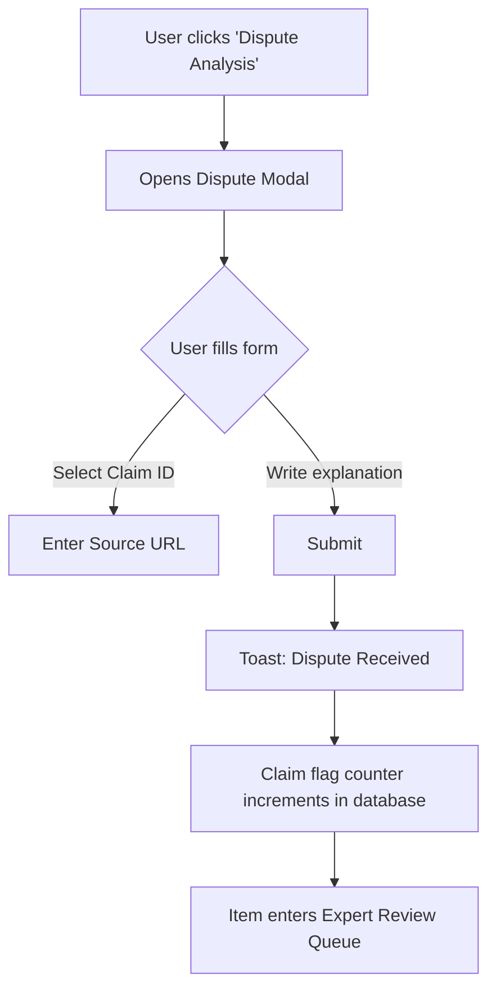

# Feature-Based UX Mapping

This document maps F-Socials' core content-analysis features to their layout requirements, component variants, interaction patterns, and edge cases. 

---

## 1. Feature: Claim Ledger
The Claim Ledger extracts the core claims of a piece of media and evaluates their supporting evidence.

* **Target Page**: Report Page (Main Body)
* **Screen Section**: Section 1 (Claims tab or upper section)
* **Mapped Components**: Claim Card, Status Tag, Expand Chevron, Icon Button ("View Details")

### Interaction Model
1. **Default State**: Claims are listed in order of appearance in the media, marked with numbers. A tag indicates Evidence Strength.
2. **On Hover**: Card border highlights (`border-accent-teal/40`), cursor changes to `cursor-pointer`.
3. **On Tap / Click**: Card expands downwards to reveal the **Evidence Drawer**.
   * *Smart Animate* transition reveals the original quote segment from the transcript, a list of citation links, and a brief description of why the evidence was rated.
4. **On "Dispute" Tap**: Opens the Dispute Modal pre-filled with this Claim's ID.

### Evidence Status Mapping
* **Supported Evidence** (Muted Teal tag / `ShieldCheck` icon): 3+ independent, high-reputation citations with no major consensus conflicts.
* **Mixed Evidence** (Muted Amber tag / `AlertTriangle` icon): Evidence exists but is contested by other reputable sources, or studies show conflicting data.
* **Weak Evidence** (Muted Amber tag / `AlertOctagon` icon): Only 1 source or limited data backing the claim.
* **Insufficient Evidence** (Slate Gray tag / `HelpCircle` icon): No direct evidence or citations found.

---

## 2. Feature: Framing Signals
Framing Signals analyze how the content is presented to influence reader emotion or bias.

* **Target Page**: Report Page
* **Screen Section**: Section 2 (Framing tab or middle section)
* **Mapped Components**: Framing Card, Threat-Level Badges (High, Medium, Low)

### Mapped Signals
* **Emotional Language**: Uses fear-inducing or alarmist phrasing.
* **Us vs. Them Framing**: Divides groups to create polarized conflict (e.g., "ordinary people" vs. "corporate elites").
* **Selective Emphasis**: Focuses heavily on risks while omitting benefits, or vice versa.

### Interaction Model
* **On Hover**: Card lifts slightly (`shadow-raised`).
* **On Tap / Click**: Expands to show highlighted snippets within the text transcript where this framing occurs.
* **Highlight interaction**: Hovering over a highlighted snippet displays a tooltip explaining the specific linguistic framing technique used.

---

## 3. Feature: Useful Context
Provides neutral, objective baseline data to put claims in perspective.

* **Target Page**: Report Page
* **Screen Section**: Section 3 (Lower middle section)
* **Mapped Components**: Context Card, External Link Chip

### Interaction Model
* Renders as a 3-column grid on desktop, single vertical stack on mobile.
* Each card highlights a sub-topic (e.g., "Scale of Impact" or "Recyclability Advances").
* Displays a brief neutral description + a direct, prominent source link with an external link indicator (`↗`).
* Tap on source link opens the source in a new browser tab.

---

## 4. Feature: Other Credible Angles
Combines related coverage from reputable publishers to offer different thematic perspectives on the same topic.

* **Target Page**: Report Page
* **Screen Section**: Section 4 (Pre-footer section)
* **Mapped Components**: Article Card, Perspective Chips, Navigation Scroll Buttons

### Perspective Tag System
Each article card carries a specialized perspective tag:
* **Environmental angle**: Focus on ecological, wildlife, and natural resource impacts.
* **Policy angle**: Focus on legislation, political debate, and legal frameworks.
* **Technical angle**: Focus on engineering, feasibility, infrastructure, and hard science.
* **Community angle**: Focus on localized social impacts, worker voices, and housing.
* **Research angle**: Focus on academic study methodologies and peer-reviewed journals.

### Interaction Model
* **Mobile**: Horizontal scroll container with swipe gesture.
* **Desktop**: Flex grid with navigation arrows (`ChevronLeft`, `ChevronRight`) showing 3 cards at a time.
* **Rationale Block**: Each card includes a "Why included" summary explaining what unique dimension this article adds to the topic.

---

## 5. Feature: Sources & Provenance
Ensures transparency by showing how the report was generated and who reviewed it.

* **Target Page**: Report Page (Footer)
* **Screen Section**: Section 5 (Footer)
* **Mapped Components**: Provenance Card, Action Buttons ("Methodology", "Dispute Analysis")

### Metadata Schema
Displays:
* **Model**: AI analysis engine used (e.g., "Gemini 2.5 Pro").
* **Analysis Version**: e.g., "1.0.0".
* **Source Policy**: Linked policy version (e.g., "v1.0 (May 2025)").
* **Review Status**: "Expert-Reviewed" (Teal badge) or "AI-Generated / Under Dispute" (Amber badge).

---

## 6. Feature: Dispute Submission & Resolution Flow
Allows users to dispute claims or propose source edits.

### Review Queue Interface (Expert Workspace)
* **Queue Cards**: Stacked list of reports under dispute, sorted by dispute volume.
* **Action Workspace**:
  * Side-by-side view: Left = Current Report, Right = Submitted Dispute Sources.
  * **Edit Form**: Input fields to alter Evidence tags, edit description texts, and append source URLs.
  * **Submit Edit Button**: Requires a mandatory "Public Changelog Reason" text block to compile the revision history.
