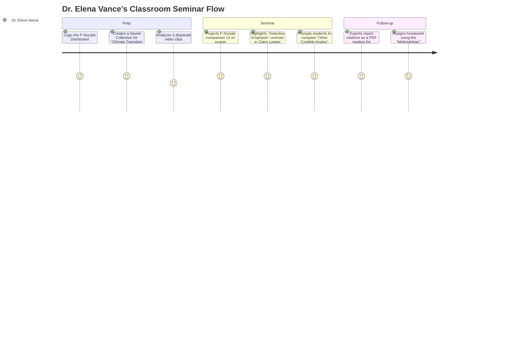

# Target Audience Specifications

This document defines the primary user audience, detailed user personas, empathy maps, journey maps, and segmentation strategies for **F-Socials**. These strategy deliverables guide the UX layout and component behaviors to meet the requirements of different user profiles.

---

## 1. User Personas

### Persona A: Dr. Elena Vance (The Media Literacy Educator)
> *"My goal is to teach students how to think, not what to think. F-Socials is the perfect sandboxed laboratory for media literacy."*

* **Demographics**: 42 years old | University Lecturer in Communication & Journalism | Utrecht, NL
* **Core Goals**:
  * Integrate live news analysis into classroom seminars.
  * Provide students with a structured method to dismantle political propaganda and framing devices.
  * Export claim checklists and source citations for syllabus materials.
* **Key Pain Points**:
  * Existing fact-checking sites provide simplistic "True/False" verdicts, which stifle classroom discussion and critical thinking.
  * Most analysis dashboards are cluttered, sensationalist, or carry clear political bias.
* **Behaviors**:
  * Primary device is a desktop browser or tablet connected to a lecture hall projector.
  * Prefers high-density text interfaces with deep footnote/provenance navigation.
  * Reads full reports and evaluates "Other Credible Angles" systematically.

---

### Persona B: Liam Bakker (The Curious Public User)
> *"I see so many wild claims on my feeds. I just want to check if a claim is backed by actual evidence before I send it to my family group chat."*

* **Demographics**: 27 years old | Freelance Graphic Designer | Rotterdam, NL
* **Core Goals**:
  * Quickly check the verifiability of a viral video or article URL.
  * Share a neutral, non-confrontational summary page with peers.
  * Learn to spot manipulative emotional language in everyday content.
* **Key Pain Points**:
  * Feeling overwhelmed by rapid-fire news cycles and polarized comments.
  * Being called out or feeling embarrassed for sharing unverified rumors.
  * Academic fact-checks are too long, dry, and difficult to parse on a mobile screen.
* **Behaviors**:
  * 100% mobile-first user.
  * Copy-pastes links from YouTube, TikTok, or Twitter.
  * Focuses heavily on the **TL;DR** section, the visual **Framing Signals** meter, and the **Bridging Sources** cards.

---

### Persona C: Jan de Wilde (The Expert Reviewer)
> *"Neutrality is hard work. When reviewing disputes, I need a workspace that lets me evaluate sources efficiently and transparently."*

* **Demographics**: 34 years old | Academic Researcher & Part-time Fact-Checker | Amsterdam, NL
* **Core Goals**:
  * Review user disputes on claim analyses efficiently.
  * Edit source citations and context tags with absolute provenance tracking.
  * Maintain the credibility and neutrality of the public database.
* **Key Pain Points**:
  * Lack of a clear dashboard view showing disputed claims sorted by urgency or report volume.
  * Clunky text editors that do not support structured changelogs or transparent revisions.
* **Behaviors**:
  * Power user; utilizes keyboard shortcuts for navigation.
  * Works primarily on a dual-monitor desktop setup.
  * Needs a detailed "Methodology" reference panel open at all times during review tasks.

---

## 2. Empathy Maps

### Empathy Map: Liam Bakker (Curious Public User)

```
       +-------------------------------------------------------------+
       |                           THINKS & FEELS                     |
       |  - "Am I being lied to by this viral video?"                |
       |  - "I don't want to look foolish in my group chat."         |
       |  - "Everything is so polarized; who can I trust?"          |
       +------------------------------+------------------------------+
                                      |
       +------------------------------v------------------------------+
       |                               HEARS                         |
       |  - Friends saying: "Did you see that video? That's crazy!"  |
       |  - Podcasters debating claims with high emotional energy.    |
       |  - Constant alerts from social apps announcing breaking news|
       +------------------------------+------------------------------+
                                      |
       +------------------------------v------------------------------+
       |                            SAYS & DOES                      |
       |  - Copy-pastes URLs into search bars to verify.             |
       |  - Shares TL;DR summaries instead of original links.        |
       |  - Tells family: "Look at the context before reacting."      |
       +------------------------------+------------------------------+
                                      |
       +------------------------------v------------------------------+
       |                             PAINS & GAINS                   |
       |  Pain: Fatigue from sensationalism, fear of misinformation. |
       |  Gain: Confidence in sharing verified, neutral perspectives.|
       +-------------------------------------------------------------+
```

---

## 3. User Journey Maps

### Flow 1: Liam's Onboarding and First URL Verification (Mobile-First)

```mermaid
journey
    title Liam's Onboarding & URL Verification
    section Discovery
      Sees a suspicious post on Reddit: 4: Liam Bakker
      Copies the URL to clipboard: 5: Liam Bakker
    section Onboarding
      Lands on F-Socials home page: 5: Liam Bakker
      Reads clean, minimal tagline ("A lens, not a judge"): 5: Liam Bakker
      Pastes URL into central Hero Input: 5: Liam Bakker
    section Analysis
      Observes multi-step progress bar (Transcribing, checking sources): 4: Liam Bakker
      Reads the generated TL;DR summary: 5: Liam Bakker
      Expands "Us vs. Them" Framing Signal to inspect evidence: 5: Liam Bakker
    section Sharing
      Taps "Share" button to copy clean report link: 5: Liam Bakker
      Sends report to family chat: 5: Liam Bakker
```

### Flow 2: Dr. Vance's Classroom Seminar setup (Desktop)



### Flow 3: Contributor Dispute & Resolution Flow (Expert Reviewer)

```mermaid
journey
    title Contributor Dispute & Resolution Flow
    section Dispute Alert
      Jan logs into the Review Dashboard: 5: Jan de Wilde
      Sees a flagged claim with 15 user disputes: 4: Jan de Wilde
      Reads user dispute submissions: 4: Jan de Wilde
    section Investigation
      Reviews original transcript section: 5: Jan de Wilde
      Clicks "View Citation Source" to inspect the peer-reviewed study: 5: Jan de Wilde
      Finds that the claim interpretation was slightly over-simplified: 4: Jan de Wilde
    section Resolution
      Clicks "Propose Edit" on the claim card: 5: Jan de Wilde
      Adjusts Evidence Strength from "Weak" to "Mixed": 5: Jan de Wilde
      Appends the new source URL and writes a public changelog note: 5: Jan de Wilde
      Saves edit; report updates with a transparent "Edited" history badge: 5: Jan de Wilde
```

---

## 4. Audience Segmentation Recommendations

F-Socials features should be structured around three clear tiers of user interaction:

| User Segment | Platform Role | Core Feature Alignment | UX Requirements |
| :--- | :--- | :--- | :--- |
| **Passive Consumers** | Read reports, verify links, share context. | Hero URL input, TL;DR cards, visual framing signal lists, sharing widgets. | **Zero Friction**: Clean, fast, mobile-friendly landing page with no mandatory login. |
| **Active Disputers** | Highlight errors, flag biased language, submit sources. | Dispute submission modal, highlight-to-flag text utility, community comment threads. | **Structured Inputs**: Dropdowns for error types, character-limited source justification text box. |
| **Verified Expert Panel** | Resolve disputes, edit reports, audit sources. | Expert Dashboard, claim edit panel, changelog history tracker, audit queue filters. | **High Density**: Keyboard shortcuts, detailed status indicators, side-by-side text comparisons. |
